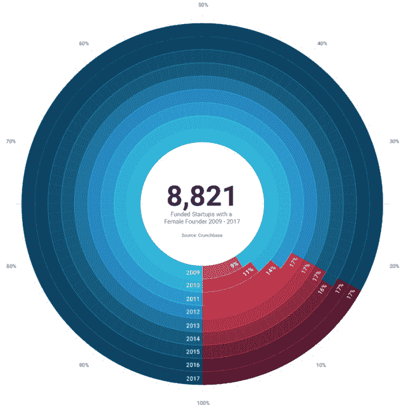
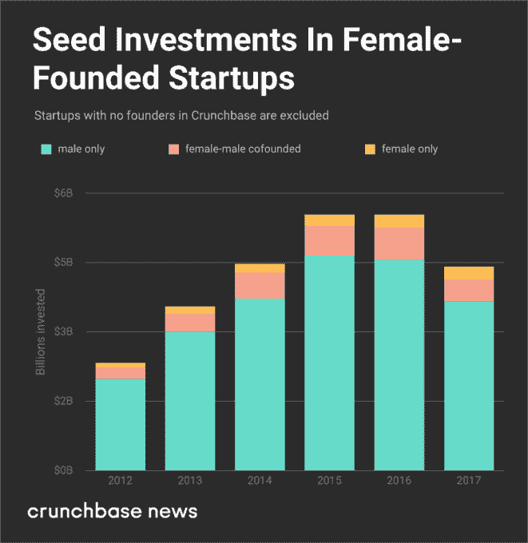
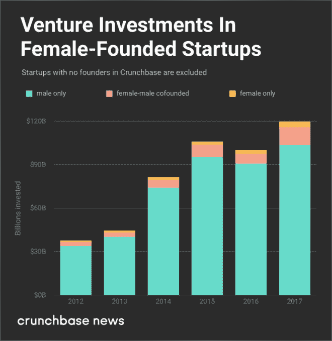

# 由女性创办的风险投资支持的创业公司比例一直停滞不前

> 原文：<https://web.archive.org/web/https://techcrunch.com/2018/01/15/the-portion-of-vc-backed-startups-founded-by-women-stays-stubbornly-stagnant/>

# 由女性创办的风险投资支持的创业公司比例一直停滞不前

More posts by this contributor

对于科技行业来说，这是动荡的一年，性骚扰、T2 薪酬差距和 T4 女性代表不足经常占据头条。科技行业认为自己的使命是[改变世界](https://web.archive.org/web/20230323153502/https://www.inc.com/jessica-stillman/10-breakthrough-technologies-that-are-about-to-change-the-world.html)这与其对女性的歧视形成了鲜明对比。

虽然性别歧视并不是在硅谷诞生的，但性骚扰被证明对商业有害，正如优步、[索菲](https://web.archive.org/web/20230323153502/http://money.cnn.com/2017/09/15/technology/business/sofi-ceo-resigns/index.html)、[二元资本](https://web.archive.org/web/20230323153502/https://www.theguardian.com/technology/2017/jun/23/justin-caldbeck-sexual-harassment-binary-capital-women-tech)和其他人所经历的那样。作为我们更大的第四季度和 2017 年报道的一部分，让我们看看风险行业去年是如何投资女性的。

## 按第一个资助年度分列的女性创始人

作为 Crunchbase 对女性创始人持续研究的一部分，我们统计了 54，702 家创始人在 2009 年至 2017 年期间获得初始资金的全球公司。在这些全球公司中，8821 家(16%)至少有一名女性创始人。

从 2009 年到 2012 年，拥有女性创始人的风险投资公司的比例增加了近 8%。然而，自 2012 年以来，全球女性创办的风险投资公司的比例一直稳定在 17%左右。六年后的 2017 年底，这一比例仍未改变。

拥有女性创始人的公司的绝对数量(以及创业公司的总数)增长了八倍多，从 2009 年的 186 家增长到 2016 年的 1588 家。这个数字在 2017 年下降到 1047 家，因为这一年获得资助的创业公司减少了。随着更多的创业公司在 2018 年加入 Crunchbase，初始资金被认可到 2017 年，我们预计 2017 年女性创始人创业公司的绝对数量将会上升；然而，它可能不会达到 2016 年记录的绝对数字。

## 女性领导的初创企业的种子期融资

自 2012 年以来，仅由女性创办的创业公司的种子金额在所有种子资金的 4%至 5%之间徘徊，2017 年占 6%，投资额为 2.77 亿美元。女性和男性共同创建的团队比例徘徊在 11%到 13%之间。男性创办的团队筹集了所有种子投资美元的 85%至 83%，2017 年降至 83%。

## 女性领导的创业公司的风险投资

自 2012 年以来，女性创办的创业公司的风险金额一直保持在所有风险美元的 3%，2017 年为 38 亿美元。女性和男性共同创办的团队徘徊在 7%至 8%之间，2017 年上升到 10%。男性创办的团队筹集了所有风险投资美元的 86%至 90%，2017 年降至 86%。

## 女性没有得到平等的资助

对于这个行业来说，女性创始人筹集到多少资金是一个关键数字。我们[在 2017 年早些时候](https://web.archive.org/web/20230323153502/https://news.crunchbase.com/news/2017-women-still-arent-funded-equally/)报道过，在种子阶段，男性创立的团队每筹集 100 美元，女性团队平均筹集 82 美元。对于早期创业，女性的表现更差，自 2010 年以来，男性创立的团队平均每筹集 100 美元，女性就能获得 77 美元。

## 创业妇女报告

在我们的[“风险投资中的女性”报道](https://web.archive.org/web/20230323153502/https://techcrunch.com/2017/10/04/announcing-the-2017-update-to-the-crunchbase-women-in-venture-report/?ncid=mobilerecirc_recent)中，在过去的 18 个月中，前 100 家风险投资公司的女性合伙人的数量增加了 1%，从 7%增加到 8%。从最好的方面来说，女性风投的增加是一个缓慢的过程。这代表了前 100 家公司 752 名合伙人中的 64 名女性合伙人。

就女性创始人筹集的资金数量而言，2017 年并不是一个分水岭。然而，在这一年里，对科技行业兄弟会文化的庆祝有望被淘汰。