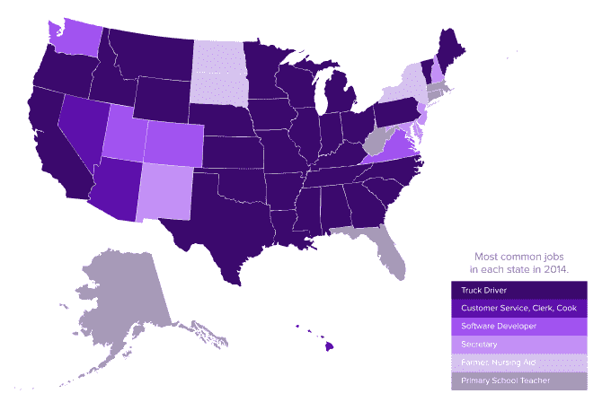
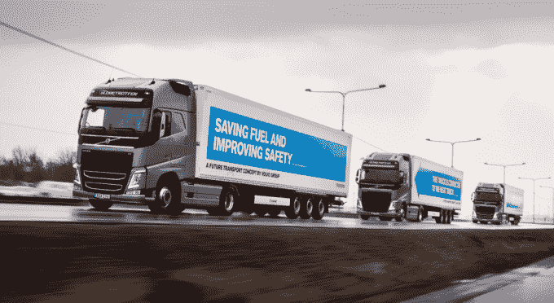

# 卡车运输的现在和未来，我国破碎、低效的经济支柱 

> 原文：<https://web.archive.org/web/https://techcrunch.com/2016/11/02/the-present-and-future-of-trucking-our-countrys-broken-inefficient-economic-backbone/>

[Jake Medwell](https://web.archive.org/web/20221209072354/https://www.linkedin.com/in/jakemedwell)

是的创始合伙人

[8VC](https://web.archive.org/web/20221209072354/http://8vc.com/)

总部位于旧金山的风险投资公司。

卡车运输业是巨大而重要的。它仍然是我们运输货物的主要方式，并且影响着几乎所有美国人的生活。

卡车运输是电子商务和个人对个人运输的实体支柱。仅在美国，去年陆路物流的支出就超过了 7000 亿美元。其中至少有 6000 亿美元是 FTL(满载)，大约一半是私人承运人，一半是代理货运。

市场的其余部分由 490 亿美元的“包裹”运输、350 亿美元的 LTL(零担)运输和 280 亿美元的航空运输组成，这使得卡车运输成为美国最大的单一行业之一。根据最近一次美国人口普查，卡车司机是美国最普遍的工作。下图概述了 2014 年各州最常见的工作。

**该行业分为三个主要角色。理解它们将有助于突出低效率和机会:**

托运人(需求):这些公司需要转移他们的产品——从小制造商一直到像耐克、诺德斯特龙、拉尔夫等大品牌。制造业、批发业和零售业总共有 170 万家企业。仅在美国，他们每年就需要 4 亿次 8 级运输(18 轮卡车/拖车)。

**承运人(供应):**这些是车队和独立的卡车司机。美国 250 万辆 8 级卡车有 300 万名司机。这听起来像是司机过剩，但实际上是司机短缺，因为卡车需要几乎全天候运行才能满足需求。这种短缺在一定程度上是因为年轻一代发现卡车司机的工作不如婴儿潮一代有吸引力。大多数司机和卡车都与美国 532，000 家运输公司之一有联系。

这种短缺在一定程度上是因为年轻一代不像婴儿潮时期出生的人那样觉得卡车运输工作有吸引力。大多数司机和卡车都与美国 532，000 家运输公司之一有联系。

然而，承运商市场极其分散:90%的承运商车队中的卡车数量少于 6 辆，50%的承运商是所有者/经营者。

**经纪人**:这个国家大约有 13000 家货运经纪人，他们在托运人和承运人之间充当中介。由于航运和运输业的分散，经纪人保持了他们的成功。他们充当供应和需求之间的中介，以确保产品在需要时移动，并将正确的驱动程序分配给正确的负载。经纪人通常会从每笔交易中抽取 15-20%的佣金(超过 300 美元)，通过端到端的预订和管理，经纪人每年的总收入为 1500 亿美元。

这种管理涉及到很多因素，几乎都涉及到人与人之间的互动。货运经纪是卡车运输行业最分散的部分，前 20 名经纪人占总收入不到 4%。

由于司机经常需要等待数周才能收到工作报酬和大部分生活工资，经纪人经常参与“保理”，即他们将当场支付司机额外 3-5%的工资。这种剥削行为被称为“快速支付”，对卡车司机非常不利。

*注意:一些大的托运人雇佣他们自己的私人船队，但是仍然使用经纪人/承运人来填补空白。*

托运人、经纪人和承运人都苦于极度缺乏现代技术。整个行业都运行在 15 年以上的陈旧软件上，几乎没有数据被捕获，并且没有一个软件系统可以相互通信。

三大势力沟通的主要方式是通过人际交往。毫不奇怪，67%的托运人根本不使用任何软件(他们仍然依赖纸质记录)。

在这种中世纪的低效率状态下，航空公司受害最深。如果他们的公司被另一家承运商抢走了当地的运输订单(28%的私人车队卡车是空载行驶的)，司机们经常无所事事，等待几个小时的装货，甚至空载行驶。有企业家围绕优化零担(零担)空间建立业务，但零担市场以其 350 亿美元的支出代表了不到 5%的行业。

他们还面临着早期的收养问题；例如，Cargomatic 最近[解雇了 50%的](https://web.archive.org/web/20221209072354/http://www.businessinsider.com/cargomatic-layoffs-2016-4)员工。

经纪人看到了最多的创新，但它仍然只是对传统软件的一点点改进。几个小时仍然浪费在等待报价和预订卡车上。找到司机的唯一方法仍然是给他们打电话询问，这也使得过滤质量变得非常困难，并导致许多欺诈行为。一个普通的经纪人每天预订 3-4 批货。

这种手动过程不仅浪费时间，而且对于托运人和承运人来说，价格和路线都不是最优的。已经有一些公司，如 Coyote Logistics，开发了内部解决方案来“优化”他们的公司。

[Coyote 去年以 18 亿美元的价格卖给了 UPS](https://web.archive.org/web/20221209072354/http://www.wsj.com/articles/how-coyote-logistics-went-from-startup-to-1-8-billion-ups-takeover-target-in-under-a-decade-1438367463) ，唯一的竞争优势是他们运行的软件稍微好一点(想想 UX/UI 的改进)。这使他们能够吸引最优秀的人才，并在经纪公司中建立起一支占主导地位的销售队伍。作为我们的[智能企业论文](https://web.archive.org/web/20221209072354/https://medium.com/8vc-news/the-smart-enterprise-wave-d6c8662297f5#.sudcx1h0z)的一部分，我们看到物流经纪公司集成了软件，取代了高达 90%的人工操作的时间密集型流程，同时减少了卡车运输操作的等待时间。

幸运的是，技术社区已经注意到了这个领域的巨大机会。自 2013 年以来，投入该领域的风险资本增加了 90%，总额超过 4 亿美元(仅 2015 年就达 7100 万美元)。

各公司一直专注于优化该行业的特定垂直行业——托运人、承运人和经纪人。一旦在各自的领域中出现了赢家，他们最终将寻求拥有水平软件层的圣杯，该软件层促进整个行业的通信(甚至与仓库软件接口)。

我们见过一些团队，他们正在组建公司，做从资产跟踪到电子文档管理的一切事情；运输管理和优化，以分析经纪人和托运人；跟踪和车队管理(GPS 硬件和软件)到信息传递，当然还有支付。

这将是非常有趣的，看看这些公司是否联合起来，共享数据，以改善整个行业；或者拼个你死我活，成为第一个各方统一的软件。幸运的是，在如此巨大的市场中，可能会有许多大赢家。

创业公司应该专注于打造捕捉大型数据集、具有强大网络效应的产品。如果他们这样做，并与领先的行业参与者合作，他们可以更快地大规模采用。

想想生态系统中每个托运人、司机和经纪人接触到多少人！最初的几笔交易将是最难达成的，但如果定位正确，可以带来巨大的增长。众所周知，这个行业是古老、乏味且难以渗透的，所以最初的产品能够与当前的软件相一致以使采用无摩擦是很关键的。

*注:你已经看到排队了，需要 v2v 沟通。第一辆^(第一辆)卡车省油 2%，第二辆^(第五辆)卡车省油 12%，第三辆^(第七辆)卡车省油 9%。*

如果我们坚持不懈地创新，这个行业将在 10 年内迎头赶上。高度分散的陆路物流市场最终将围绕核心软件服务具体化，这些服务统一了运输过程中的离散元素。我们预计卡车运输行业将出现联合大企业，横向整合小公司的现状，纵向整合经纪和运输服务。

经纪公司将几乎完全被软件取代，并与运输商的 TMS 和谐地同步。将不再有装载板、纸质文档或空路线。去年浪费在闲置卡车上的 260 亿美元可以推动更多的发动机效率研发。卡车运输将变成半自动的([一队半自动卡车实际上刚刚驶过欧洲](https://web.archive.org/web/20221209072354/http://www.gizmag.com/eu-truck-platooning-challenge-success/42714/))。此外，优步最近收购了奥托，以开发其自动驾驶汽车项目。总的来说，随着物流行业变得更快、更便宜、更精简，它的定位是削减成本。