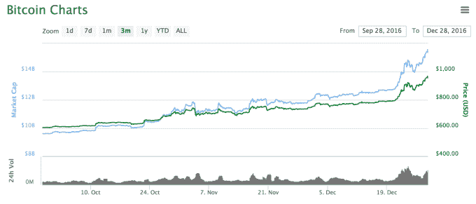

# 比特币的价格正朝着 1000 美元的三年高点攀升

> 原文：<https://web.archive.org/web/https://techcrunch.com/2016/12/28/the-price-of-bitcoin-is-creeping-back-toward-its-3-year-high-of-1000/>

# 比特币的价格正朝着 1000 美元的三年高点攀升

你是否感觉只有在比特币价格突然飙升或下跌时才会听说它？我们也是！

这次是暴涨。比特币上个月上涨了约 30%，过去 3 个月上涨了约 50%。目前的价格徘徊在 950 美元左右。上一次交易价格如此接近 1000 美元是在 2014 年 1 月，当时[价格触及 1023 美元](https://web.archive.org/web/20221204100052/http://www.coindesk.com/price-bitcoin-150-last-week/)——就在与巨量 Mt. Gox 相关的崩盘之前。

但这种价格上涨似乎不是比特币常见的疯狂快速波动。正如你在上面看到的——50%的增长相当稳定，在圣诞节前后有所加快。

不像最近的波动(至少松散地)与像[减半](https://web.archive.org/web/20221204100052/https://beta.techcrunch.com/2016/07/09/the-reward-for-mining-bitcoin-was-just-cut-in-half/)或[比特币核心更新](https://web.archive.org/web/20221204100052/https://beta.techcrunch.com/2016/06/16/bitcoin-is-being-bitcoin-and-spiking-30-this-week-and-200-this-year/)这样的事件联系在一起，这次反弹似乎不是由任何特别的事情引起的。当然，现在世界上存在一些普遍的经济不确定性，但股票市场表现良好，而[黄金甚至下跌了](https://web.archive.org/web/20221204100052/http://goldprice.org/)，这种商品至少通常与比特币平行交易。

那么是什么引起的呢？没有人确切知道。也许这是比特币在圣诞节前后常见的炒作。也许这是减半后的延迟自然反应——或者这只是比特币表现好于人们想象的一个迹象。

一个轶事迹象表明，比特币作为一种消费产品可能比人们想象的更有影响力——Airbnb 首席执行官布莱恩·切斯基(Brian Chesky)征求了 2017 年的产品建议，接受比特币支付是该公司最受欢迎的功能。

看看 2017 年比特币会有什么变化将会很有趣。虽然普遍的共识是比特币作为消费者支付平台已经寿终正寝(取而代之的是像定制区块链这样以企业为中心的解决方案)，但情况可能不再是这样了。

不管怎样，记住比特币做的和比特币一样，永远不要抱着赚快钱的希望买卖比特币——因为你可能会失去它。