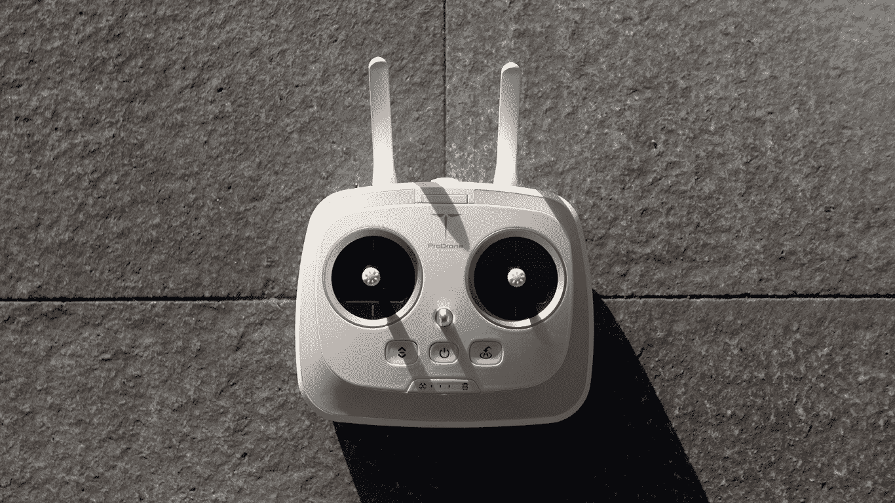
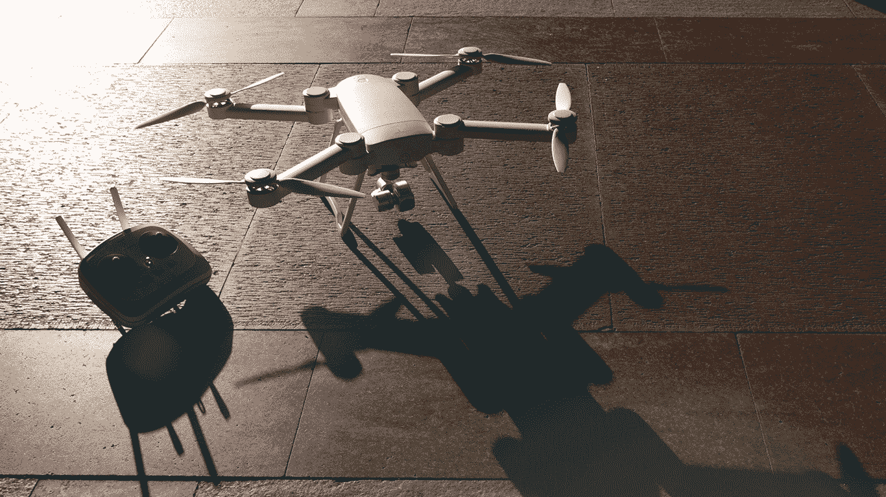
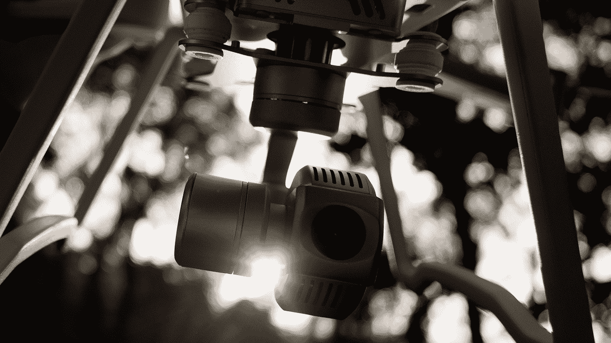
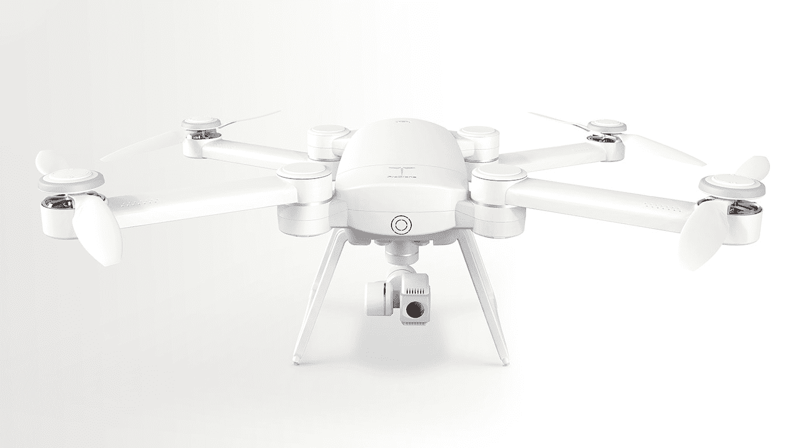

# 回顾:prod rone BYRD 

> 原文：<https://web.archive.org/web/https://techcrunch.com/2016/03/27/the-prodrone-byrd/>

公众对无人机的品味越来越成熟。该行业发展如此之快，以至于即使不是每隔几个月，也是每年都会发布主要的新功能。

如果一家公司想向越来越精明的入门级四轴飞行器领域销售，它需要制造一种能够做的不仅仅是简单飞行的无人机。为了脱颖而出，由 [ProDrone](https://web.archive.org/web/20221025223510/http://www.prodrone-tech.com/index.php?lang=en) 制造的新型 [BYRD](https://web.archive.org/web/20221025223510/http://www.prodrone-tech.com/pro.php?lang=en) 四轴飞行器依靠一个不寻常的噱头:可折叠性。四轴飞行器的手臂和腿可以折叠到身体上，极大地减小了体积，使其可以放入背包中。

该无人机的标准版本有 25 分钟的飞行时间，还过得去的 1080p 摄像头和 750 美元的价格标签，使其符合流行的入门级爱好无人机，如 DJI 幻影 3 标准。伯德的升级高级和高级型号增加了一些高级功能，如 4K 相机和“跟我来”模式，无人机可以自动跟随用户。

当我在旧金山驾驶无人机飞行了几个星期后，它很快赢得了我的信任。很明显，这不仅仅是一个可折叠的噱头。这是一架价格合理的无人机，轻松涵盖所有基本功能。

## 基础

*   向下折叠至 273 × 223 × 107 毫米
*   重 1890 克
*   25 分钟的飞行时间
*   包含 1080p、1600 万像素摄像头
*   2.4G 无线高清视频下行
*   传输距离高达 0.62 英里

## 设置

我没有汽车，所以在湾区驾驶无人机不可避免地需要乘坐公共交通工具。你还没有树敌，直到你在高峰时间乘公共汽车，一个巨大的硬壳滚轴夹在你的膝盖和你旁边的人之间。

所以当我可以的时候，我喜欢把无人机放在我的背包里，这对它们来说很难。我曾折断过螺旋桨，也曾打碎过一架特别脆弱的四轴飞行器的面板。但这符合业余爱好者行业与探险和极限运动日益增长的联系。如果我要去那个僻静的海滩，拍摄自己冲浪，无人机最好尽可能便携。

ProDrone 是第一批真正认识到这一点的公司之一。伯德的手臂和螺旋桨紧紧地折叠在它的身体上，将其长度从 24.5 英寸减少到 10.7 英寸。它的折叠宽度只有 8.8 英寸。简而言之，它可以从超大的无人机折叠成比 XBox 小一点的东西。它的摄像机和万向架必须拆卸下来，存放在一个单独的箱子里。无人机、相机和控制器都可以装进我的顶装背包，还有些多余的空间。

一旦你到达你的飞行地点，就该集合所有东西了。你展开每个臂和推进器到适当的位置，这足以将它们锁定到位。伯德的两条腿也折了出来。一个品牌的 LiPo 电池滑入无人机顶部。

> 如果我要去那个僻静的海滩，拍摄自己冲浪，无人机最好尽可能便携。

最难组装的部分是插入伯德腹部的摄像机和相连的万向架。覆盖在相机镜头上的透明塑料盒很难拆卸和重新安装。这部分通常比我完成无人机其余部分的时间加起来还要长。但是在几个星期的使用过程中，我设法将我的设置和存放时间减少到了两分钟以内。

一旦你将无人机连接到它的控制器上，就是无人机舞蹈的时候了:举起无人机，转一圈。当你在公园里有观众时，这部分有点尴尬。如果 BYRD 成功校准了它的罗盘，那么它的灯将会变成绿色。除了几次，我都可以用 GPS 锁定。重启无人机足以解决这个问题。

伯德的控制器具有快捷按钮，让你命令无人机自主着陆或起飞。

## 应用程序和控制器

下一步是通过 Wi-Fi 将无人机连接到 ProDrone ProFlight 应用程序，该应用程序可以下载到 [Android](https://web.archive.org/web/20221025223510/https://play.google.com/store/apps/details?id=com.guide.uav&hl=en) 和 [iOS](https://web.archive.org/web/20221025223510/https://itunes.apple.com/us/app/proflight/id1051197380?mt=8) 设备。ProDrone 建议使用平板电脑，所以我带了一台 Nexus 9。BYRD 有一个漂亮的设备支架，连接到控制器的顶部，可以调整以容纳任何尺寸的屏幕。

该应用的主飞行屏幕允许你做除了驾驶四轴飞行器之外的任何事情。有按钮可以命令无人机自己起飞或降落，也可以输入自主飞行路径。摄像机画面的实时流占据了屏幕的大部分。因此，需要注意的最重要的按钮是照片和视频图标。存储在无人机 micro SD 卡上的照片和视频可以在 ProFlight 应用程序的另一个页面上查看。

总的来说，我喜欢应用程序中按钮的位置。我发现自己几乎每次都在使用自动返回主页按钮。起飞一直是无人机飞行中最令人兴奋的部分之一，所以我把它留给了自己。

> 如果你曾经使用第一人称视角的耳机驾驶过无人机，你就会知道与在地面上从你的视角驾驶无人机相比，这种感觉有多自然。

除了我的第一次飞行之外，摄像机的直播就是这样——一个直播。一般来说，我用 GoPro 驾驶四轴飞行器，它的应用程序有明显的滞后。它更像是一个预览；用它来设置你的镜头，但不要依赖它来获得准确的视角。使用 ProFlight 应用程序，我发现自己在定期修正飞行轨迹。

如果你曾经使用第一人称视角的耳机驾驶过无人机，你就会知道与在地面上从你的视角驾驶无人机相比，这种感觉有多自然。如果您正在与电影摄影师合作，或者只是想要共享视图，您也可以跨多个设备访问流。

虽然 ProFlight 应用程序很有用，但我还是很高兴地回到了 BYRD 的控制器上，了解它最基本的功能。无人机配备了标准的四轴飞行器控制器:一根操纵杆使伯德上升、下降或转向，而另一根操纵杆使它向前、向后或向侧面飞行。控制器还有一个开关，可以让你在几种飞行模式之间进行选择。你可以依靠四轴飞行器的定位智能飞行，或者完全手动飞行，这对灵活性更好。

该控制器有一些预设和可编程快捷按钮形式的不错的附加功能。就像应用程序一样，有自主起飞和降落的按钮，还有拍照或开始拍摄的按钮。一旦我通过触摸学会了控制器，我就更喜欢这些按钮而不是应用程序。

四轴飞行器的全球定位系统和视觉定位系统即使在大风天也很有效，所以你可以专注于电影摄影，而不是棘手的驾驶。

## 飞行

当你驾驶专注摄影的无人机时，信任是关键。如果风吹着你的 GPS 锁定的无人机穿过田野，那么你的飞行将更多地是控制四轴飞行器，而不是获得完美的视频。驾驶不可靠的无人机是有压力的，而不是快乐的。

谢天谢地，伯德属于可靠的一类。它将 GPS 和视觉定位结合起来，当飞行员放开控制时，它可以锁定自己的位置。

> 像任何摄影无人机一样，伯德不会赢得任何敏捷奖。

我喜欢在旧金山的 Crissy Field 测试这一点——一个完全开放的长绿地，一直延伸到海湾。它坐落在金门大桥脚下，这是一个出了名的多风地区。当风超过它们的小螺旋桨时，较小的无人机往往会上下弹跳。

一阵特别强劲的风把伯德街吹到了一边，但除此之外，它还留在原地。它还喜欢在不到 10 英尺的高度盘旋时，如果风力增强，它就会失去高度，但在此之上，它不会有问题。我的舒适度越来越高，可以在场地上来回巡游，拍摄一些金门大桥和远处旧金山市区的全景照片。

像任何摄影无人机一样，伯德不会赢得任何敏捷奖。但它有反应。如果你摇晃操纵杆，四轴飞行器也会随之摇晃。飞行员需要用手指发展一些技巧来获得流畅的镜头。

与市场上的其他选择相比，伯德标准的 1080p 相机感觉黯淡无光，但你可以随时将其换成 GoPro 或 DSLR。

## 照相机

在我们的手机有 4K 视频的时代，ProDrone BYRD 的 1080p，1600 万像素相机值得一个“哼”该无人机的高级版本配有 4K 相机，与任何高端消费无人机一致。不过只要不需要超高清视频，标准的伯德 1080p 视频应该没问题。

如果你有兴趣升级伯德标准的相机，它包括万向节是可拆卸和可更换的。该公司还为 GoPros 制造了一个万向节，并将很快为 DSLR 和无反光镜相机提供附件。我不相信自己作为一名飞行员足以将我的 DSLR 绑在无人机的底部，但对于严肃的空中摄影师来说，这将是一个受欢迎的功能。要知道它会把飞行时间减少到 12-15 分钟。

与 GoPro 相比，内置相机的一个好处是，它的镜头在无人机上看起来相当不错。GoPros 往往会产生沉闷、沉闷的视频，需要一些后期处理。伯德的镜头看起来明亮，曝光良好。我从未接触过 ProFlight 应用程序上的相机设置。

但有时当相机适应不同的光线条件时，它会变得有点过于急切。当我在 Crissy Field 沿着太阳的大致方向驾驶无人机时，它产生了一种闪烁的效果。树木产生的斑驳阳光导致相机迅速上下提升曝光水平，产生无法使用的视频。我不得不通过在更高的高度飞行来进行调整，在那里无人机遇到了直射的阳光，而不是透过树木过滤的光线。

## 结果

很难挑一款无人机买。就在几年前，DJI 的 Phantom 系列是唯一一种为初学者提供全套服务的无人机:可靠性、相对较低的价格和像样的应用程序。今天，几乎每一架进入市场的无人机都有那些东西。

因此，问题转向您的预期应用。太好了，你想拍照。但是你想不用控制器就能把你的无人机扔到空中飞行吗？你想要一个小翼展还是一个大翼展？当你滑雪到那个史诗般的峡谷边缘时，你需要一些可以塞进背包的东西吗？

如果最后一个问题是肯定的，那么伯德可能是正确的选择。我飞行的标准版本结合了一个可通过的相机和信任激励的飞行定位。在这种口径的无人机上很少看到可折叠的机身，所以如果这是你的第一要务，就选择伯德。高级和高级型号的“跟我来”模式将使它们对极限和休闲运动员更具吸引力。

然而，四轴飞行器创新周期仍在转向。自去年年底 ProDrone 宣布 BYRD 以来，DJI 展示了 [Phantom 4](https://web.archive.org/web/20221025223510/http://www.dji.com/product/phantom-4) :一款价值 1400 美元的四轴飞行器，可以自动避开障碍物。这可能意味着车祸和令人尴尬的失误会大大减少。这是一个新的酒吧，在几年内，它不会令人惊讶地成为每一个爱好四轴飞行器的标准。

这并不意味着您应该忽略 ProDrone BYRD 标准。在目前的无人机领域，这是一个很好的选择，特别是在 750 美元的价位。只是当你朋友明年买的无人机可以绕着它转圈的时候，不要震惊。