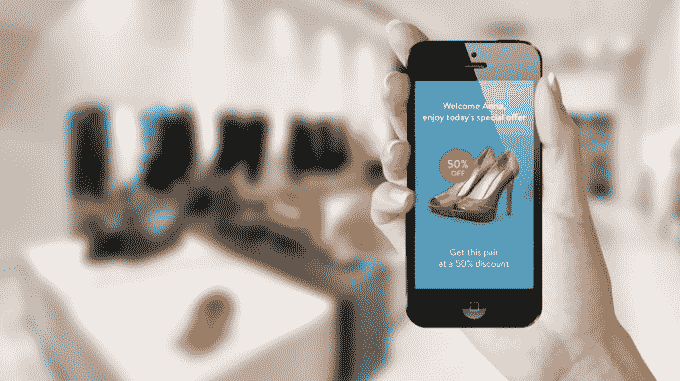

# 智能手机上增强现实的产品设计挑战 

> 原文：<https://web.archive.org/web/https://techcrunch.com/2017/09/02/the-product-design-challenges-of-ar-on-smartphones/>

随着 ARKit 的推出，我们将在未来 12 个月内看到大约 5 亿部 iPhones 可以使用增强现实应用，在接下来的 12 个月内至少会增加两倍——因为我们现在可以包括来自谷歌的 ARCore 支持设备的数量。

马特·米斯涅克斯撰稿人

马特·米斯尼克是首席执行官和联合创始人

[6D.ai](https://web.archive.org/web/20230122153306/https://www.6d.ai/)

.

More posts by this contributor

这吸引了更广泛的开发人员社区来参与 AR，随着开发人员发现 [AR 是一种全新的媒介](https://web.archive.org/web/20230122153306/https://www.youtube.com/watch?v=EvyfHuKZGXU)，我们将会看到很多很多的实验。事实上，它甚至可以更深刻，因为纵观历史，我们一直通过一个矩形来消费视觉内容(从石碑、电影、智能手机等)。)而 AR 是第一种完全无束缚的介质。

这是一种新的媒介，就像网络不同于印刷一样，不同的是种类，而不是规模。与大多数第一批商业网站是“宣传册件”一样，现有的印刷宣传册被上传到网站上，第一批 AR 应用程序将是复制到 AR 的移动应用程序。它们会像宣传册一样可怕，尽管它们会很新奇！

新媒体中的初始产品是从先前媒体复制并强加到新媒体中的成功产品。人们更容易想象和适应仍在发展的新媒体的心理模型。我经常听说 ar 将是很棒的“看到我的优步接近”(尽管 2D 地图在这方面做得很好)。获胜的 AR 应用程序将利用新媒体的新功能，做一些在旧媒体中甚至不可能做的事情。

21 世纪初，当我在 Openwave(发明了手机网络浏览器)工作时，我们经常谈论“移动原生”体验，与“小屏幕网站”截然不同。2010 年，Fred Wilson 在他被广泛引用的移动优先的文章中对这个概念的描述比我好得多。希望这篇文章会是他的一个回声，但是对于 AR。

苹果最近也公布了一些 ARKit 的[人机界面指南，看起来很棒。我在 Google for ARCore 上找不到类似的东西，但是如果有人能给我指出一个，我会很乐意在这里添加一个链接。这篇文章根据我们在现实世界中的学习，对相同类型的话题进行了更详细的讨论。](https://web.archive.org/web/20230122153306/https://developer.apple.com/ios/human-interface-guidelines/technologies/augmented-reality/)

## 那么是什么让一个 app 成为“AR 原生”呢？

我将深入探讨智能手机 AR 的一系列“特殊”因素，就像你用 ARKit 或 ARCore 构建的一样。我特别避免头戴显示器的 AR 应用程序，因为 HMD 为智能手机上不可能的产品打开了一个全新的可能性范围(免提应用程序，更长的会话时间和初学者更深的沉浸潜力)。

因此，当你考虑你的新 ARKit 应用程序的概念时，这里有一个没有特定顺序的列表。我相信还有更多的有待发现；我的朋友 Helen Papagiannis 的书 [Augmented Human](https://web.archive.org/web/20230122153306/https://www.augmentedhuman.co/) 比我在这里写的更加广泛和深入，但是这个列表*现在应该*相当全面，考虑到它是 50 多年综合 AR 智能手机应用开发经验的结果。

当我们在一个 AR 应用程序上被推销给 Super Ventures 时(这几乎是经常发生的)，很容易判断出开发者是否还没有建立一个 AR 原生产品，因为一个简单的问题是“为什么在 AR 中这样做，常规应用程序对用户来说不是更好吗？”往往足以引起对整个前提的反思。

## 在电话之外思考

一个最大的思想飞跃是，作为一名设计师/开发者，你现在需要开始思考手机之外的事情。你还需要重新思考用户如何使用智能设备的基本原则。现实世界的结构，手机可能做出的动作类型，附近的其他人，附近的物体或声音的类型，现在都在 AR 产品设计中发挥作用。一切都以 3D 形式发生(即使你的内容只是 2D)。

设计在现实世界中“生活”在手机之外的内容是一个很大的概念飞跃，尽管用户只能通过智能手机眼镜看到它并与之互动。(图片来源:[迫击炮工作室](https://web.archive.org/web/20230122153306/http://www.mortarstudios.com.au/))

在应用内*发生的各种交互/过渡/动画/更新只是要考虑的一个环境，因为“应用外”可能还有很多要考虑的。一旦你理解了这一点，剩下的就变得容易掌握了。*

## 手腕与头部(与躯干)的生物力学

我们将手机握在手中的事实是一个巨大的设计限制和机会。我们的手腕和手臂能够以我们的头部无法做到的方式运动。一个可以用一只手使用的应用程序可以允许需要两只手的应用程序无法实现的运动(因为你必须旋转你的躯干，加上在不行走的情况下只能进行非常有限的平移)。

你不能把你的头沿着桌子滑动来测量尺寸！这种类型的用例应该总是对智能手机 AR 有意义。

这意味着 AR 应用程序不需要你一直看着显示屏(因为你的手腕可能会离开你的眼睛)，也可以很好地工作。两个很好的例子是“卷尺”应用程序和 AR 应用程序，让你三维扫描一个小物体。

一个实时的快速抽动射击游戏可能很难与移动 AR 一起工作，就好像你正在快速移动手机一样(如果不是，那为什么还要在 AR 中进行)，那么可能很难看到发生了什么。

## 为什么把手机从口袋里拿出来？

AR 开发人员经常忘记，当我们四处走动时，我们通常会将手机放在口袋/包里。当用户点击我们的应用程序图标时，我们对应用程序“用户体验”的想象就开始了(甚至当你在 AR 视图中通过摄像头观看时)。它应该更早开始，因为 AR 的一大独特优势是它可以提供我们位置周围的实时背景。如果用户启动你的应用晚了 30 秒，可能没有任何好处，因为他们已经走过了应用需要的位置。脸书或短信通知没有区分位置的问题。

我现在该怎么拿出手机呢？这对智能手机 AR(以及在此之前的信标)来说是一个巨大的设计问题。(图片:[估计](https://web.archive.org/web/20230122153306/https://estimote.com/)

因此，当用户处于使用你的应用程序的最佳位置时，让他们拿出手机是一个非常现实和困难的问题。通知可以通过传统的推送消息发出，或者用户可能会在现实世界中看到他们想要更多信息的东西，从而想到使用该应用程序，他们已经知道你的应用程序可以在这方面提供帮助(例如，Google Word Lens 可以翻译菜单上的语言)。

否则，你的应用程序只需要在任何地方都能工作*，要么通过使用非结构化内容，要么能够挖掘非常非常常见的内容。这个问题是所有“AR 涂鸦”类型的应用程序的头号挑战，这些应用程序让人们留下笔记，让其他人找到。用户几乎不可能意识到有内容要找。仅供参考——这只是所有“灯塔”硬件公司都存在的同一问题的另一个版本，让购物者拿出手机来发现有益的内容。*

 *当 AR 应用程序开发人员考虑“竞争”时，这一挑战也以不同的方式表现出来。由于 AR 如此开放，很容易认为获胜的机会就在那里。然而，AR 总是在和我们一天中的分分秒秒竞争。我们已经花时间做了*的事情，*那么我的增强现实应用将如何与之竞争。

## AR 作为一项功能，例如 Yelp with Monocle，Google Lens 图像搜索

当我们开始考虑 ARKit 应用程序时，我们通常会立即想到在现实世界中以“AR 模式”进行的整个应用程序体验。这根本没有意义，因为许多操作会像普通智能手机应用程序一样工作得更好，例如输入密码。事实上，2D 地图通常是显示位置数据的更好方式，因为用户可以放大/缩小并拥有 360 度的视图。认真考虑应用程序的哪些部分天生适合 AR，并考虑建立一个混合应用程序，其中 AR 模式是一个功能。作为一个例子，Yelp 用他们的单片眼镜功能做到了这一点。

进入“AR 模式”是 Yelp 应用(Monocle)的一个功能，而不是应用的目的。这里有智慧。

## 与世界互动

在最简单的层面上，原生 AR 应用的关键在于它能够在数字内容和物理世界(或物理人)之间实现一定程度的交互。如果没有数字/物理交互，那么应该是正规的 app。更重要的是，由于智能手机应用是我们的“默认”UX，那么你的增强现实应用应该只存在于它做了一些只能在增强现实中完成的事情。与世界的互动有三种主要方式:

**3D 几何:**这意味着数字内容可以被现实世界的结构遮挡，并对现实世界的结构做出物理反应。这方面有很多很好的探戈演示，我们的 Dekko r/c 从物理坡道上跳下来，桌子下面的 Magic Leap 小机器人都是例子。

物理空间的结构成为应用程序的关键元素。

**其他人分享你的观点和物理空间:**如果你的应用程序需要其他人在你附近才能给你带来好处，那么它可能是 AR-native。很好的例子是建筑师在咖啡桌上向客户展示一个 3D 模型，或者星球大战全息记录。

能够在同一物理空间与朋友或同事“分享幻觉”是 AR 实现的一个伟大的自然用途。

**控制器动作:**这意味着内容可以是静态的，但你可以移动手机，或者手机可以充当“控制器”，就像 Wii 一样。在我看来，这只是一个边缘。如果内容只是放在桌面上，你可以通过移动手机从不同的角度观看内容，那么我个人不认为这是 AR-native，因为唯一的好处是新奇的价值。使用缩放等功能，智能手机应用可能会得到更好的使用。

有些人认为，用户通过四处移动获得的物理尺度感使其变得很自然……你需要问的问题是:除了新奇的价值，这种交互还有什么好处吗？一种以本地方式使用控制器(电话)的方式类似于 Wii 控制器，其中控制器的特定移动导致内容中的动作。一个例子是一个虚拟气球悬停在桌子上，你可以通过物理地推动气球上的控制器来“推动”它。

想想你的用例*是否需要*这些类型的交互来给用户带来你想要的好处。如果没有，那么接受这是一个新奇的事物(本身不是一件坏事，只是将重用的期望适当地设置在零左右)或者构建一个常规的应用程序。

## 地理位置重新激活了稀缺性

早在 2011 年，在我的超级投资伙伴(Ori & Tom)组织的 AWE 活动上，[杰伦·拉尼尔](https://web.archive.org/web/20230122153306/https://vimeo.com/23934526)发表了一个演讲，他提出了一个我多年来听到的最有趣的想法。正如互联网“打破”了稀缺性的概念(也就是说，数字产品很容易被无限复制，不管我在哪里工作，等等。)，那么 AR 就有能力重新启用稀缺性。许多许多 AR 体验将与你体验的地点联系在一起。即使这种体验可以在不同的地方重现，在为其设计的地方，它应该永远是*最好的*。这就相当于现场音乐会和 MP3 的数字版。

这对数字业务的新商业模式有巨大的潜力，特别是当你开始混合区块链和分散业务的潜力时。特别是创意企业可能会从中受益，因为它们受到的数字化干扰最大，至少在音乐行业，现场活动产生的收入最多。

Pokémon GO 开始利用这一概念，推出了“突袭”功能。例如，在日本，一个神奇宝贝 GO 突袭成立了——这是世界上唯一一个你可以获得最有价值的神奇宝贝 Mewtoo 的地点和时间。

另一个例子是“AR MMO”，你必须到非洲去拜访一个特定的铁匠。我预计一些非常有趣的公司将围绕数字稀缺的再创造而建立。

## 不要被你的(真正好的)想法所诱惑

AR 很有诱惑力。你想得越多，你就会意识到它会变得越大，你就会有越多全新的伟大想法。我们经常看到初创公司向我们推销一个伟大的想法:他们已经找到了一个需要解决的问题，它可以真正成为一个巨大的平台——下一个谷歌等。问题是技术或 UX 可能还不支持它(甚至在未来几年内)。创业者相信这个想法，想要开始创业；可悲的是，市场或技术不会在他们用完 18 个月的跑道之前到来。

把你相信的好主意束之高阁是非常困难的。但是你需要，除非你知道一个事实(不仅仅是真的，真的相信)你的想法可以(a)像你想象的那样*今天*；以及(b)你认识真正会买它的人(例如，你可以给我他们的名字和电话号码)。

如果你做不到以上两点，你应该问问自己，你的伟大想法是不是蒙蔽了你对今天现实的认识。

作为一个脚注，一个“好”的想法不仅仅意味着一个酷的概念。意思是*必不可少。*它意味着一种体验，这种体验提供了一个令人信服的理由，可以在非增强现实空间中替换该功能的一个更高效、社会理解和自然的版本。

## 视野是一个很大的限制

智能手机 AR 应用程序和 HMD AR 应用程序之间的一个明显区别是视野。视野大的 HMD(到达时)会有很身临其境的感觉；然而，智能手机 AR 将始终面临两个挑战:

*   你只有一个进入你的 AR 内容世界的小“窗口”(一面“魔镜”)。你的朋友有一个更小的窗口，如果他们也想看到你做什么。这可以通过良好的跟踪来[减轻一些](https://web.archive.org/web/20230122153306/http://onlinelibrary.wiley.com/doi/10.1002/cav.336/full)。
*   手机屏幕显示的是摄像头看到的，而不是你看到的。对于我们的眼睛来说，摄像机的方向、显示器的偏移和视野是不同的。如果你从眼球的中心画一条线到世界上，然后拿着相机正好在这条线上指向相同的方向，相机的视野接近你的眼睛，那么相机可能看起来有点透明，就像一块玻璃。在现实中，它从来没有，但人们并不介意，他们只是透过屏幕看，忽略屏幕上没有的东西。(顺便提一下:有一些研究[在调整视频馈送方面做得很好，看起来“清晰”得多，但这可能不会出现在大众市场的手机上。对于好奇的人来说，这是值得一看的，也许还有一些实验。)](https://web.archive.org/web/20230122153306/http://dl.acm.org/citation.cfm?id=2671027)

那么，当你透过一个小小的窗口看着你的眼睛不期望看到的内容时，有什么可以帮助你沉浸其中呢？

首先要接受的是，用户通常会暂停怀疑，接受 AR 体验是世界上的数字内容。

想想规模。如果你的内容很小，它可以完全适合智能手机玻璃和相机的视野，并避免在屏幕边缘剪裁。例如，真人大小的数码猫可能会比真人大小的霸王龙提供更好的体验。我们可以从虚拟现实中学到一些东西，玩比例反转可以创造一种沉浸感，感觉很神奇，例如一个生活在盆栽植物后面的小精灵。

如果你的内容要比你的视野大，那么考虑一些启示来帮助解决用户不能看到所有东西的问题。我们发现一个行之有效的想法是使用一些雾来覆盖数字场景——只有你正在看的东西才会清晰，而屏幕的边缘看起来模糊不清。这向用户暗示，无论如何，屏幕区域之外没有任何有趣的东西，但是如果他们想探索更大的区域，他们可以四处平移并驱散雾气。屏幕外的任何东西都应该有某种指示器来指示它的物理位置。用户不应该通过猜测来疯狂地搜索某个资产。

这种沉浸感在实践中很难实现。让你的产品超越一次性的新奇实验是很难的，这意味着重新思考 UX 的许多方面。当你从基础开始时，用户测试变得非常重要。在 AR 中，你必须随着时间的推移与相同的用户反复测试，才能摆脱新奇的偏见，获得真实的数据。从 YouTube 上看起来令人印象深刻的东西到实际使用起来感觉良好的东西，这是一个很大的飞跃。

## 接受你无法控制现场的事实

AR 应用程序与任何其他类型的软件之间的最大区别之一是，作为开发者，你无法控制用户在现实世界中决定启动你的应用程序的位置。你的桌面游戏可能需要一个 2×2 英尺的游戏区，但用户在公交车上打开应用程序，或者指向一个小桌子，或者一个覆盖着盘子和眼镜的桌子。这款应用实际上是不可玩的(或者你只是把它当作不是 AR 应用来使用)，你最终会有两个可行的选择，而第三个仍然遥遥无期。

首先，给用户关于在哪里使用应用程序的具体说明。期待他们去另一个房间，或者收拾桌子，或者只是等到他们回家。预计他们第一次在错误的地方使用它时会有糟糕的体验。不难想象这会对您的使用指标产生什么影响。解决这个问题的另一个方法是为一个非常具体的用例制作一个应用程序，这样用户就不会想到在它不工作的地方打开它。

另一个可行的方法是用“非结构化”的内容设计应用程序，即它可以在任何地方工作。我们最终在 Dekko 发现了这一点，在那里我们开始尝试构建一个具有结构化水平和难度的游戏，但最终得到了一个可以在任何地方行驶的玩具车。如果你正在考虑为 ARKit 开发一款游戏，我的建议是开发可以在任何地方玩的数字玩具(虚拟遥控车、虚拟滑板、虚拟球和棍子等)。

最后，第三个也是最好的解决方案，这是不可行的，因为它在技术上还不可行，这是事情的最终结果。对场景有一个 3D 理解，然后自动智能地将您的内容放置在场景中的现有内容的上下文中。这需要解决两个难题:实时三维场景重建(基本解决)和语义；和程序性内容布局工具。

我们距离为开发者解决所有这些问题还有几年的时间，所以你需要使用前面两种可行方法中的一种。

Moatboat 设计了他们的 AR 应用程序，让用户可以在任何地方放置内容，而不需要结构。这种“自由发挥”特别适合 AR，因为开发人员不知道物理场景可能包含什么对象。UX 在平坦的表面上和在脏乱的房间里一样好用，因为现在可以把谷仓或一些奶牛放在一堆要洗的衣服上面，让它们从“山上”掉下来也很有趣

好消息是，没有控制，并给予用户最大的代理是神奇的地方！这是媒体的决定性方面。[查理就这个话题做了一个很棒的演讲](https://web.archive.org/web/20230122153306/https://www.mindtheproduct.com/2017/07/charlie-sutton-designing-virtual-reality/)。

除上述内容外，我们还为您的应用程序提供了一个任意坐标系，该坐标系在此会话中是唯一的。你的 app 只知道它在这个坐标系内的相对位置；这个应用程序从 XYZ 0，0，0 开始。没有持久性，与“绝对坐标”(纬度/经度/高度)没有关联，也没有能力与他人分享你的“空间”。这肯定会在未来(12-18 个月)ARCore 和 ARKit 的更新中改变，有一些初创公司正在研究覆盖 API，但现在，你需要在产品设计中考虑这一点。

在我们的内容可以与世界互动之前，AR 设备需要能够捕捉或下载真实世界的数字模型，该模型与您正在看到的真实世界精确匹配。(来源:[罗兰·斯梅克](https://web.archive.org/web/20230122153306/http://smeenk.com/hololens-scanning-effect/))

## 我们如何自然地拿着手机

在移动 AR 的早期，我们乐观地认为人们会很高兴地在他们的视线范围内举起手机来获得 AR 应用的体验(我们称之为举手显示)。我们大大高估了人们改变行为的意愿。我们大大高估了如何接受其他人的这种行为(还记得 Glassholes 吗？).*你的应用不会改变这个社交契约。*你将需要你的应用程序基于人们已经持有手机的方式来工作:

*   举起手的时间非常短，大约和拍照的时间一样长。这意味着 AR 成为一种视觉上回答问题的方式，而不是一种追求长时间参与的方式。

如果你希望你的用户像这样拿着手机或平板电脑，那么你的应用最好只需要他们这样做一两秒钟。(图片:[圭迪戈](https://web.archive.org/web/20230122153306/http://blog.guidigo.com/blog/guidigo-presents-the-first-project-tango-app-capable-of-3d-indoor-geolocation/))

*   以 45 度角指向地面，就像我们大多数时候做的那样。这指向具有较小规模内容(例如 1 或 2 英尺高的资产)的应用，其中动作就发生在你面前。

这个位置更有可能让用户使用你的应用一段时间。不过请注意，真实世界的场景变得不那么有趣，也更受限制。

根据用户手持手机的方式，有多种方式可以使用手机传感器来切换模式，例如，当水平手持时，你的应用程序是一个常规的 2D 地图，但当它被举起时，会切换到 ar 模式并立即触发视觉搜索。早在 2012 年，诺基亚的 [City Lens](https://web.archive.org/web/20230122153306/https://www.youtube.com/watch?v=55Qdem9pJxY) 应用程序就很好地管理了这个用户界面。这些都是值得探索的好主意。

## 输入被玻璃分解

当你测试你的应用程序时，你会意识到当用户看到你的虚拟内容出现在现实世界中时，他们首先做的事情之一是伸手触摸手机，然后当他们不能触摸时，看起来很困惑！这是一个很好的迹象，表明你正在构建一些很酷的东西，但它显示了输入和交互受到一块玻璃的影响，这块玻璃实际上就在你的手中，而内容可能就在几英尺之外。

你实际上是在要求某人将他们对世界的直接 3D 理解抽象回智能手机屏幕上的 2D 手势。这增加了认知负荷，也打破了沉浸感。但是大的空间姿态或者依赖他人的存在同样会有问题。

找出什么样的 UI 启示对用户有意义，让他们选择“那边”的内容并与之交互，这可能是一个挑战。我们的 Dekko 遥控汽车通过让手机成为遥控控制器解决了这个问题，这在现实生活中有直接的模拟，所以对人们来说很有意义。对于我们的猴子，以及在我们与三星智能家居产品互动的三星，很难拿出直观的通用解决方案。

使用遥控汽车的设计概念意味着用户自然希望“控制器”是一个独立的手持物体，在远处控制汽车。它解决了用户只能触摸“玻璃”但需要影响桌子上一定距离外的物体的问题。

请注意，仅仅能够物理地“触摸”内容也不能解决问题。如果你有机会尝试 Meta HMD 或 Leap Motion，你会注意到触觉反馈的缺乏只是为用户创造了另一种游离。在我看来，在我们希望大规模市场日常使用 ar 之前，AR 的输入是真正需要解决的最大问题之一。

## 操纵真实世界的视频帧的机会(相对于透视显示器)

操纵视频馈送有助于使虚拟和真实看起来更加连贯，并提高 UX。这些场景中什么是真实的，什么是虚拟的？请注意，随着更多风格化的应用，这种区分变得更加困难。

智能手机 AR 与透明头盔显示器不同的一个特点是，用户看到的“真实世界”实际上是真实世界的视频馈送。这提供了操作视频源来改进你的应用程序的机会。 [Will Steptoe](https://web.archive.org/web/20230122153306/http://willsteptoe.com/) 在加入脸书之前的 2013 年做了一些很棒的研究，他在那里展示了通过巧妙地将现实世界的视频内容风格化，[更难区分虚拟和现实内容](https://web.archive.org/web/20230122153306/https://dl.dropboxusercontent.com/u/7049050/Papers/ISMAR14_steptoe.pdf)，从而增加了沉浸感。这是一个非常有趣的想法，可以以创新的方式应用于 ARKit 应用程序。

## 上下文切换的“应用”概念与原生 AR UI

智能手机增强现实应用，本质上是手机启动时进入的操作系统桌面，依赖于智能手机应用的隐喻来打开/关闭“应用”以切换上下文(例如，在我的消息应用和游戏之间切换。我可能不希望这两者都在一个应用程序中，并且该应用程序试图找出我真正想要做的事情)。你将不断地进入和退出 AR 视图(通过相机观看)，每次都在用户的驱动下切换上下文。

这真的简化了事情，因为你不必太担心动态上下文切换(例如，当我将手机指向一座建筑物时，我是否希望 AR 显示地址、Yelp 评论、Trulia 公寓价格、建筑历史、我的哪些朋友在里面？).这是一个诱人的想法，试图成为支持许多不同用例的保护伞应用程序(“我是一个平台！”)，但是理解用户想要什么并展示出来是一个非常具有挑战性的问题。(对于任何从这篇文章中学到东西的人来说，这可能太难了。)

## Skeumorphism 是好的

AR 是一个全新的媒介，用户根本不知道怎么用。有很多非常聪明的方法来设计交互，但是用户无法领会你的聪明之处。通过复制你正在数字化的“真实”的东西，用户会本能地理解如何使用你的应用。

在 Dekko，我们制作了这个令人惊奇的小猴子角色，人们很喜欢，但他们不知道如何处理桌子上的小猴子。当我们换到一辆看起来像遥控车的遥控车时，我们不用解释任何事情。在三星，我们在 AR 中实现了接听电话的原型。有很多很酷的方法可以做到这一点(例如，一只霍格沃茨猫头鹰可以带着信息飞过并降落在你面前)，但用户测试的最佳想法是复制你的 iPhone 手机应用程序的外观和感觉，用绿色圆圈回答，红色圆圈忽略，等等。

值得注意的是，它不会是 2D 式的——它很可能是一种新的 3D 符号语言，使用空间线索(阴影、阴影、透明度等)进化而来。)但不一定需要逼真地忠实于现实世界的物体。

当用户对整个体验感到陌生时，让您的数字对象看起来与用户已经知道如何使用的物理对象完全相同是一个好主意。

只有让从未使用过 AR 的用户测试你的应用，才能证明这一点。我保证你会震惊于为了避免解释要做什么，你需要多么简化和字面上的东西。

## 为不相信自己所见的用户提供启示

我们观察到的让我们难以接受的是，一直沉浸在 AR 中的用户往往不相信他们所看到的。他们无法相信内容实际上是“在 3D 世界中”而不是在屏幕上。

自由地使用启示和微妙的信号来显示与现实世界的联系将真正帮助用户理解正在发生的事情。我不能夸大至少一个投影的重要性，如果不是动态阴影和光源的话。将网格线或其他“描绘”世界的方式与你的交互内容分开，也能非常有效地帮助用户理解。

我们必须包括网格线，并对网格的边缘进行着色，以突出该应用程序理解深度和 3D，并隐藏其他部分，所有这些都是为了以一种微妙的方式向用户发出信号，表明该技术“在引擎盖下”正在发生什么。这有助于他们相信应用程序会以他们难以理解或相信的方式运行。

另一个困难但非常有效的启示是，虚拟对象对碰撞、遮挡、手机运动和控制输入的动画响应对于让对象看起来“真实”至关重要稳定跟踪(无漂移)只是第一步。研究在 AR 中“行走”的虚拟人物，你经常会发现他们的脚每走一步都会“滑动”一点，这感觉不对，会破坏临场感。就好像角色“撞到”一个物理结构，而没有像你预期的那样反应。

像与摄像机的眼神交流这样的暗示真的感觉很好。要做到这一点，很大一部分是选择合适的角色类型来放入你的 AR 场景中。你的角色越真实，用户对什么是“正确”的潜意识期望就越多与动画电影相比，恐怖谷对 AR 来说显然是一个更大的问题，因为我们周围都有真实世界的背景。我们发现，有意识地选择不“真实”的、更卡通或更幻想的角色，可以确保人们对他们在现实世界中的行为的预期不是预先设定的，动画中的缺陷也不那么令人不快。想想兔子罗杰，而不是极地特快。

启示强调的一个大问题是内容重叠和信息密度。大多数 AR 演示展示了一个布局愉快的空间，标签都整齐地分开且可读。正如展览设计师和建筑师所知，在 3D 空间中设计标签和标志，使其在移动时可读和可理解，这真的很难。

## 角色和资产设计

哈克设计的 Dekko 猴子真的和人们联系在一起，他们很喜欢它。甚至在今天(3-4 年后),仍然会有人问我这个问题。

当考虑在你的应用中使用哪些资产和角色时，我们发现了一些似乎正在行业中传播的非常可行的方法。早在 2010 年，Silka 就为我们的 Dekko monkey 做了大量的研究和用户测试。她发现“皮克斯成人版”是思考复杂、低数量模型的完美方式，这些模型不会试图穿越恐怖谷，但有些启示在现实世界中看起来很好。这种风格对女人和男人、孩子和成年人都适用，并且在全球范围内都适用。

她觉得数字版的 [KidRobot](https://web.archive.org/web/20230122153306/https://www.kidrobot.com/) 可收藏的乙烯基玩具非常完美，于是她联系了 KidRobot 的顶级设计师[哈克·吉](https://web.archive.org/web/20230122153306/https://www.huckgee.com/)，他设计了我们的猴子，并从此成为了一个很好的朋友(说真的，雇佣他来设计你的 AR 角色，他太棒了——联系我联系他)。

几年后，来自五芒星的娜塔莎·珍独立地为一个 Magic Leap 设计项目得出了几乎相同的结论，包括 KidRobot 的灵感。[这段视频](https://web.archive.org/web/20230122153306/https://www.rca.ac.uk/news-and-events/events/architecture-international-lecture-series-natasha-jen-pentagram/)讨论了她的想法(大约 30 分钟)。

ARCore 的最新演示显示了类似的风格，尤其是绿野仙踪中的角色。

## 那又怎样？

我希望分享这些经验可以减少几个产品迭代周期的学习，让用户参与的产品更快进入市场。近 10 年来，我一直在 YouTube 上观看伟大概念的演示，我想要的只是使用一些伟大的应用程序。有一个很大的差异和一个比许多人意识到的更大的鸿沟要跨越。

如果我可以用一个教训来结束这篇文章，那就是:让一位经验丰富的 AR、UX 或工业设计师担任高级职位，并对每一件小事进行用户测试、用户测试、用户测试。祝你好运！

**感谢……**

如果没有一些朋友的帮助，这篇文章是不可能发表的，他们对 ar UX 的理解比我好得多，并且已经致力于解决真实的 AR 产品 UX 问题至少五年了:

*   [Charlie Sutton](https://web.archive.org/web/20230122153306/https://medium.com/@CactusWool) 在三星领导我们 AR 团队的设计，之前在诺基亚领导一个团队设计 AR 产品(鲜为人知的事实是……诺基亚在 2000 年代末是 AR 领域的世界领导者，现在仍然拥有最丰富的 AR 专利组合之一)，现在在脸书工作。
*   [保罗·雷诺兹](https://web.archive.org/web/20230122153306/https://medium.com/@mugofpaul)正在打造[火炬](https://web.archive.org/web/20230122153306/http://torch3d.com/)让开发者和设计师创建原生 AR/VR 应用变得简单。Paul 之前在 Magic Leap 领导 SDK 团队，为 AR 找出应用和平台的交叉点。
*   马克·比林赫斯特是世界领先的增强现实研究人员之一，也是少数几个关于增强现实互动的行业传奇人物之一。马克已经研究这个领域超过 20 年了，他的工作几乎肯定会在你学习 AR/VR 的任何书籍或论文中被引用。马克目前在阿德莱德的[移情计算实验室](https://web.archive.org/web/20230122153306/http://arvrreview.com/about-us/)工作，之前在新西兰 HIT 实验室工作；他的大部分作品都发表在这些网站上。他也是我的好朋友，也是我在超级投资公司的合伙人之一。
*   杰弗里·林博士是研究视觉感知在大脑中如何表现的世界级专家。在加入 Magic Leap 担任设计总监之前，他将这些知识用于设计 Valve 和 Riot Games 的产品。他的中帖是丰富的 AR 设计知识。
*   我的妻子 Silka Miesnieks 自 2009 年以来一直致力于设计 AR 产品，并与我共同创立了 Dekko，解决了许多 AR 人仍然没有想到的 AR UX 问题。她现在领导着 Adobe 的设计实验室，帮助非工程师的人们找到沉浸式设计工具的未来。

这里所有的错误都是我的，是因为我没有把我收到的建议翻译成上面的帖子。你应该在社交媒体上关注他们，向他们寻求帮助，采纳他们的建议，如果可能的话，试着把他们从现在的工作岗位上挖走！*