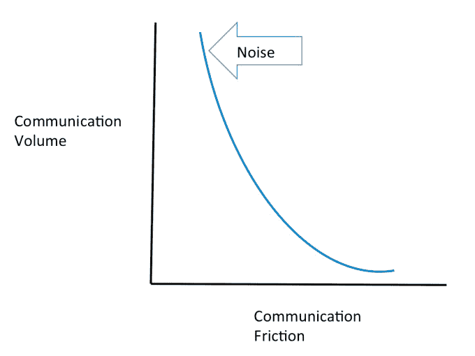

# 协作软件 TechCrunch 的前景、进步和痛苦

> 原文：<https://web.archive.org/web/https://techcrunch.com/2014/05/24/the-promise-the-progress-and-the-pain-of-collaboration-software/>

More posts by this contributor

**编者按:** *[杰森·格林](https://web.archive.org/web/20230216062624/http://www.crunchbase.com/person/jason-green-3)是 [Emergence Capital Partners](https://web.archive.org/web/20230216062624/http://www.emcap.com/) 的创始人兼普通合伙人。他是 Yammer 和 Success Factors 的早期投资者，目前是 ServiceMax、Replicon、Cotap、Lotame、Xad、Digital Airstrike 和 Box (observer)的董事会成员。*

真正有效的企业协作应用代表着云计算最有前途的机会之一。在过去的十年里，已经出现了几家改善工作场所协作的 SaaS 公司，包括知名公司如 [Box](https://web.archive.org/web/20230216062624/http://www.box.com/) 和 [Yammer](https://web.archive.org/web/20230216062624/http://www.yammer.com/) ，以及较新的公司如 [Quip](https://web.archive.org/web/20230216062624/http://www.quip.com/) 、 [Cotap](https://web.archive.org/web/20230216062624/http://www.cotap.com/) 、 [Hall](https://web.archive.org/web/20230216062624/http://www.hall.com/) 和 [Slack](https://web.archive.org/web/20230216062624/http://www.slack.com/) 。

鉴于我在其中几家公司的董事职位，我经常被问及什么在起作用，下一步是什么。我想分享我对协作软件的承诺和进展的想法，同时也触及机会或痛苦的领域。

Emergence Capital Partners 的出发点是，软件即服务将改变员工的协作方式。我们预计，互联员工将越来越依赖不断更新的云解决方案进行互动，从而减少现代分布式工作环境中的通信挑战。

这些挑战在 1988 年被社会学家 Johansen 记录在他开创性的 [CSCW 矩阵](https://web.archive.org/web/20230216062624/http://en.wikipedia.org/wiki/Computer-supported_cooperative_work)中，需要不同类型的解决方案，这取决于沟通是同时发生还是异步发生，以及沟通是面对面还是远程发生。

云解决方案在帮助远程工作的员工应对挑战方面尤其有效。例如，Yammer 建立了一个商业社交网络平台，以帮助员工感觉彼此联系更加紧密，无论他们在哪里工作。Box 极大地简化了以前在多个地点的多个设备上处理一组共享文档的复杂任务。Google Hangouts 和 Skype 提供多设备、实时视频会议应用程序，成本只是以前的一小部分。

我们也开始看到一套新的以移动为先的协作工具，在工作环境中提供移动通讯，如 [Biba](https://web.archive.org/web/20230216062624/http://www.biba.com/) 和 [Remind101](https://web.archive.org/web/20230216062624/http://www.remind101.com/) 。Cotap 等应用程序支持一对一或一对多的短信发送，这对于分散在各地的员工的时间敏感信息尤其有效。

好消息是，这些云协作公司正在减少员工参与方面的摩擦，特别是对于分散的员工。坏消息是，我们都在处理信息过载(“噪音”)，这是越来越无摩擦的交流的一个不想要的副产品。

鉴于通信的爆炸式增长，对话可以在几个竞争渠道上同时发生，由于需要上下文的多次改变而造成混乱和低效。此外，跨所有这些通信渠道轻松无缝地访问先前内容的能力变得更具挑战性。

当我考虑棘手领域时，我看到了几个明显的机会:

大多数知识工作者会告诉你，他们最大的挑战是从所有通信和协作选项的噪音中提取信号。在工作场所部署这些解决方案的雇主需要确信最高优先级的项目正在打破混乱。

我可以设想新的解决方案，帮助过滤个人和组织层面的沟通。以下是一些例子:

*   新型多平台搜索功能，允许对分布式通信和内容进行实时分析。
*   一个可以订阅、重定向和重新调整企业通信优先级的监管应用程序。
*   电子邮件足够智能，可以将“低优先级”电子邮件转换为“高优先级”文本。
*   自动分配任务和后续行动的应用程序，可以跟踪并在完成时与团队交流。

我对使用云技术为企业解决大问题的企业家感到兴奋。消费者对新通信应用的采用是职场专业人士未来需求的一个重要先行指标。

作为风险投资家，我们的工作是找到那些真正提高企业生产力并符合企业安全、隐私和合规需求的应用程序。我们刚刚揭开了云计算和移动技术带来的新协作形式的冰山一角，我们迫不及待地希望与新兴的企业领导者合作，帮助他们解决这些挑战。

图片:由[快门架](https://web.archive.org/web/20230216062624/http://www.shutterstock.com/)T3 修改而来