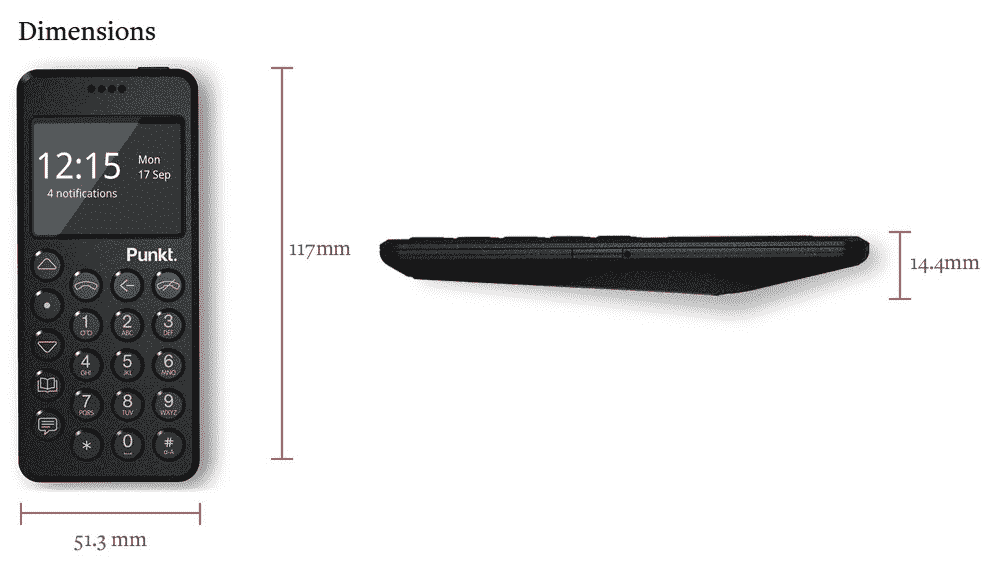
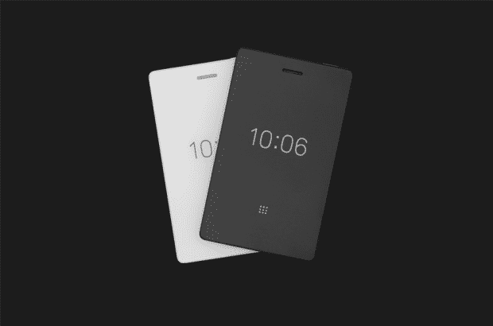

# Punkt MP02 英寸更接近极简主义手机 

> 原文：<https://web.archive.org/web/https://techcrunch.com/2018/09/18/the-punkt-mp02-inches-closer-to-what-a-minimalist-phone-ought-to-be/>

我的心里有一个空的地方，可以放一部只有最基本功能的极简手机。这对我的心脏不好，但对一些公司来说是好事，他们推出了旨在填补空白的设备。Punkt 的最新产品 MP02 在制造我想要的设备方面做了一些努力，但是还没有完全实现。

Punkt 的第一款设备只包括短信和通话，如果不是因为选择了只连接 2G 网络这一不方便的选择，它可能会像预期的那样工作。这些网络在世界各地被关闭和取代，所以你最终得到的手机会比你想象的更加有限。

[MP02 是](https://web.archive.org/web/20221025225758/https://www.punkt.ch/en/products/mp02-4g-mobile-phone/#null)的续集，它增加了一些有用的功能。它运行在 4G LTE 网络上，这应该会让它在未来几年保持连接，并且它已经获得了线程短信(而不是单一的收件箱和发件箱——还记得那些吗？)和黑莓加密那些敏感的通信。

它有漂亮的物理按钮，你可以按多次来选择一个字母，还可以让你记笔记、查阅日历和计算事情。电池有 12 天的待机时间，由于它的微型单色显示屏和有限的数据选项，即使定期使用，它也可能保持几乎 12 天的续航时间。

它最直接的竞争对手可能是光电话，它也有第二个迭代正在进行中，老实说，看起来更实用。

现在，我喜欢 MP02。我喜欢它厚实的设计(虽然它可能有点太厚)，我喜欢它的圆形按钮和布局，我喜欢它刻意的限制。但在我看来，它和其他未来的迷你手机在模仿多年前的设备时过于盲目。我们想要的是简约主义，而不仅仅是怀旧。我们想要一部没有所有垃圾的手机最基本最有用的功能。

轻型电话 2 及其漂亮的电子墨水屏幕。

对我来说，这意味着包括一些这些设备倾向于避免的事情。

一个是现代信息。短信之所以不好有很多原因。为什么不加入一个瘦客户机，将文本传递给像 WhatsApp 或 Messenger 这样的消息服务呢？当然，我的消息是禁止的——谢谢，苹果——但是我们至少可以得到一些跨平台的应用程序。在我看来，如果手机连接到现代信息基础设施，它不会损害手机的极简主义本质。不需要图像、礼物或任何东西——只需要文本就可以了。

二是地图。我们以前的功能手机上肯定没有地图，但是你最好相信我们想要它们。基本地图绘制是我们每天依靠手机完成的工作之一。无论这款迷你手机上有什么，都不一定全是推荐、实时交通等——只有位置和街道，也许还有地址或 lat/long 查找，就像你在旧的单色 GPS 设备上看到的一样。我不需要手机告诉我去哪里吃饭——只要别让我迷路就行。

第三，这只是我，我想某种同步笔记应用程序或能力，把文章从口袋或其他什么在那里。轻型手机上的电子墨水屏幕是这种特殊消费类型的绝佳机会。这里的两家公司似乎都不太可能增加这个功能，但这并不能改变这一事实，即它是我经常使用手机的少数几个功能之一。

轻型电话 2 可能会收到音乐、天气和语音指令，这些对我来说都不算什么，也不算微不足道。拼车是一种可能，但也可能是一种痛苦。

我对我的手机只做便携设备需要做的事情，而把更复杂的事情留给另一个设备没有问题。但是那个袖珍设备不可能是*那个*笨蛋。幸运的是，我确实相信，我们正在向像我这样的怪人有意义的不同选择的日子靠近。我们还没到那里，但我可以等。