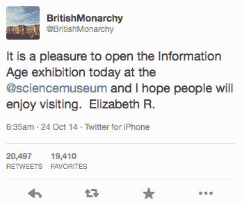

# 女王的第一条推特是一个皇家之谜 

> 原文：<https://web.archive.org/web/https://techcrunch.com/2014/10/24/the-queens-first-tweet-is-a-royal-mystery/>

想想你的第一条微博。我的是从桌面上发的，但我肯定很多人是从智能手机上发的第一条微博。

但是在你发微博之前，你必须注册一个账户。当然，你必须打出一条真实的信息。只有这样，你才能按下那个蓝色的小按钮，开始你的推特之旅。

然而，女王做的事情有点不同。

在她的第一条推文中，她宣传了科学博物馆信息时代展览的开幕，并在推文中签上了她的官方签名:Elizabeth R 代表 Regina，这是拉丁语中女王的意思。

这条推文来自英国王室的官方账户，该账户拥有超过 75 万名粉丝。在撰写本文时，这条推文已经有超过 2 万次转发，几乎有同样多的人喜欢。

关于女王是否真的亲自打出这条推文，存在一些争议，因为当时的视频只显示她走到讲台上的 iPad 前，脱下手套，按下一个按钮。然而，之前拍摄的照片显示她在 iPad 上打字。尽管如此，TweetDeck 显示这条推文是从 iPhone 发出的，正如你在下图中看到的那样。

英国王室告诉《T2》杂志，这种差异是由于“程序学”(不管那是什么意思)，并坚持认为这条推文是女王亲自发送的。他们甚至发了微博。

我个人不介意女王让别人打出她的 140 字知识炸弹。毕竟，阿什顿·库彻[甚至无法承受压力](https://web.archive.org/web/20221209135830/http://www.usmagazine.com/celebrity-news/news/ashton-kutcher-hands-over-twitter-account-to-management-20111011)，他也没有领导任何帝国。