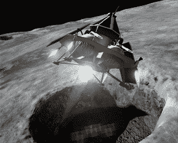
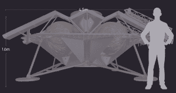

# 随着 Astrobotic 筹集到 250 万美元，登月竞赛正在进行 

> 原文：<https://web.archive.org/web/https://techcrunch.com/2016/05/11/the-race-to-the-moon-is-underway-as-astrobotic-raises-2-5-million/>

计划向月球运送有效载荷的公司 Astrobotic Technology 已经完成了由[太空天使网络](https://web.archive.org/web/20230125192912/http://spaceangelsnetwork.com/)牵头的 250 万美元的种子轮投资。

该公司最初于 2007 年从卡耐基梅隆大学分离出来，参与竞争[谷歌月球探险](https://web.archive.org/web/20230125192912/http://lunar.xprize.org/) (GLXP)。截至今天，他们已经从政府、公司、大学、非营利组织和个人那里获得了 10 笔首次登月任务的交易。

像 GLXP 中剩下的其他 16 家公司一样，Astrobotic 希望通过成为第一个私人资助的月球车，在月球上着陆，行驶 500 米，并将高清视频和图像传回地球，赢得 2000 万美元的大奖。

Astrobotic 的格里芬着陆器插图/图片由 Astrobotic 提供

但与其他 GLXP 竞争对手不同，Astrobotic 的独特之处在于，他们为其他太空机构或公司创建了一个 rideshare 平台，将他们的有效载荷发送到月球。有趣的是，另外两个 GLXP 的竞争对手已经与 Astrobotic 合作，将他们的漫游者降落在月球表面。

> “我们为世界各地的太空机构提供了前所未有的、负担得起的登月机会，以实现他们的科学、探索和资源目标。”约翰·桑顿，太空机器人技术公司的首席执行官

智利的 [AngelicvM](https://web.archive.org/web/20230125192912/http://www.teamangelicvm.com/) 和日本的 [HAKUTO](https://web.archive.org/web/20230125192912/http://team-hakuto.jp/en/) 是两家与 Astrobotic 合作登陆月球表面的 GLXP 公司。HAKUTO 是日本唯一的参赛者，它将把两辆漫游者，即“垦月者”和“俄罗斯方块”连接到 Astrobotic 的着陆器上。同样，Astrobotic 将携带 AngelicvM 的 Uni(代表“统一”)火星车。

与 Astrobotic 合作使这些公司能够专注于漫游、成像和通信技术，并将困难的进入、下降和着陆留给 Astrobotic。

> “我们设想了一个‘纳斯卡登月’的场景，参赛队伍一起着陆，各国可以为自己的队伍加油直到终点线。”约翰·桑顿，太空机器人技术公司的首席执行官

在技术开发方面，Astrobotic 已经证明了自己是 GLXP 的有力竞争者。事实上，Astrobotic 是唯一一个赢得三项 GLXP 里程碑大奖中的三项的[GLXP 团队，奖金总计 175 万美元。](https://web.archive.org/web/20230125192912/https://www.astrobotic.com/2015/1/27/astrobotic-wins-third-google-lunar-xprize-milestone-prize)

正因为如此，美国、日本和智利的公司在月球上进行一场纳斯卡式的竞赛以赢得 2000 万美元的大奖肯定不是不可能的。

总部位于佛罗里达州的月球快递公司和德国的兼职科学家分别获得了两项 GLXP 里程碑奖。

火化的人类遗骸、个人纪念品、来自世界各地儿童的信息和一个时间胶囊是其他一些签约的天体有效载荷。当被问及这些更感性的有效载荷是否是核心业务的一部分时，Astrobotic 的首席执行官约翰·桑顿告诉 TechCrunch，“虽然这是我们长期业务的一小部分，但对我们来说，实现人类联系仍然很重要。”

最终，Astrobotic 似乎很乐意与任何愿意支付每公斤 120 万美元价格的太空机构或商业公司合作。

任何由天体机器人带到月球的有效载荷现在都必须留在那里。桑顿说，他们不打算在前两次月球任务中带回任何东西，但最终他们可以在增加有效载荷后进行科学样本返回。

> “我们的第一次登月任务将成为历史性的着陆点，不会被未来的定居者参观。后续任务中的硬件可能会被重新利用或回收用于未来的月球定居点。例如，燃料罐可以用来储存流体，太阳能电池板可以重复使用，金属可以磨成粉末，用于 3D 打印新零件。”约翰·桑顿，太空机器人技术公司的首席执行官

有了这笔额外的资金，Astrobotic 计划加速他们与美国宇航局共同开发的格里芬着陆器的开发。自 2007 年以来，Astrobotic 已经从 NASA 获得了 [21 份](https://web.archive.org/web/20230125192912/http://www.post-gazette.com/local/city/2015/05/01/CMU-Astrobotic-get-grant-for-Andy-the-unmanned-rover/stories/201505010254)合同，总额达数百万美元。

Astrobotic 的格里芬着陆器/图片由 Astrobotic 提供

Astrobotic 是美国宇航局与[合作](https://web.archive.org/web/20230125192912/http://www.nasa.gov/lunarcatalyst/#.VzPDT_krLb1)的三家公司之一，通过月球货物运输和软着陆着陆(CATALYST)计划来提高机器人登月能力。

Astrobotic 的下一个重大步骤将是获得一份经过验证的发射合同。

两个 GLXP 团队——Moon Express 和以色列公司 space il——已经分别与 RocketLab 和 SpaceX 签订了经过验证的发射合同。两家公司都计划在 2017 年推出。

桑顿表示，一旦他们的清单足以飞行，他们将保留自己的发射合同。他预计它们将在未来几年内推出。

然而，无论谁赢得 GLXP 大奖，月球秀都将继续。像其他 GLXP 的领跑者一样，Astrobotic 计划在 GLXP 结束后继续照常运营。

> “GLXP 是启动的一个很好的催化剂，现在我们已经计划了一系列的 5 个月球任务。不管奖项的结果如何，Astrobotic 将在未来几十年执行飞行任务