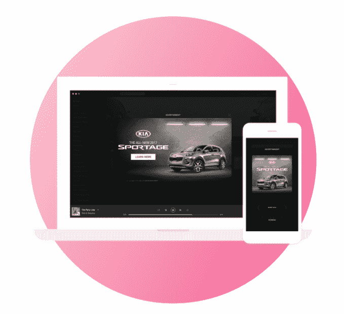
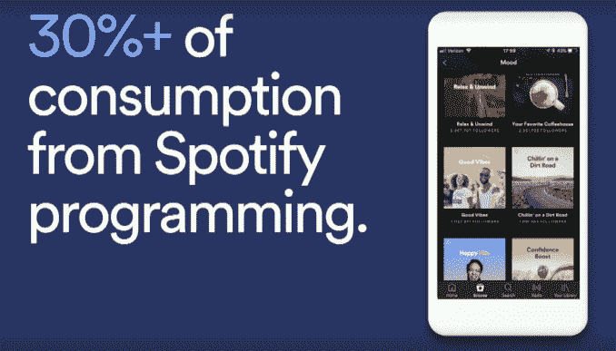
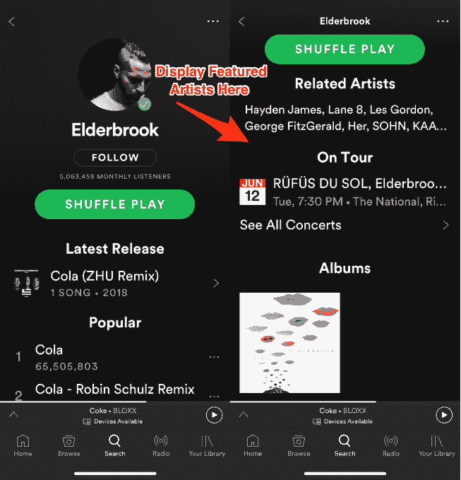

# Spotify 缺少的赚钱工具是艺人对粉丝的信息技术

> 原文：<https://web.archive.org/web/https://techcrunch.com/2018/04/03/the-rainbow-connection/>

Spotify 作为一家只播放美国歌曲的上市公司，流媒体版税过于昂贵。 [Spotify 的股票在纽约证券交易所上市首日收盘下跌 10%。幸运的是，它控制了应用程序上音乐人和粉丝之间的大部分关系，通过不停止音乐的原生广告和信息将两者联系起来，从而建立了一个强大的收入和艺术家忠诚度生成器。](https://web.archive.org/web/20230126171625/https://techcrunch.com/2018/04/03/spotify-traded-down-10-on-first-day-achieves-26-6-billion-market-cap/)

Spotify 已经为传统品牌打造了广泛的[广告体验](https://web.archive.org/web/20230126171625/https://spotifyforbrands.com/en-US/ad-experiences/)，从音频广告到展示单元，再到赞助会话，用户可以通过观看广告来获得无广告播放。但这些广告单元都不是为了帮助音乐人在 Spotify 中增加观众，即使他们可以为此而努力。

遵循脸书的路线图，Spotify 可能会大获全胜。

早在 2007 年，脸书就已经有了指向异地的广告。把这些想象成 Spotify 现有的音频和显示广告。但是当脸书建立页面让企业通过新闻 Feed 联系到你的时候，它也推出了广告让他们在脸书推广和发展他们的页面。与你在网上看到的股票横幅广告不同，这些广告源于脸书，以其个人资料数据为目标，并使用你朋友互动页面的社交推荐来吸引你。这些给了脸书的实体一种付费的方式来增加他们在平台内的受欢迎程度。

这是 Spotify 的机会。

Spotify 现有的广告单元是为品牌设计的，而不是为音乐人

几年前，Spotify 的用户群太小，艺术家们无法专注于在那里花钱来获得人气。但是 Spotify 已经发展到了取代排名前 40 的电台的规模，现在超过 30%的收听来自它的推荐和算法播放列表，比如《发现周刊》。唱片公司现在需要 Spotify 来获得成功。凭借这种影响力和它作为最大的点播音乐流媒体服务的地位，Spotify 有能力为艺术家提供最佳工具来扩大他们的粉丝群。无论艺术家是想在 Spotify 上积累粉丝，出售收藏者的物品，还是想在他们的演出中占据前排座位，Spotify 都可以满足他们。

这家不再创业的公司已经为此奠定了基础，去年推出了面向艺术家的[Spotify](https://web.archive.org/web/20230126171625/https://techcrunch.com/2017/10/12/spotify-launches-an-app-for-artists-with-real-time-streaming-data-audience-demographics/)分析仪表板应用程序，显示音乐家的热门歌曲，以及粉丝的人口统计数据，包括他们的位置、性别、年龄以及他们还听什么。Spotify 通过其粉丝首次电子邮件活动证明了这一数据的力量，这些活动让艺术家能够获得演唱会门票预售和独家商品，从而接触到他们最频繁的听众。它声称电子邮件有 40%的打开率和 17%的点击率，远高于行业标准。

但如果 Spotify 在其应用程序中为艺术家建立新的界面，直接接触粉丝，它可能会成为唱片公司营销资金的目的地。由于这些艺术家广告和信息都将推动用户更深入地使用该应用，而不是像品牌广告那样远离它，Spotify 可以收取比传统广告更低的费用，让预算有限的唱片公司或音乐人能够负担得起。

Spotify 可以通过以下几种方式创建本地艺术家对粉丝的营销渠道:

算法播放列表上的赞助歌曲可以让粉丝以最自然的方式接触到艺术家，或者把以前的听众变成忠实听众。哪里有推荐，哪里就有付费发现的空间。听众可以很容易地跳过曲目或切换到不同的播放列表，但最终可能会爱上乐队，并一头扎进他们的目录。这相当于脸书的新闻推送原生广告，但推广的是一位音乐家，而不是一个商业页面。Spotify 实际上被发现在 2017 年年中在一些播放列表的开始上方测试实际上是赞助的歌曲。虽然该应用程序的设置中有一个退出选项，但后来消失了，Spotify 至少考虑了这个想法。

Spotify 被发现在 2017 年年中测试一首实际上是赞助的歌曲

**推广艺术家**可以使用类似于谷歌 AdWords 赞助搜索结果的模式。当用户搜索一位艺术家时，他们可以在搜索类型或结果页面中看到类似的付费艺术家。Spotify 还可以在你正在浏览的另一位艺术家的个人资料中，在他们的热门曲目下方插入一个框。Spotify 已经在文本中列出了一系列相关的艺术家，但可以突出显示付费的艺术家，或许可以展示他们的一首可以立即播放的歌曲。

特色艺术家可以在 Spotify 的浏览页面上给付费艺术家一个特别的位置。有了这么多的推荐，很容易插入一个赞助部分而不会感到被打断。

**赞助可视化**可以在你听的时候更好地利用你的屏幕。Spotify 可以让艺术家向粉丝推销他们的其他音乐、门票、设备或社交媒体渠道，而不仅仅是盯着专辑封面和播放控制。Spotify 也可以用有趣的无声视频剪辑、照片幻灯片和传记信息来填充这个空间，正如我在 2016 年提出的差异化优势[，类似于歌词网站](https://web.archive.org/web/20230126171625/https://twitter.com/JoshConstine/status/763725297124388864) [Genius 本周开始用其故事](https://web.archive.org/web/20230126171625/https://techcrunch.com/2018/04/02/music-app-genius-launches-its-own-take-on-stories-aided-by-youtube/)做的事情。假设用户目前正在听这位艺术家的音乐，他们可能已经为这些体验做好了准备。Spotify 已经测试了让艺术家在回放期间展示 gif 的功能，并与 Genius 合作展示音乐仿真图背后的内容，但这是一个可以帮助艺术家赚更多钱并娱乐粉丝的领域。

## 直接消息传递

让艺人接触粉丝的最有野心和大胆的方式是一个特殊的艺人对粉丝的信息渠道。几年前，Spotify 取消了应用内收件箱和向朋友发送歌曲的信息功能，转而推动用户通过他们选择的聊天应用分享音乐。但与粉丝的第一封电子邮件活动类似，Spotify 可以在其应用程序中创建一个特殊的艺术家到粉丝的信息部分，可以提醒用户新发布的歌曲和播放列表是品牌广告，甚至可以推送旅游和商品，作为更直接的表演广告。

Spotify 可以给所有艺术家免费发送一定数量的信息，或者让他们每月或每年联系前 1%的粉丝一定次数。然后，艺术家可以付费发送更多超出限制的信息。或者，它可以只对任何信息的使用收费。

如果做错了，上述选项可能会让人感觉像 Spotify 为了吸引自己的粉丝而欺骗艺术家。但是如果做得好，用户可能真的会喜欢它。这些联系与在其他社交媒体上关注一位艺术家不会相差太远，但人们已经在听了。发现你最喜欢的乐队的新专辑、巡演或 t 恤可能不像是广告，更像是粉丝俱乐部的内部消息。

Spotify 或许可以向已经订阅的用户展示一些不同的体验，如果他们不妨碍听音乐的话。转到机会光谱的另一端，该公司可以将所有这些体验赠送给艺术家，提高他们对 Spotify 的忠诚度，让他们在 Spotify 上推广自己的存在，而不是在 Apple Music 等竞争对手的流媒体服务上。

如果 Spotify 找不到办法通过增加收入来提高利润率，它作为一家上市公司可能会很难生存。如果仅从音乐流中获利过多，唱片公司总是可以尝试提高版税。Spotify 可能希望更多的艺术家直接与它合作，省去中间人，但唱片公司仍然提供艺术家需要的一些重要的营销、广播推广和分销服务。与此同时，包括 [United Masters](https://web.archive.org/web/20230126171625/https://techcrunch.com/2017/11/15/united-masters/) (从谷歌母公司 Alphabet 和 Andreessen Horowitz 获得了 7000 万美元的 A 轮融资)和 Patreon 这样的订阅众筹平台在内的初创公司希望在 Spotify 之前篡夺唱片公司，成为艺术家赚取更多收入的方式。

《纽约时报》的这张图表显示了为什么音乐人觉得自己被骗了，尽管是唱片公司而不是 Spotify 保住了他们的钱

创造与听众联系的方式可以为 Spotify 提供一种方式，来对抗它正在颠覆音乐人的持久叙事。如果 Spotify 能够证明这些艺术家到粉丝的信息选项让他们赚得比他们的成本更多，那么它可以被视为实际上试图帮助音乐人谋生的流媒体服务。

自 MP3 问世以来，录制音乐已经成为音乐人所有其他收入盈利方式的主要推广工具。流媒体的点播结构和每次播放不额外收费的特性，让那些只听说过一个艺术家或只喜欢一首单曲的好奇听众变成了死忠粉丝，每当他们最喜欢的表演在城里上演时，他们就会支付大笔费用。

随着我们转向体验文化，我们的财产被数字化，我们的兴趣定义了我们，人们希望更接近他们所爱的创作者。艺术家到粉丝的信息传递可以将从发现到亲和到真正货币化的整个生命周期超越版税，所有这些都在一个绿色和黑色的应用程序中。

*关于 Spotify 上市的更多信息，请阅读我们的专题报道:*