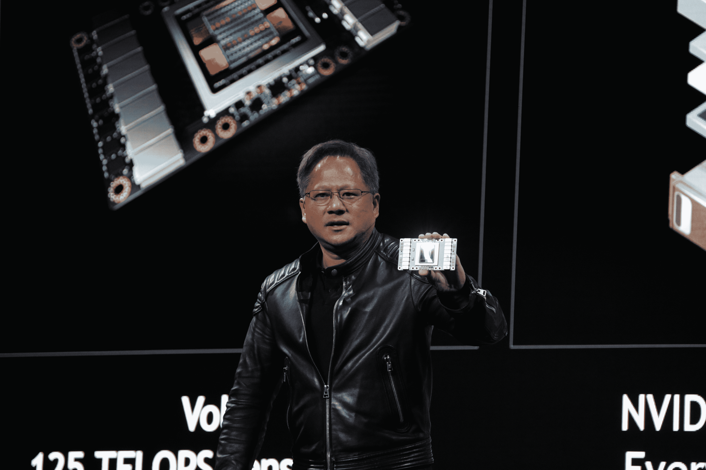

# 随着一家名为 samba nova Systems TechCrunch 的初创公司获得 5600 万美元的投资，炙手可热的人工智能硬件领域变得更加火热

> 原文：<https://web.archive.org/web/https://techcrunch.com/2018/03/15/the-red-hot-ai-chip-space-gets-even-hotter-with-56m-for-a-startup-called-sambanova/>

一家人工智能芯片公司的另一轮大规模融资今天即将到来，这一次是 samba nova Systems——一对斯坦福大学教授和一名长期芯片公司高管创办的初创公司——建立下一代硬件，以增强以人工智能为中心的运营。

SambaNova 加入了一个已经相当大的创业公司类别，寻求通过重新思考计算发生的实际底层来解决让人工智能操作更有效和更快的问题。GPU 在开发人员中越来越受欢迎，因为它能够以非常快速的方式处理人工智能操作所需的轻量级数学。像 SambaNova 这样的初创公司希望从头开始创建一个新的平台，一直到硬件，并针对这些操作进行优化。希望通过这样做，它将能够在速度，功耗，甚至潜在的芯片实际大小方面超越 GPU。SambaNova 今天表示，它已经筹集了 5600 万美元的巨额 A 轮融资，由 GV 和华登国际共同牵头，Redline Capital 和 Atlantic Bridge Ventures 参与。

SambaNova 是斯坦福大学两位教授 Kunle Olukotun 和 Chris Ré的技术产品，由前甲骨文 SVP 开发部 Rodrigo Liang 领导，Rodrigo Liang 在 Sun 担任副总裁近 8 年。在展望前景时，SambaNova 的团队回顾了他们的工作方式，首先确定哪些操作需要更有效地进行，然后计算出为了实现这一点需要什么样的硬件。这可以归结为源于一个叫做线性代数的数学领域的大量计算，这些计算完成得非常非常快，但这是现有的 CPU 无法准确完成的事情。这一领域大多数创始人的一个共同批评是，尽管 Nvidia GPUs 在这些操作方面比 CPU 强大得多，但颠覆的时机仍然成熟。

“你有这些巨大的(计算)需求，但你有摩尔定律的放缓，”奥卢科顿说。“问题是，当摩尔定律放缓时，你如何满足这些需求。从根本上说，你必须开发更高效的计算。如果你看看当前基于多个大内核或多个小内核，甚至 FPGA 或 GPU 来改进这些应用的方法，我们根本不认为你可以获得所需的效率。您需要一种方法，这种方法与您使用的算法和所需的底层硬件不同。您需要将这两者结合起来，以达到前进所需的性能和灵活性水平。”

虽然 5600 万美元的系列 A 融资可能听起来很庞大，但对于寻求攻击这一领域的初创公司来说，这正成为一个相当标准的数字，因为这一领域有机会击败大型芯片制造商，创造出新一代硬件，这种硬件将无处不在，出现在任何围绕人工智能构建的设备中——无论是坐在自主车辆上进行快速图像处理的芯片，还是潜在的医疗机构内培训复杂医疗问题模型的服务器。另一家芯片初创公司 Graphcore 从红杉资本获得了 5000 万美元的资金，而大脑系统[也从基准资本](https://web.archive.org/web/20230130100805/https://techcrunch.com/2016/12/19/a-stealthy-startup-called-cerebras-raised-around-25-million-to-build-deep-learning-hardware/)获得了大量资金。然而，在这一系列投资活动中，还没有什么真正出笼，你可以把这些筹集数千万美元的公司定义为上市前公司

Olukotun 和梁不会深入研究该架构的具体细节，但他们希望重新设计操作硬件，以优化以人工智能为中心的框架，这种框架在图像和语音识别等领域越来越受欢迎。其核心是，除了其他复杂的问题之外，这涉及到对与内存的交互是如何发生的以及硬件的散热发生了什么的大量重新思考。[苹果](https://web.archive.org/web/20230130100805/https://techcrunch.com/2017/09/12/the-new-iphone-8-has-a-custom-gpu-designed-by-apple-with-its-new-a11-bionic-chip/)、谷歌及其 TPU、[以及据报道亚马逊](https://web.archive.org/web/20230130100805/https://techcrunch.com/2018/02/12/amazon-may-be-developing-ai-chips-for-alexa/)都对这一领域产生了浓厚的兴趣，为 Siri 或 Alexa 等产品设计了自己的优化硬件，这是有意义的，因为最终尽可能准确地将延迟降至零会改善用户体验。出色的用户体验导致这些平台更多的锁定，虽然较大的玩家可能最终会制造自己的硬件，但加入公司董事会的 GV 的戴夫·穆尼切洛说，这基本上是一种验证，即*其他所有人*很快就会需要这项技术。

“大公司看到了对专业硬件和基础设施的需求，”他说。“人工智能和大规模数据分析对于提供最大公司提供的服务来说是如此重要，以至于他们愿意投资于自己的基础设施，这告诉我们更多的投资即将到来。亚马逊、谷歌、微软和苹果今天正在做的事情，将会是其他财富 100 强企业在 5 年内投资的事情。我认为这只是创造了一个非常有趣的市场和一个销售独特产品的机会。这只是意味着市场真的很大，如果你相信你公司的技术差异，你欢迎竞争。”

这个领域肯定会有很多竞争，而且不仅仅是来自那些初创公司。虽然 SambaNova 希望创建一个真正的平台，但对于它应该走向何方有很多不同的解释——例如它是否应该是处理推理或机器训练的两个独立的硬件。英特尔也在押注一系列产品，以及一种名为现场可编程门阵列(FPGA)的技术，这将允许在构建人工智能专用硬件时采用更加模块化的方法，并且设计灵活，可以随着时间的推移而变化。Munichiello 和 Olukotun 的观点是，这些要求开发人员具有 FPGA 的特殊专业知识，这是一种利基中的利基，大多数组织可能不容易获得。

Nvidia 一直是人工智能系统爆炸的主要捐助者，但它显然暴露了投资新品种硅的巨大兴趣。开发人员锁定在 Nvidia 平台(如 Cuda)上肯定有争议。但是有很多新的框架，比如 TensorFlow，正在创建一个越来越受开发人员欢迎的抽象层。Olukotun 说，这对 SambaNova 和其他创业公司来说也是一个机会，他们可以努力插入这些流行的框架。脑波强化系统公司首席执行官安德鲁·费尔德曼实际上也在上个月的高盛技术和互联网大会上谈到了这一点。

“英伟达花了很长时间围绕他们的 GPU 建立了一个生态系统，在很大程度上，随着 TensorFlow 的结合，谷歌已经扼杀了它的大部分价值，”费尔德曼在会议上说。“TensorFlow 所做的是，它对研究人员和人工智能专业人员说，你不必进入硬件的内部。你可以在上层写，你可以用 Python 写，你可以使用脚本，你不必担心底层发生了什么。然后你可以非常简单直接地把它编译到 CPU，TPU，GPU，到很多不同的硬件，包括我们的。如果为了完成这项工作，你必须是那种能够手工调整组装或者能够深入硬件内部的工程师，那就不会有采用……我们只是接受他们的张量流，我们不必担心其他任何事情。”

(作为题外话，我曾经被告知 Cuda 和其他那些低级平台实际上是被像 Yann LeCun 这样的人工智能专家用来在互联网的角落里构建怪异的人工智能东西。)

对于 SambaNova 来说，也有两个大的问号:首先，这是一个非常新的项目，从 11 月份才开始，而对于初创公司和大公司来说，这些努力已经进行了多年。Munichiello 对此的回答是，这些技术的发展确实已经开始了一段时间——这并不是一件可怕的事情，因为 SambaNova 刚刚开始满足当前一代的人工智能需求。第二，硅谷的一些人认为，大多数行业可能不需要以极快的速度完成这些操作的硬件。你可能会说，后者可能会得到缓解，因为许多这样的公司正在获得如此多的资金，其中一些公司的估值已经接近 10 亿美元。

但是，最终，你现在可以将 SambaNova 添加到已经筹集了大量资金的人工智能初创公司的名单中——这一名单延伸到包括 Graphcore 和 Cerebras Systems 等世界各地的无数公司，以及 Cambricon Technology 和 Horizon Robotics 等公司在中国的大量活动。这项工作确实需要大量投资，不仅因为它的基础是硬件，而且它必须说服客户部署该硬件，并开始利用它创建的平台，支持现有框架有望缓解这一问题。

“你看到的挑战是，在过去十年里，该行业在半导体设计方面的投资不足，”梁说。“如果你看看大公司初创阶段的创新，你会发现我们真的没有突破半导体设计的极限。它非常昂贵，回报也不是很好。现在，你突然需要半导体设计，而低功耗设计需要不同的技能。如果你看看这种向智能软件的转变，这是我们在这个行业很长时间以来看到的最大转变之一。你不是在加速旧软件，你想要创建一个足够灵活的平台(来优化这些操作)，你想要考虑所有的部分。这不仅仅是机器学习。”