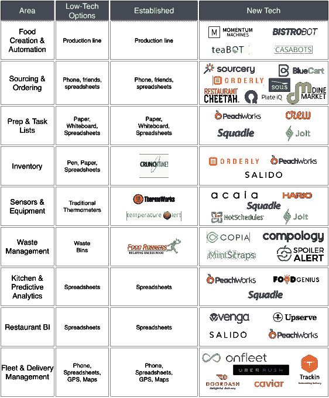
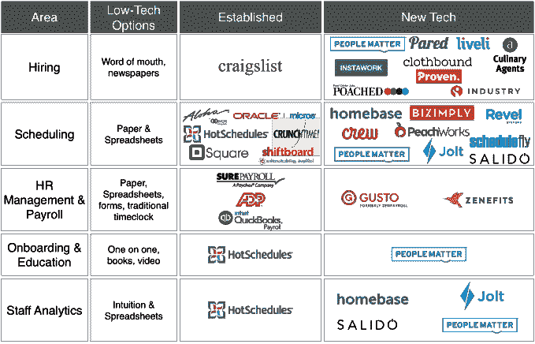

# TechCrunch 餐厅

> 原文：<https://web.archive.org/web/https://techcrunch.com/2016/04/26/the-restaurant-os/>

克里斯·卡利兹是 FTW 风险投资公司的合伙人。

所以你是个技术人员和美食家。你正在吃晚饭，你的手机嗡嗡作响，让你知道你可以通过一个应用程序支付你正在享用的饭菜。这时你会意识到餐厅技术中有问题。

如果你想了解更多，或者想参与其中，这是你的入门书——因为餐饮业有很多新的活动，我们将对其中一些进行细分。

餐馆老板:即使你有丰富的资源，我们希望这个简短的概述能给你一些想法，如果你想升级或更换你的技术包的话。

## 餐厅 OS 是什么？

就像你电脑的操作系统一样，一家餐馆需要一套合理的系统来使它高效地开展业务。众所周知的例子包括用于预订的 OpenTable、用于支票管理和厨房通知的 NCR Aloha POS 以及用于管理员工日程的 Shiftboard。经营一家餐厅有很多运营要求；在这里，我们将重点介绍几个旨在改善餐厅运营和消费者体验的技术选项。

餐馆技术并不新鲜:20 世纪 80 年代推出的销售点机器彻底改变了厨房下单和烹饪的方式。后来，在线预订系统消除了在营业时间打电话给餐馆要求座位的需要。现在，一些城市的美食家可以在不到一个小时的时间内从他们最喜欢的餐桌服务餐馆获得送货上门的饭菜。去年，我们看到更多的人在外面吃饭，而不是去杂货店购物。

餐馆正在努力升级他们的技术选项，以提高满意度、获得和保留食客，以及优化利润。出去吃一顿大餐很有趣，但经营一家餐馆可能很艰难，因为利润微薄，工资不断上涨。科技在餐饮业有很大的发展潜力。

## 餐厅 OS 中的配料

为了顺利运营，餐馆需要几个方面的操作——但是有一个问题，因为餐馆是疯狂的地方。餐厅系统需要应对和适应不断变化的环境。在经营一家餐馆的诸多要求中，我们专注于餐馆特有的技术和产品，这些技术和产品的价格取决于经常性的运营费用；不包括存在通用技术或替代品的大型设备采购或租赁的房地产、设计和资本支出。

这些故障是由操作功能，但有几个不同的功能排列，产生重复的一些公司。

**就餐者体验和店面**

最注重用餐者体验的餐厅技术:

已建立:更多年，无处不在和市场份额。新技术:寿命更短，市场份额更有限。(点击放大)

**厨房和屋后**

专注于生产和提供美味食物的产品和技术:

点击放大

**人员配备和人员管理**

点击放大

即使有这么多漂亮的标志和特色，仍然有很大的创新和发展空间。特别是，房子的背面没有太大的变化，并提供了很多现代化或优化的空间。

在发现和保留部分有许多参与者，但也有许多重叠。有这么多，最大的突出了非常实用和非常昂贵的餐厅。与此同时，较小的公司正专注于利基市场，但为企业提供更具竞争力的价格组合。

另一个未来创新的例子是我们需要个性化的推荐。有许多推荐系统，但没有一个能提供很好的个性化。找到一家餐馆和选择菜单仍然是一个骰子滚动。有一个数据赤字，克服它导致伟大的个性化。换句话说，我们需要像网飞推荐系统那样的餐馆和食物推荐系统。

## 一般观察

**一刀切。**正如不是所有的餐厅都是一样的，也不是所有的技术或产品定价结构都是一样的——也不可能对所有的餐厅都适用。如果一个餐馆的体验主要是建立在人和热情的基础上，那么技术就很难实现并证明其价值。一般来说，快速、随意和快捷的服务餐厅被证明是更好的科技环境。最后，一些餐馆科技产品是为餐馆集团或连锁店设计的。

**大 POS 终端是老大；平板电脑还没有完全准备好。**平板电脑无处不在，但它们还不足以取代所有的 POS 系统、打印机或终端。甚至像 Micros 这样的传统 POS 提供商也提供针对平板电脑优化的软件版本。这样做的最大好处是它显著降低了前期成本和占地面积。

> 餐馆技术一点也不像消费者应用程序开发。

平板电脑也有一些可能影响一些操作的问题，比如有限的多任务处理、过多的新设备连接、对 Wi-Fi 的依赖(可能不稳定)、较小的屏幕以及应用程序与主机操作系统的竞争。这些问题实际上可能导致多个平板电脑，每个都有一个单一的目的，占用比承诺更多的空间。

**POS 的选择会影响许多其他技术决策。**一家餐厅对 POS 的选择会影响和决定 it 部门的大多数其他技术选择。原因是多种多样的，从包含多种功能的丰富包到与其他产品的有限集成选项。

一个重要的例子是 Square POS，它在其他支付处理器中没有提供选择，但有一个集成市场，而 Micros 和 Aloha 支持许多支付处理器，但很少有外部产品集成。

一体式软件包和缺乏集成构建了围墙花园。哪里有几个功能的套餐，哪里就有和其他产品的天然冲突。例如，如果一家餐馆整合了一整套 Aloha 套餐，该套餐带有员工排班功能，他们可能不希望考虑像 Hot Schedules 这样的东西，因为这将降低套餐交易的 ROI，并产生额外的成本。此外，附加包甚至可能不与 POS 集成，且创建了团队需要学习和记住使用的额外项目。

**劳动力成本很难与 SaaS 产品相比。**没有强大的人员配备和薪资分析包的餐厅老板或经理很难量化人力和技术产品。他们希望降低劳动力成本，但也希望提高整体利润率。

所以当考虑一个工作优化的 SaaS 产品时，计算出软件对时间和精力的价值是很棘手的。一些提供商已经开始谈论他们相对于现有成本的成本，这很有帮助。一家餐厅可以认为自己类似于一家早期的科技初创公司，不断管理收入和烧钱率与产品/雇佣需求和喜好之间的关系。

## 新产品的注意事项

如果你正在为餐饮业开发新产品，我们想知道！但是你应该记住一些事情来帮助你成功。

首先，请把握好决策者和用户的用户之旅。流程/工具/技术中的任何中断都可能打破服务节奏，并成为员工抵制的原因。了解用户旅程和餐厅需求也应该有助于你理解一个正常的消费者 app MVP 不会削减它；在发布之前，你需要更多的思考和润色。

除了待客之道和与人交流的关怀，一个产品必须有一个完整的用户旅程，这样商业决策者和用户的需求才能被完全覆盖。这应该是显而易见的，但令人惊讶的是，有多少产品只关注一端而不关注另一端。餐馆技术一点也不像消费者应用程序开发。

接下来，要注意的是，不是餐馆里的每个人都会说同样的语言，或者分享同样水平的技术知识。入职、培训和支持对您的产品和餐厅的成功至关重要。没有持续的压力，你无法获得粘性，但要保持它的轻便和简单，因为它会切入开销。考虑到员工流动可能会影响你的产品使用，并影响餐厅坚持使用常规或既定之外的东西的愿望。

最后，永远记住，餐馆是接待和服务行业。任何没有这种心态的人都可能被拒绝——这完全是关系和你如何支持这个行业的问题。

正如丹尼·迈耶在*摆桌子*中所说，“商业，就像生活一样，就是你让人们感觉如何。就这么简单，又这么难。”当你联系餐馆老板或经理向他们推销你的产品时，仔细考虑你何时和如何联系他们。要知道，餐馆老板和经理会收到很多新事物的邀约。

我要感谢[国家餐饮协会](https://web.archive.org/web/20230218173517/http://www.restaurant.org/)的[安娜·陶津](https://web.archive.org/web/20230218173517/https://twitter.com/annatauzin)，美国国内[的塞斯·哈蒙德](https://web.archive.org/web/20230218173517/http://www.statesideseattle.com/)，蓝牌[的杰夫·特勒南](https://web.archive.org/web/20230218173517/http://blueplatesf.com/)和[艾米·帕拉西奥斯](https://web.archive.org/web/20230218173517/https://www.linkedin.com/in/aimeepalacios)的洞察力和支持。