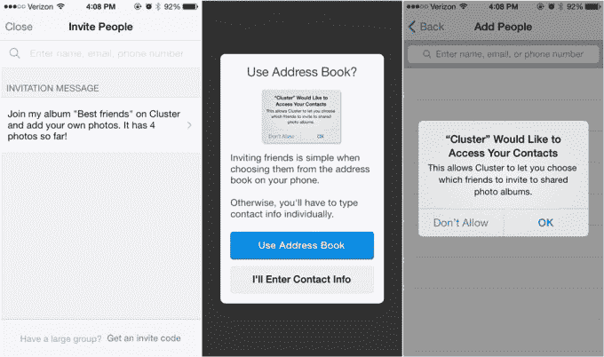
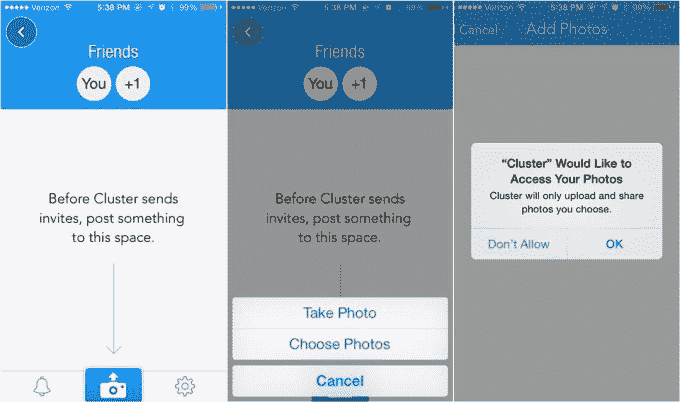
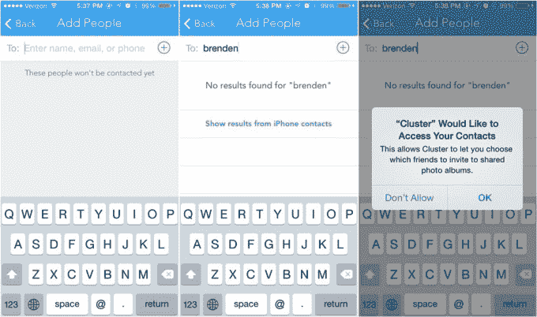

# 向用户询问 iOS 权限的正确方式 

> 原文：<https://web.archive.org/web/https://techcrunch.com/2014/04/04/the-right-way-to-ask-users-for-ios-permissions/>

随着时间的推移，我们学会了在我们绝对需要的时候，并且只有在我们绝对需要的时候，请求用户的许可，并且我们认为用户能够清楚地讲述这种访问将如何使他们受益。

我们已经使用两种方法重新设计了集群，仅在用户告诉我们他们打算说“允许”时才显示系统权限对话框。

**预许可对话框**

在弹出 iOS 对话框之前，我们已经成功地使用自己的用户界面请求权限。

如上所述，最糟糕的情况是用户在系统级别拒绝权限，因为在 iOS 中撤销这个决定非常复杂。但是我们在系统回答之前问他们，他们说不，我们仍然有机会在将来当他们更有可能回答是时再问他们。

单就照片而言，46%在预先许可对话框中拒绝访问的人最终在稍后更合适的时间被要求访问时同意了。

这比你想象的要简单。您可以设计自己的对话框，或者为此使用附加的 iOS 对话框。

**双系统风格对话框**

在旧版本的集群中，当我们请求访问照片时，我们实际上会请求他们两次。

使用 iOS 对话框进行预许可。

第一个对话框(如上图中间所示)会在应用程序中设置一个本地标志，表示他们拒绝，但不会在操作系统中设置为“拒绝”。这意味着如果我们想在未来的某个时候问他们，我们没有失去唯一的机会。

只有 3%点击“允许访问”的用户点击了“不允许”，这意味着不到 2%的用户在系统级别拒绝访问。

尽管问两次似乎很烦人，但我们几乎完全消除了用户点击“不允许”的可能性，为我们在未来赢回他们留下了机会。值得一提的是，在[现场用户测试](https://web.archive.org/web/20221226080945/https://medium.com/ux-ui-design/9b7e9edd2de8)中，当第二个对话框出现时，没有一个测试对象犹豫(或表示困惑)。

### 教育 p **重新许可**覆盖

当要求联系人访问权限时，我们想做更多的培训，标准的系统对话框没有给我们足够的空间或灵活性来完全解释发生了什么，所以我们建立了自己的允许我们包括图像的对话框。

一个定制的、教育性的预先许可覆盖。

所以我们首先向他们展示了一个对话框，告诉他们为什么我们需要访问，并让他们选择使用地址簿，或者自己手动输入联系信息。当然，只有当他们明确选择“使用地址簿”时，我们才会显示系统权限对话框

像上面一样，问他们两次有点痛苦，但是当出现 iOS 对话框时，没有人点击“不允许”此外，当点击“我将输入联系信息”的人意识到这是多么痛苦时，我们有另一个提示，让他们在这一点上连接他们的地址簿。

使用预先许可对话框使得“不允许”的问题几乎消失了。当被询问时，用户不给我们系统级别的访问权限是非常罕见的。这是我们的一次重大胜利。有很多欢乐。

**用户触发的对话框(最成功的)**

即使用户没有在系统级别拒绝访问，我们仍然会看到一些用户没有进入系统对话框，因为他们根本不想给我们访问权限。预许可对话框所做的是减少用户不期望的时间，而不一定让更多的用户接受它。我们知道我们可以做得更好。

当我们解构这个问题时，我们意识到用户仍然不希望被询问，所以我们找到了一种让他们有意触发提示的方法，这在[测试几十个人的真实流](https://web.archive.org/web/20221226080945/https://medium.com/ux-ui-design/9b7e9edd2de8)中获得了接近 100%的权限。

**照片**

在以前的版本中，在集群中创建新空间的第一步是添加照片。这意味着我们要求在他们点击“创建集群”后立即访问照片这导致用户在 67%的情况下授予照片访问权限。但这还可以改进。

我们决定将照片上传向后移几步，直到他们更清楚什么是集群，并让他们在我们请求访问之前实际点击相机图标并“选择照片”。

在用户点击相机并“选择照片”后，要求用户访问照片，接受率从 67%提高到 89%。

此时，用户打算上传他们之前拍摄的照片，因此让应用程序访问他们的照片是显而易见的。

**联系人**

我们问自己，授予联系人访问权限给用户带来的最大好处是什么。这类似于我们在预许可对话框中手动输入“我将输入联系信息”的操作。但在这种情况下，他们还没有感受到痛苦，所以好处并不明显。

最终，我们决定让他们看看在没有许可的情况下，添加联系人的过程有多空虚。现在，当他们在搜索中看不到他们的朋友时，下面会有一个“显示来自 iPhone 联系人的结果”的操作当用户在列表中看不到他们的朋友时，通常会点击这个按钮。

我们发现，由于他们显然试图访问自己的地址簿，100%的用户在提示时接受联系人访问。

**推送通知**

集群是用来和朋友搭建小型私人空间的。我们问自己，我们的用户会从推送通知中获得什么价值？答案是知道他们的朋友什么时候在他们创造的空间里活动。

因此，当用户第一次建立空间并邀请一些人时，我们会问一个非常符合逻辑的问题:“您是否希望在刚刚邀请的朋友加入时收到通知？”如果他们单击“通知我”，我们会向他们显示标准的 iOS 访问对话框。如果他们说“不，谢谢”，我们就让他们继续前进。

在用户测试期间，我们发现在 iOS 推送通知权限中，在轻按“通知我”之后，成功率为 100%。

## 我们学到的是:情境至关重要

显然，每款应用都不一样，但认真考虑用户何时会自然地需要访问手机的不同部分，以及确保他们预期会被问到这些问题，已经为这些系统对话框的成功做出了重大改进。

*非常感谢 Cluster 团队的[泰勒休斯](https://web.archive.org/web/20221226080945/https://medium.com/r/?url=http%3A%2F%2Ftwitter.com%2Ftaylorhughes)和[里兹萨塔尔](https://web.archive.org/web/20221226080945/https://medium.com/r/?url=https%3A%2F%2Ftwitter.com%2Frizzledizzle)，他们提供了大量的想法和数据。*