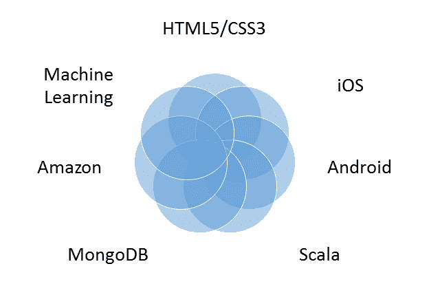

# 全栈开发商 TechCrunch 的兴衰

> 原文：<https://web.archive.org/web/https://techcrunch.com/2014/11/08/the-rise-and-fall-of-the-full-stack-developer/>

彼得·亚雷德是的联合创始人兼首席技术官

[Sapho](https://web.archive.org/web/20221206163736/https://www.sapho.com/)

.

More posts by this contributor

**编者按:** *[彼得·亚雷德](https://web.archive.org/web/20221206163736/http://www.crunchbase.com/person/peter-yared)是[萨福](https://web.archive.org/web/20221206163736/http://www.sapho.com/)的创始人兼 CTO，曾任 CBS Interactive 的 CTO/CIO。*

似乎今天技术界的每个人都迷恋全栈开发人员。在 Web 2.0 时代，全栈可能已经成为可能，但新一代创业公司正在崛起，推动几乎所有软件领域的极限。从机器智能到预测推送计算，再到数据分析，再到移动/可穿戴设备等等，单个开发人员几乎不可能跨现代完整堆栈进行编程。

当我还是个孩子的时候，在移动电话出现之前的 20 世纪 70 年代末、80 年代初，我第一次开始编写计算机程序时，通常一个人从头到尾编写一个完整的软件程序，在程序员和硬件之间没有很多其他的软件层。使用汇编语言是程序员试图从 8 位处理器和非常有限的内存中挤出更多性能和空间的标准。

随着 20 世纪 80 年代末和 90 年代初客户机/服务器计算的出现，以及 20 世纪 90 年代末和 21 世纪初的互联网计算浪潮，编程应用迅速演变成一项团队运动。新技术的每个方面都非常复杂，经常需要一名专家，有时一名专家负责不同的层(例如前端、数据库、应用服务器等)。管理一个商业网站成了一项专长，包括操作网络设备，如路由器和负载平衡器，调整 Java 虚拟机，以及使用各种数据库索引机制。

到了 2005 年中期，创建几乎任何东西——从简单的网站到下一代 SaaS 服务——都变得极其昂贵。不断上升的费用与来自不同层的大量个人相互通信(并且经常是错误通信)的开销直接相关，并且一层中的更改会级联到其他层和部署参数中。正如马克·安德森在最近一次关于烧钱率的推特风暴中指出的，“更多的人成倍增加通信开销，减慢一切。”

相反，创建新一代 Web 2.0 网站的技术变得越来越精简和简化。程序员从使用更复杂的企业 Java 栈和数据库(如 Oracle)转向使用更简单的 LAMP 栈(Linux、Apache、MySQL、PHP/Python/Perl)。Django 和 Ruby on Rails 等新语言和框架实现了网站和数据库之间的自动化。jQuery 等前端框架有助于抽象不同浏览器之间的所有错综复杂之处。Amazon Web Services 等云服务简化了部署，并提供了交钥匙网络。

到 2000 年代末，许多程序员可以交付完整的消费者或 SaaS 网站，包括动态 web 客户端、服务器端业务逻辑、可伸缩数据库、部署和运营支持。这种新型的全栈开发人员可以绕着尝试相同任务的程序员团队跑。当项目规模扩大时，增加更多的全栈程序员允许一个人在应用程序的所有层上添加单个功能，这加速了功能交付，避免了在每个层中让不同的人拥有功能的通信开销。

如果你在上面举例说明的全栈基础上建立一个网站，找到能有效地戴上这些帽子的全栈开发者。但是现在，我认为这不是全部筹码，你可以说我疯了。这里有一个更完整的完整堆栈:

我敢打赌，没有任何一个在这些领域拥有高级知识的人能够单枪匹马地交付这种下一代应用程序。仅仅是跟上每个类别中的进步和新的编程接口就几乎是一项全职工作。

我们正处于向更复杂的技术快速转变的过程中，与过去一样，这需要各个层次的专家。开发优秀的 iOS 和 Android 应用程序需要这些平台的专家理解其中的复杂性。在操作上，维护新的对象数据库(如 MongoDB)需要不断的关注和调整。在 Amazon 这样的云服务上运行应用程序需要了解各种服务的来龙去脉，以及如何跨区域进行故障转移的专业知识。就连德高望重的 web 前端也进化成了 CSS4、JSON 和 JavaScript MVC 框架，比如 Angular.js 和 Backbone.js。

在这个勇敢的新世界中，至少有一个人至少对每个组合部分有功能上的理解，并且能够连接不同的层和与每个专家一起工作，以便能够实际交付一个特性，这是非常关键的。在某种程度上，这些连接各层、搭建桥梁的软件架构师——他们可能只是一两层的专家——不太像全栈开发人员，而更像全栈集成人员。

安息吧，全栈开发者。欢迎，全栈集成商，以及在特定领域拥有深厚技术技能的工程师。这是一个迷人的软件世界，我们比以往任何时候都更需要你。