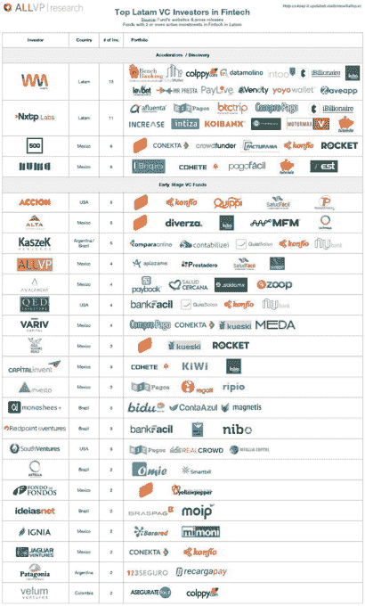

# 墨西哥金融科技的崛起

> 原文：<https://web.archive.org/web/https://techcrunch.com/2016/07/28/the-rise-and-rise-of-mexican-fintech/>

费德里科·安东尼撰稿人

费德里科·安东尼是

[ALLVP](https://web.archive.org/web/20230321184135/http://allvp.vc/)

墨西哥的一家早期风险投资公司。他是斯坦福大学商学院的管理学讲师。

More posts by this contributor

没有什么比金融科技的崛起更能说明墨西哥科技生态系统如何在拉丁美洲蒸蒸日上了。

金融服务领域符合企业家在创办公司时寻求的所有条件:难以解决的问题、有意义的影响、变革性技术、清晰的商业模式和坚实的融资环境。

另一方面，墨西哥的金融科技行业拥有风投梦寐以求的一切:巨大的未开发市场、高度可扩展的模式、具有稳固牵引力的初创公司、世界各地的成功案例以及多种退出场景。

虽然生态系统观察人士可能已经预测到了这一势头，但还是有必要退一步分析一下推动墨西哥金融科技崛起的力量，以便为该地区的其他行业和国家提供一个框架。

墨西哥似乎是在拉丁美洲成立金融科技初创公司的理想市场。首先，有很多经验丰富的创始人带来了丰富的商业、产品和技术方面的独特知识。他们通过利用私营企业和政府在过去 20 年中创建的坚实的金融基础设施，释放创新。

此外，金融服务业是多样化的、竞争激烈的和不断变化的，与尖端技术的速度同步。最后，天使投资人、家族办公室和风险投资人遍布这个领域的创始人，渴望并愿意投资更多更快。

如果你正准备创办你的第一家或下一家公司，墨西哥的金融科技机会值得长期关注。这可能是你打造下一个伟大创业公司的最佳机会。

## 是天赋，笨蛋！

自 2012 年墨西哥科技浪潮开始以来，一批经验丰富、精通技术、不留余地的新一代创始人已经出现，他们正在改变创业生态系统的面貌。

尤其是金融科技，吸引了一些最优秀的人才；从有硅谷科技公司经验的企业家，如 PayPal 的 Adolfo Babatz (PayClip)或 Ooyala 的 [Adalberto Flores](https://web.archive.org/web/20230321184135/https://www.crunchbase.com/person/adalberto-flores) (Kueski)，到其他引入相关行业专业知识的人，如 quant jock[David Arana](https://web.archive.org/web/20230321184135/https://www.crunchbase.com/person/david-arana)(Konfio)，P2P 先驱 Gerardo Obregon (Prestadero)，法律巨头 Marc Segura (Play Business)和 adtech 明星巴勃罗·埃尔南德斯·奥哈根(pagohagan) 比如对冲基金内部企业家费尔南多·拉莫斯(Briq)，小额信贷企业家费尔南多·德·奥贝索(Salud Fácil)和[文森特·费诺尔](https://web.archive.org/web/20230321184135/https://www.crunchbase.com/person/vicente-fenoll) (Kubo)以及典当行经理路易斯·克里尔(Cohete)。

众所周知，硅谷的创新是由第一代或第二代移民推动的。创新可以追溯到中东、俄罗斯和南非——超过一半的数十亿科技公司是由“外国人”创建的因此，当外国创始人搬到墨西哥时，我们都应该为他们欢呼——即使那些讨厌生态系统的人不会把他们的产品算作墨西哥的创新(他们可能是秘密选民，或者更糟，是代表！).

> 任何金融科技的发展都依赖于一个由管道、连接器、阀门和适配器组成的网络，让数据和资金在经济体中流动。

作为本土人才的补充，墨西哥很幸运地迎来了一些企业家，如来自阿根廷的美国运通前高管亚历杭德罗·康斯坦丁诺(阿富伦塔)，来自瑞士的前星球财经首席运营官·克里斯蒂安·西诺巴斯(奇异果)，来自巴西的连续科技企业家[鲁本·桑切斯·索萨](https://web.archive.org/web/20230321184135/https://www.crunchbase.com/person/ruben-sanchez-souza) (Visor)，来自西班牙的[费尔南多·卡贝略](https://web.archive.org/web/20230321184135/https://www.crunchbase.com/person/fernando-cabello-astolfi#/entity)以及来自哥伦比亚的前金融部门监管者[丹尼尔·罗哈斯](https://web.archive.org/web/20230321184135/https://www.crunchbase.com/person/daniel-mauricio-rojas) (Rocket)。

上个月，前投资银行家、现任财政和公共信贷部长路易斯·维德加雷·卡索(Luis Videgaray Caso)邀请上述大多数人参加了一个关于即将出台的金融科技监管的私人会议。这是一次令人印象深刻的聚会，不仅因为政府终于开始关注这个行业，还因为与最高级别的监管机构进行了高层、坦诚、有时甚至是激烈的讨论。

## 准备好跳跃了吗？

墨西哥代表着世界上最大的消费市场之一，新兴的中产阶级伴随着不断增长的服务业和制造业经济。在这种背景下，金融服务业充满了反差:在一个信贷渗透率极低、金融包容性低、欺诈水平高得吓人的国家，大型、灵活的银行和金融机构蓬勃发展。

事实上，中小企业的信贷缺口每年高达 100 亿美元，获得银行服务的缺口超过人口的一半，如果欺诈稳定在可接受的水平，潜在的储蓄将节省约 3%的 GDP。这些庞大的数字让这个机会变得如此令人感兴趣。

这些长期存在的问题的大多数解决方案都涉及到提高生产力和改变全国人民生活的技术。金融普惠和信贷渗透是公平社会不可或缺的。墨西哥各地的新兴中产阶级可以获得房屋所有权、更好的消费信贷和更多的投资机会。中小企业可以获得短期和长期融资，投资于营运资本、增长，当然还有技术。中小企业中更多的软件将反过来为创业公司带来新的机遇。这是一个前所未有的机会，可以用金融科技改变生活，改变行业。

墨西哥金融科技未来的另一个令人兴奋的方面是，大多数模型将在人工智能和纯移动世界中构建和扩展。P2P 平台将随着嵌入其算法的智能而扩展，支付系统将包括 API 友好的平台。诞生于后优步时代的拉丁美洲，众筹平台和钱包将通过手机瞄准数百万人。我们不仅可以快速赶上美国和英国，而且创始人可以建立更聪明的公司，具有更大胆的颠覆潜力。

## 关于管道和阀门

任何金融科技的发展都依赖于一个由管道、连接器、阀门和适配器组成的网络，让数据和资金在经济体中流动。自 20 世纪 90 年代以来，墨西哥政府、银行和金融公司一直在投资技术和基础设施。像 BBVA、花旗银行、贝莱德、美国运通、维萨和西联这样的公司在墨西哥都有活跃的分支机构，覆盖面很广。今天，一半以上的互联网用户通过网上银行和小额信贷机构在微型企业主中创造了一种信贷文化，为金融普惠创造了更好的环境。

最近，培尼亚·涅托政府在其总统任期前半年通过的一项更具雄心的改革与金融部门有关。它为信贷活动提供了更有利的法律环境，在过去三年里颁发了 50 多个新的银行执照，从而增加了竞争。金融包容性意味着更大的纳税人基础，反过来也是增加应税基础的优先事项。今天，只有 5000 万墨西哥人纳税；3000 万人仍游离于税收体系之外。

智能手机普及率和互联网使用率的增长速度超过了最乐观的预测，根据某些估计，将达到一半以上的人口。仅此一点就带来了无限的可能性，可以跨越像自动取款机这样的旧技术。

> 墨西哥金融科技正在快速起飞——而这才刚刚开始。

说到零售，LatAm 最大的连锁便利店，百货公司，电子产品零售商都在墨西哥。消费者可以支付账单，接收汇款，进行简单的金融交易。对零售商来说，这是一项非常好的业务，包括沃尔玛和埃莱克特拉在内的大多数零售商都有自己的银行。此外，Bimbo、百事可乐和可口可乐等大型消费品公司每月光顾 500，000 家商店，编织了一个物流网络，创始人可以利用该网络提供需要实物配送的金融服务。

世界各地的银行永远更多地参与到创业生态系统中。在墨西哥，零售银行规模庞大，不断增长，利润丰厚(就目前而言)。在 2000 年代的 M&A 活动浪潮之后，金融服务部门被西班牙和美国的银行(BBVA、花旗、桑坦德、汇丰和加拿大丰业银行)以及新兴的本地集团(Banorte、Gentera、GBM 和 Vector)所主导。这些公司正在尽快建立创新中心并投资墨西哥的初创企业。最近，美国运通在支付系统 [PayClip](https://web.archive.org/web/20230321184135/https://www.crunchbase.com/organization/payclip) 领投了 A 轮融资，Gentera 投资了发薪日贷款 [Mimoni](https://web.archive.org/web/20230321184135/https://www.mimoni.com/#/?_k=9bri6z) ，GBM 领投了房地产众筹 Briq 的种子轮，Crédito Real 收购了 [Resuelve tu Deuda](https://web.archive.org/web/20230321184135/http://resuelvetudeuda.com/) 。

## 下一件大事

尽管墨西哥的创业生态系统取得了进步，但天使投资仍然严重缺乏。然而，一个罕见的亮点是金融服务业。例如，天使投资者承担了推出 Resuelve tu Deuda、 [KiWi](https://web.archive.org/web/20230321184135/https://www.crunchbase.com/organization/kiwi-4) 、 [Prestadero](https://web.archive.org/web/20230321184135/https://www.crunchbase.com/organization/prestadero) 、[coherete](https://web.archive.org/web/20230321184135/https://www.crunchbase.com/organization/cohete)和 OpenPay 的大部分财务负担。事实上，经验丰富的前任和现任金融家都以天使投资者的身份参与其中，包括奥古斯托·阿尔瓦雷斯、费尔南多·帕迪拉、豪尔赫·奥尔蒂斯、费尔南多·勒洛·德拉里亚和哈维尔·克里尔。

在墨西哥创业的企业家面临着庞大而多样的机构投资者群体。我们都可能会抱怨与其中一些人的经历和互动，但事实是，我们很幸运有这么多。

另一个好消息是，总的来说，金融服务业对投资者有很强的吸引力。它对每一种潜在的支持者都有好处。当你向展示型投资者展示拉丁美洲的 1000 亿个机会时，他们会非常高兴。你的曲棍球棒和不断增长的数字让“展示我的魅力”投资者放心——我们看到 fintech 比任何其他行业都更有吸引力。

当您解释您的人工智能层或区块链协议时，先锋投资者——全新展示——将会很高兴。更传统的投资者，即“给我看出口”型投资者，会对 M&A 在全球的投资活动留下深刻印象，而作为支持，你可以通过一个包括当地风投、美国风投和战略投资者的财团，来吸引“给我看人群，但给我打电话”的主要投资者。

我们已经看到这一波乐观情绪的结果，不仅在种子阶段，而且在 A 系列赛阶段，风投们已经领导了[大轮](https://web.archive.org/web/20230321184135/https://techcrunch.com/2015/12/07/american-express-backs-mexican-fintech-startup-clip-as-emerging-markets-warm-to-financial-startups/)，最著名的是 Kueski、Konfio 和 PayClip，分别完成了 1000 万美元、800 万美元和 800 万美元的轮次。下表显示了活动的增加以及墨西哥如何在这一领域主宰拉丁美洲。

但并不是花园里的一切都是美好的。墨西哥的金融监管不是为快速创新设计的。尽管政府表现出了良好的意愿，但当涉及到监管时，钱仍然不在银行里。整个行业面临着与有组织犯罪和职业骗子使用的平台相关的丑闻风险。尽管结果很有希望，但规模仍在酝酿中。话虽如此，墨西哥金融科技正在快速起飞——这才刚刚开始。你不会想错过的。

*披露:在文章中提到的 18 家拉丁美洲公司中，有四家(Prestadero、Salud Fácil、Aplazame 和 Visor)获得了 ALLVP 的投资，Federico Antoni 是 ALLVP 的合伙人兼董事总经理，Federico Antoni 是 ALLVP 的顾问。*