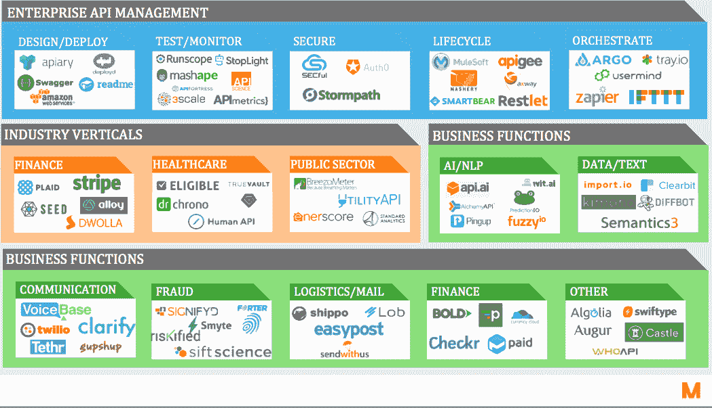

# APIs  的兴起

> 原文：<https://web.archive.org/web/https://techcrunch.com/2016/05/21/the-rise-of-apis/>

马特·墨菲是

[Menlo Ventures](https://web.archive.org/web/20230322083723/https://www.menlovc.com/)

成长风险投资公司的种子。Matt 专注于跨云基础设施和人工智能第一 SaaS 应用的多阶段投资。

More posts by this contributor

自从我们听说“[软件正在吞噬世界](https://web.archive.org/web/20230322083723/http://www.wsj.com/articles/SB10001424053111903480904576512250915629460)”以来，已经快五年了。SaaS 应用程序的数量激增，在提供关键结缔组织和日益重要功能的 API 领域，软件创新浪潮正在兴起。第三方应用编程接口公司激增，从根本上改变了软件创造和上市的方式。

几十年来，应用编程接口(API)一直是软件开发的一个关键部分，作为一种为特定平台(如 Microsoft Windows)开发的方式。最近，从 Salesforce 到脸书和谷歌等较新的平台提供商提供了帮助开发者的 API，实际上已经造成了开发者对这些平台的依赖。

现在，一种新的第三方 API 提供的功能使开发人员不必锁定任何特定的平台，并允许他们更有效地将其应用程序推向市场。

过去几十年为企业提供动力的单一基础设施和应用正在让位于分布式和模块化的替代品。这些都依赖于小型、独立且可重复使用的[微服务](https://web.archive.org/web/20230322083723/https://opensource.com/resources/what-are-microservices)，它们可以相对容易地组装成更复杂的应用程序。因此，开发人员可以专注于他们自己独特的功能，并将其与由其他专家开发的功能齐全的分布式流程相结合，他们可以通过 API 访问这些流程。

## 更快、更便宜、更智能

开发人员意识到，他们需要构建到应用程序中的许多功能对于许多其他公司来说是多余的。他们学会了不要把宝贵的资源花在重新发明轮子上，而是依靠来自更大平台的 API，比如 Salesforce、Amazon 以及最近的专业开发人员。我们仍然处于向第三方 API 转变的早期阶段，但许多有希望的例子说明了开发人员可以如何转向诸如支付连接的 [Stripe](https://web.archive.org/web/20230322083723/https://www.crunchbase.com/organization/stripe) 和 [Plaid](https://web.archive.org/web/20230322083723/https://www.crunchbase.com/organization/plaid) ，电话的 [Twilio](https://web.archive.org/web/20230322083723/https://www.crunchbase.com/organization/twilio) ，基于位置的数据的 [Factual](https://web.archive.org/web/20230322083723/https://www.crunchbase.com/organization/factual) 和网站搜索的 [Algolia](https://web.archive.org/web/20230322083723/https://www.crunchbase.com/organization/algolia) 等公司。

事实上，该地区正在蓬勃发展。最近一次检查显示， [ProgrammableWeb](https://web.archive.org/web/20230322083723/http://www.programmableweb.com/about) 提供了近 15，000 个 API 的可搜索访问，并且每天都在增加。开发人员可以将这些 API 整合到他们的软件项目中，并且比单干更快地进入市场。

虽然以更低的成本更快地进入市场是一个巨大的优势，但还有一个更重要的优势:专注于核心能力的公司以更高的速度开发差异化的功能，即他们的“秘方”。

> 对于软件开发生态系统的其余部分来说，好处是深远的。

另一个优势是第三方 API 通常更好。它们比内部构建的 API 工作得更好，提供的灵活性也更大。公司经常低估构建和维护功能的工作量，他们现在可以通过第三方 API 获得这些功能。最后，第三方 API 开发人员拥有更大的容量，可以访问更大的数据集，从而产生网络效应。

这些网络效应可以体现在从更好的定价到更好的 SLA，再到使用人工智能在数据中挖掘最佳实践和模式的方方面面。例如，Menlo 的投资组合公司 [Signifyd](https://web.archive.org/web/20230322083723/https://www.crunchbase.com/organization/signifyd) 提供欺诈分析作为 API。他们汇总了数百家公司的零售交易，这使他们能够比任何个人客户更好地了解各种欺诈标记。

## 一种新型的软件公司

将软件作为 API 发布允许这些公司追求许多不同的采用途径。客户通常是开发人员，而不是试图销售特定的行业垂直产品或用例，这导致了摩擦极低的销售过程。收入模式几乎总是重复出现，随着最终客户使用量的增加，这导致了固有的可扩展业务模式。虽然基于 API 的公司的生态系统还处于发展的早期，但我们相信这些公司的属性将结合起来，最终创造出更具资本效率和利润的商业模式。

这个机会不仅限于新贵。现有的开发人员可能有机会将他们自己独特的功能作为 API 公开，将他们的产品从应用程序变形到平台。一些杰出的公司已经建立了 API 业务，达到或超过了他们最初的关注点:据报道，Salesforce [的收入有 50%来自 API，易贝将近 60 %, Expedia 高达 90%。](https://web.archive.org/web/20230322083723/https://hbr.org/2015/01/the-strategic-value-of-apis)

这种模式对企业家和投资者很有吸引力。与其试图创建下一个热门应用程序，在验证可扩展需求之前不得不在营销和分发方面进行大量投资，不如构建一组有限的功能，并成为其他开发者的军火商，这可能更有意义。

API 模型创建了一条引人注目的市场路线，如果成功，可以有效地扩大资本规模，并随着时间的推移获得网络效应。目前，有 900 万开发人员在开发私有 APIs 随着人才看到了创建公司而不是功能的机会，我们可能会看到向公共 API 开发的重大转变(目前只有 120 万开发人员)。

## 重新思考价值链

过去，最大的公司是那些最接近数据(如记录系统)、能够征税或锁定其平台的公司。在 API 经济中，最大的公司可能是那些聪明地聚集最多数据并向其他人开放的公司。

这创造了新型的竞争壁垒，比如 Twilio 能够从运营商那里获得单个开发商无法获得的批量折扣，或者 Stripe 通过在许多开发商之间集中支付而享受的批量定价。像[Usermind](https://web.archive.org/web/20230322083723/https://www.crunchbase.com/organization/usermind-inc)(Menlo Ventures 投资组合公司)这样的公司展示了通过创建工作流和简化现有 SaaS 应用程序之间的 API 连接，让企业超越单一应用程序孤岛的巨大前景。

虽然 API 初创公司的生态系统今天很有吸引力，但我们相信它只会变得更加强大。在过去的五年里，人们对 SaaS、大数据、微服务和人工智能等面向企业的技术越来越感兴趣。API 是所有这四个领域的纽带。

随着企业软件开发领域进一步拥抱第三方 API，我们期望看到大量大公司的出现。低接触销售模式、经常性收入和缺乏客户集中度导致了一个非常有吸引力的商业模式。此外，对于软件开发生态系统的其余部分来说，好处是深远的，因为应用程序开发人员可以专注于提供其应用程序的独特功能，并以更快、更低的成本提供越来越重要的初始产品。

