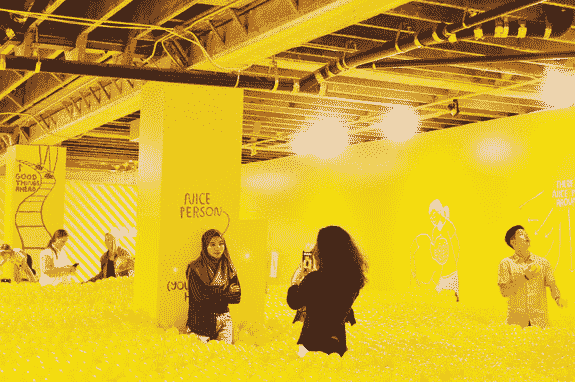
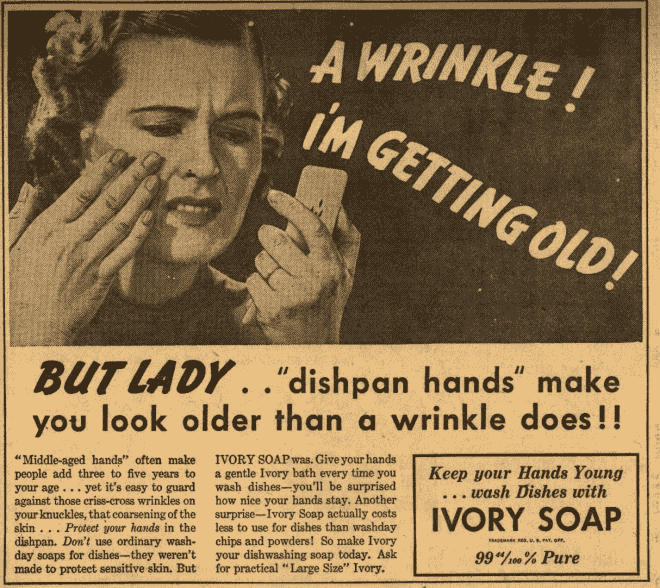
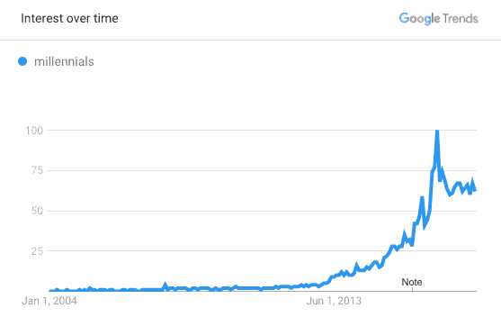
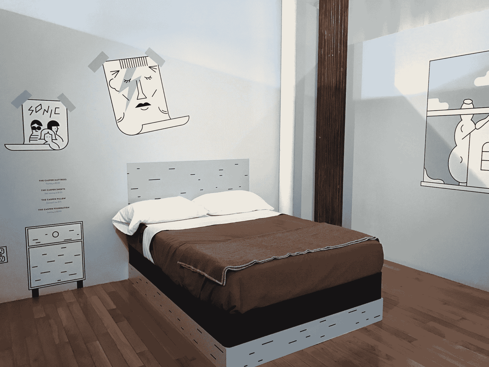

# 体验式商业的兴起 

> 原文：<https://web.archive.org/web/https://techcrunch.com/2018/03/17/the-rise-of-experiential-commerce/>

桑尼迪隆撰稿人

桑尼·迪隆是

[Signia Ventures](https://web.archive.org/web/20221007121451/http://signiaventurepartners.com/)

在旧金山，他投资零售技术、电子商务基础设施和物流，以及消费者和企业软件初创公司。

More posts by this contributor

“4300 万美元，你只能在里面买一杯咖啡。”

三星商店发展高级总监[米夏埃尔·科赫](https://web.archive.org/web/20221007121451/http://info.retailspacesevent.com/blog/the-transformation-of-experiential-retail)在谈到该公司的旗舰产品曼哈顿“popup”[三星 837](https://web.archive.org/web/20221007121451/http://info.retailspacesevent.com/blog/the-transformation-of-experiential-retail) 时如是说，尽管“popup”是对一个 56，000 平方英尺的洞穴的低调描述，这个洞穴有互动艺术、虚拟现实、休息区、录音室和一个三层的 96 屏幕显示墙。最令人震惊的不是那里有什么，而是领导这个项目的科赫对这个地方的评价

“我不希望你在里面买任何东西。”

 **这似乎与“商店”的目的背道而驰，但它抓住了一个关键的理解——体验是商业未来的核心。

 **## 各地的经历

那么什么是体验式商业，它看起来像什么？

红牛真的给了这家伙翅膀。

体验式商业的接管是一个有一千张面孔的人物。这是商店向陈列室的长期转变。Airbnb 首席执行官 Brian Chesky 的雄心是，该公司的[体验平台](https://web.archive.org/web/20221007121451/http://fortune.com/2017/10/23/airbnb-ceo-experiences-new-york/)将与房屋租赁并列，成为业务的核心部分。红牛花费 6500 万美元[将一名奥地利冒险者从太空气球](https://web.archive.org/web/20221007121451/https://www.sportsbusinessdaily.com/Global/Issues/2012/10/16/Marketing-and-Sponsorship/Red-Bull.aspx)中扔出，并在 YouTube 上向数百万观众直播。2017 年，美国的暑假支出增加了 100 亿美元，增幅为 12.5%。

你必须提前几个月购买旧金山[色彩工厂](https://web.archive.org/web/20221007121451/https://www.instagram.com/colorfactoryco/?hl=en)的门票，该工厂自称拥有 12000 平方英尺的“色彩体验”，而[密室](https://web.archive.org/web/20221007121451/https://blog.updraftventures.com/the-state-of-the-escape-room-industry-2017-f8e2bd6f0861)已经风靡全国。

这一定是林戈说的潜艇。

## 解释体验式商业的兴起

 **并不总是这样。历史上的现状主要集中在功能上。营销和品牌建设强调产品的用途——这个品牌可以很好地清洁你的衣服或熨平皱纹，或者如果你每天使用它，这种面霜会减少年龄线。

 **实体商店集产品测试、仓储和分销于一体。你走进一家零售店试鞋；客服助理走到后面去拿你穿的运动鞋；你在柜台付款，然后带着它出去。然而，最重要的是，商店是你买东西的地方。你应该走进去，然后带着东西走出去，否则商店和它的售货员就没有做好他们的工作。分析师会根据每家商店的“每平方英尺销售额”等指标来判断成功与否。

地狱的愤怒不像一只提前起皱的手。

现在 [Payless 破产](https://web.archive.org/web/20221007121451/https://www.cnbc.com/2017/04/04/payless-shoesource-files-for-chapter-11-bankruptcy.html)，Allbirds 正在[将收入](https://web.archive.org/web/20221007121451/https://www.racked.com/2017/9/5/16250626/allbirds-funding-kids-shoes)翻一番，到 2018 年达到 1 亿美元。现状就这样了。为什么？因为技术和物流的进步使它有可能改变，而消费者的偏好使它有必要改变。

电子商务基础设施(Stripe、AWS、Shopify 等)和履行网络的发展减少了在商店进行配送和仓储的需求。电商在工业地产的份额[在 2013 年到 2017 年间从 5%增长到 20%](https://web.archive.org/web/20221007121451/https://www.curbed.com/2017/12/18/16793180/warehouse-real-estate-amazon-retail-e-commerce)；仓库面积的增长速度是办公面积的两倍(T3)。2016 年，亚马逊代表市场卖家完成了[20 亿份订单](https://web.archive.org/web/20221007121451/http://www.businessinsider.com/amazons-earnings-highlight-expanding-logistics-network-2017-2)。随着无人机和其他自动驾驶车辆的交付仍然成为主流，[配送方面的创新几乎没有完成](https://web.archive.org/web/20221007121451/https://www.mckinsey.com/~/media/mckinsey/industries/travel%20transport%20and%20logistics/our%20insights/how%20customer%20demands%20are%20reshaping%20last%20mile%20delivery/parcel_delivery_the_future_of_last_mile.ashx)。

在线评论和免费送货/退货减少了在商店测试产品的需要——你知道运动鞋是好的运动鞋，因为 238 人评论了它们，平均评分为 4.7/5 颗星；即使它们被证明是糟糕的，你知道你可以零成本和最小的不便把它们送回去。

****

消费者偏好的改变有很多原因。在很大程度上，这种转变是一代人的转变，这意味着，是的，我们必须谈论千禧一代(我 33 岁，是一个古老的边缘千禧一代)。

 **千禧一代不像前几代人那样物质主义:2014 年由 Harris Poll 进行的 Eventbrite 研究发现[他们中 78%的人更愿意把钱花在想要的经历或事件上](https://web.archive.org/web/20221007121451/https://eventbrite-s3.s3.amazonaws.com/marketing/Millennials_Research/Gen_PR_Final.pdf)而不是想要的东西上。由于自我报告是支撑这一论点的不确定基础——我经常报告说更愿意花钱去健身房或吃奢侈的甜点——真正引人注目的发现是，在 1990 年至 2010 年期间，美国消费者在现场活动上的支出翻了一番，当时第一批千禧一代已经 30 岁了。

 **毫无疑问，这与社交媒体有关，社交媒体颠覆了消费中的显眼元素。当你可以花同样多的钱在多种上镜的食物和瑜伽课程上时，为什么要花大量的钱在一个昂贵的手表上，这将为你的 Instagram 追随者和喜欢计数做更多的事情？正如我的朋友黛博拉·温斯威格所说，“健康是新的奢侈品。”一件物品你只能拍一次，但一种有价值的生活方式囊括了数百个可分享的瞬间。

 **最后，共享经济的到来意味着知道如何驾驭这个空间的人——懂技术的年轻人——实际上不必拥有太多东西。当你可以把你的汽车外包给优步，把你的衣柜外包给出租跑道时，就有可能用更少的东西却用更多的东西。这些力量结合在一起，导致了我们今天看到的体验式商业繁荣。

 **## 体验式商务对企业意味着什么

 **将在这种环境中茁壮成长的公司明白，产品或实体场所的吸引力必须超越功能。商店必须是消费者想要消磨时间的地方，而不仅仅是交易的地方。这并不是一个新的观点——基于这个想法，星巴克花了几年时间成功地向顾客收取他们在自制咖啡上花费的 15-20 倍的费用[。星巴克 CEO 霍华德·舒尔茨曾经说过，他要让星巴克成为人们生活中的](https://web.archive.org/web/20221007121451/http://www.businessinsider.com/heres-how-much-money-you-could-save-by-making-coffee-at-home-2015-10)[、【第三个地方】](https://web.archive.org/web/20221007121451/https://www.fastcompany.com/887990/starbucks-third-place-and-creating-ultimate-customer-experience)，仅次于工作和家庭。因此，舒适的椅子、免费 Wi-Fi 和努力的装饰。星巴克的顾客完全知道这种价格差异，但仍然欢迎这种敲诈，因为他们喜欢在那里度过时光。我提到免费无线网络了吗？[蓝瓶](https://web.archive.org/web/20221007121451/https://techcrunch.com/2017/09/14/nestle-acquires-a-majority-stake-in-blue-bottle-coffee/)也在关注——添加更好的咖啡，减去免费 Wi-Fi；雀巢愿意花 5 亿美元收购一家拥有 40 家店铺的公司。

 **这个教训也渗透到销售实物商品的公司的头脑中。17 年前通过苹果商店改变了零售业的苹果公司，现在希望它的位置不仅仅是一个互动和购买产品的地方。在最近的 iPhone 活动中，苹果 SVP 公司(零售设计半神)安吉拉·阿伦茨展示了一个名为[“城镇广场”](https://web.archive.org/web/20221007121451/http://www.zdnet.com/article/apple-touts-new-town-square-retail-store-concept/)的新零售概念，将苹果的位置定位为当地社区参加音乐会、研讨会等活动的聚集地。

 **然而，不仅仅是三星和苹果这样的巨头拥抱体验。Casper 邀请其潜在客户来其展厅小睡一会儿。哈里在 Soho 开了一家[理发店。](https://web.archive.org/web/20221007121451/https://www.harrys.com/en/us/cornershop) [b8ta](https://web.archive.org/web/20221007121451/https://www.cnbc.com/2017/10/01/b8ta-uses-try-before-you-buy-to-revive-retail-model.html) 的功能就像一个科技产品陈列馆，倾向于让你先试一试。Glossier 想让你去逛逛，看看他们的陈列室，一位建筑记者[流着口水](https://web.archive.org/web/20221007121451/https://www.architecturaldigest.com/story/glossier-unveils-a-fabulous-brick-and-mortar-space)把它描述为“现代闺房和高级时尚娱乐场的混合体。”一个特别古怪的体验是，顾客按下一个红色按钮，一只戴着手套的手就会从一个孔里伸出来，在他们的手腕上喷洒更亮泽的香水。

所有 Casper 员工都在卧室墙壁上贴满了异想天开的手绘漫画。

然而，与星巴克不同的是，这个目标并不像说服某人花 5 美元买一杯咖啡那么直接。毕竟，这是一种交易，发生在消费者逗留的同一地点。相反，这些新的消费品牌希望利用出色的实体体验来吸引消费者——来我的展厅小睡一会儿，两个月后当你需要新床垫时，你会选择 Casper 而不是 Tuft & Needle。你可能不会在商店里订购，但你会回家在网上订购……这正是我们的想法。

在这种情况下，实体建筑比其他任何东西都更像是一种营销或品牌建设的努力。一种思考方式是把它当成一个精心设计的多维广告牌。

 **## 为什么体验式商务很重要

 **这种消费趋势的影响超出了时代广场和你的床垫选择。体验式商业正在加速零售工作和购物中心的衰落[。乐观主义者不难发现美国购物中心面积减少的好处——美国的人均购物中心覆盖率是德国的 10 倍，如果这意味着更多的经济适用房或绿色空间，许多人会乐于看到这一差距缩小。另一方面，当纽约人开始陶醉于三星 837 的数字财富时，该公司会为克利夫兰做类似的事情吗？如果 M & Ms 可以通过一个巧妙的时代广场广告牌噱头接触到一百万社交媒体公民，那就没有必要在明尼阿波利斯复制它。](https://web.archive.org/web/20221007121451/https://www.theatlantic.com/business/archive/2017/04/retail-meltdown-of-2017/522384/)

 **如果品牌将实体店铺视为营销费用，通过客流量和社交媒体曝光来提高亲和力，那么在人口最密集的大都市以外的任何地方开设店铺可能都没有意义。这种动态有可能进一步推动美国沿海和城市中心的经济活力。

不过，总的来说，体验式商业对消费者来说是个好消息。它已经进入了商品贸易领域，并向商品贸易注入了服务意识，消除了试图获取佣金的咄咄逼人的销售人员。这种态度的转变将会给 CPG 公司带来更高的标准和更有意义的消费者-产品互动。

 **鉴于分析师对[“零售末日”](https://web.archive.org/web/20221007121451/https://trends.google.com/trends/explore?date=today%205-y&geo=US&q=retail%20apocalypse)的着迷，你可能会认为资本主义末日时钟已经从 午夜 拨出了几分钟。虽然许多零售商正在加速死亡，但这一趋势并没有标志着零售业的终结，而是其本质上的一个转折点。对于花费数十年时间完善传统实体体验的零售商和品牌来说，这种转变并不受欢迎。但是，在当今竞争激烈的零售环境中，拥抱体验是保持相关性和业务的可靠方法。******************************