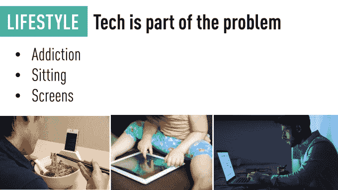
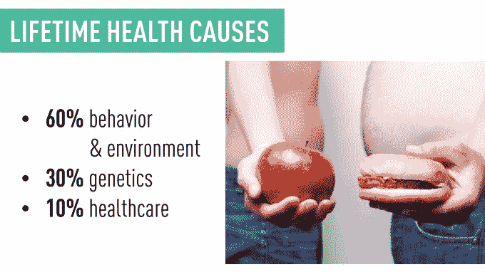
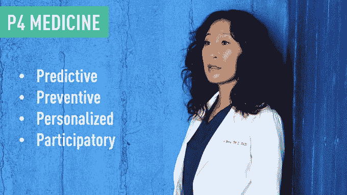
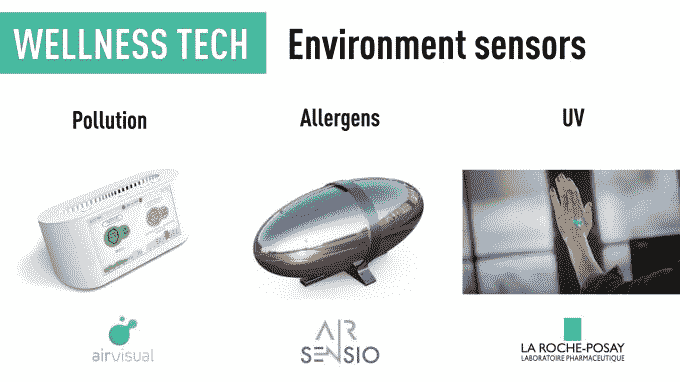
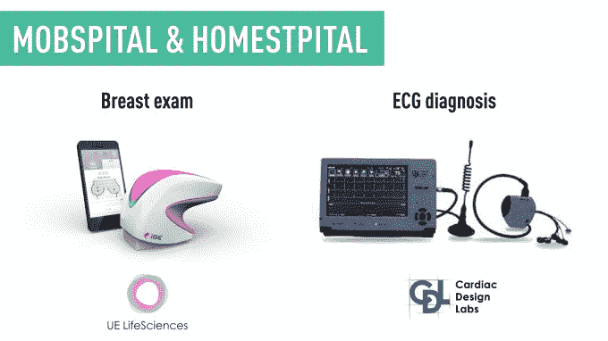
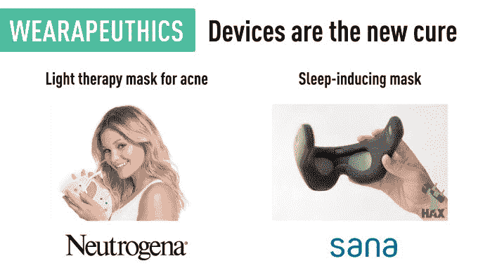
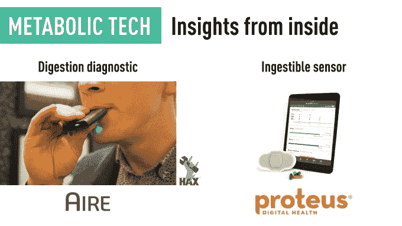

# “健康一代”的崛起

> 原文：<https://web.archive.org/web/https://techcrunch.com/2017/02/05/the-rise-of-generation-health/>

邓肯·特纳撰稿人

邓肯·特纳是

[HAX](https://web.archive.org/web/20230228130755/https://hax.co/)

，基于深圳& SF 的硬件创业加速器。

More posts by this contributor

本杰明·乔菲撰稿人

本杰明·乔夫是

[SOSV](https://web.archive.org/web/20230228130755/https://sosv.com/)

.

More posts by this contributor

在上升了十年之后，美国人的预期寿命已经开始稳定下来，对于某些群体来说甚至有所下降。

糖尿病、心脏病和肥胖症以及压力、焦虑和抑郁是现在的主要问题。现在的情况几乎是，在很多方面改善了生活的技术正在慢慢杀死我们。同时，马华力量化了

与此同时，相信量化自我的特立独行的人成功地对自己进行了诊断。

幸运的是，未来看起来更有希望。全球领先的医疗保健公司强生(Johnson)的首席执行官表示，“我们有机会让现在出生的一代成为历史上最健康的一代，即‘H 世代’。

如果你睡不着或者不能集中注意力，问题可能就在你面前

**从疾病护理到科学健康**

今天，医疗保健系统主要是围绕疾病设计的。这个系统为疾病买单，而不是，比如说，为健康有营养的食物买单。这对社会和个人来说成本很高(大多数个人破产都与健康有关)。这实际上是一个价值万亿美元的问题。除此之外，全球缺乏医疗保健专业人员，这种局面已经到了崩溃的时候。

现在，健康有许多决定因素。[虽然你的里程可能有所不同](https://web.archive.org/web/20230228130755/http://healthaffairs.org/healthpolicybriefs/brief_pdfs/healthpolicybrief_123.pdf)但有几次提到，一生的健康 60%与我们的行为和环境有关，30%与遗传有关，10%与医疗保健有关。

行为是一生健康的最大贡献者

今天对奇亚种子、扑克碗、防弹咖啡和其他“超级食物”的狂热强调了我们对健康的希望——这与凯洛格在《通往威尔维尔之路》中的虚构尝试没有什么不同。这反过来又启发了去研究[的市级实验](https://web.archive.org/web/20230228130755/http://hiccup.co/)。

但变化正在到来:上个月，一群具有前瞻性思维的创新者聚集在山景城标志性的计算机历史博物馆，参加了名为[超级健康](https://web.archive.org/web/20230228130755/http://hyperwellbeing.com/)的首届“健康即服务”活动。

关键想法迅速浮现:医疗保健的未来可能会从疾病护理转移到一个新的“科学健康”行业，帮助我们充分发挥幸福的潜力。还使用了“P4 医学”的表述:预测性、个性化、预防性和参与性。目标是预防疾病，延长寿命，优化健康和福祉。

“一个人的临床研究”即将到来:通过每年收集每人数千或数百万个数据点(而不是一年一次的体检)，通过混合数据和人工智能，我们将从“离散的”转向连续的“健康功能”。

**拯救生命的健康科技设备**

当谈到健康技术时，我们经常听到大数据、远程医疗和基因组学(与 [CRISPR](https://web.archive.org/web/20230228130755/https://en.wikipedia.org/wiki/CRISPR) )。虽然这很重要，但它并没有给出一个完整的画面:软件只有在数据进来时才工作。为了健康，这需要从我们的身体和思想中学习。这就是健康设备的用武之地。

这一趋势始于大约两年前，当时关键传感器正在商品化——部分原因是智能手机——而建立高科技硬件创业公司的成本和风险正在下降。生物医学工程师、医生和企业家开始加入这场竞争。

如今，初创公司希望跟踪、预防、诊断和治愈身体和精神疾病。他们希望我们更好，这是一件严肃的事情。

**新兴品类**

最著名的健康设备可能是 Fitbit，但是许多用户在几周内就放弃了它。就像吃药一样，这表明健康的一个关键挑战是行为。正如我们在 HAX 通过 20 多项投资所看到的那样，健康设备不仅仅是计数器，自从小米以仅 15 美元的价格发布了 [Mi 手环以来，健康设备已经成为一种商品。](https://web.archive.org/web/20230228130755/http://www.mi.com/en/miband/)

现在，请原谅我们为一些新兴的类别造了几个词。

**运动蔻驰软件:**结合传感器、人工智能、数据用于伤害预防或教练。只看跑步， [Vi](https://web.archive.org/web/20230228130755/https://www.kickstarter.com/projects/1050572498/vi-the-first-true-artificial-intelligence-personal) 是人工智能驱动的教练，而[Tiemppo](https://web.archive.org/web/20230228130755/https://tiemppo.com/en/index.php)智能鞋底通过实时步态分析帮助改善你的跑步形式。这些方法正在扩展到各种运动。

现在有一些追踪器可以帮助应对现代生活中的各种疾病。 [AirVisual](https://web.archive.org/web/20230228130755/https://airvisual.com/) 追踪污染， [AIR Sensio](https://web.archive.org/web/20230228130755/http://www.wlab.io/) 检测过敏原，还有很多像[Hello’s Sense](https://web.archive.org/web/20230228130755/https://techcrunch.com/2016/11/01/hello-launches-an-updated-voice-enabled-sense-bedside-sleep-tracker-for-149/)测量你的睡眠——根据阿里安娜·赫芬顿的新书“[睡眠革命](https://web.archive.org/web/20230228130755/http://ariannahuffington.com/books/the-sleep-revolution-hc)”，我们大多数人都需要更多的睡眠。

我们的环境让我们处于危险之中。

HAX 启动 [Darma](https://web.archive.org/web/20230228130755/http://darma.co/) 测量各种生物信号(心电图、呼吸等。)通过智能坐垫中的非接触式传感器(因为[坐姿是新的吸烟方式](https://web.archive.org/web/20230228130755/http://www.forbes.com/sites/davidsturt/2015/01/13/is-sitting-the-new-smoking/))或病床。其他人也在关注测量紫外线的[:初创公司，但也有重量级公司，如微软的](https://web.archive.org/web/20230228130755/http://www.wareable.com/health-and-wellbeing/smart-uv-protection-wearables) [Band 2](https://web.archive.org/web/20230228130755/http://www.wareable.com/microsoft/microsoft-band-2-review-1996) 和罗氏的[一次性紫外线贴片](https://web.archive.org/web/20230228130755/http://www.laroche-posay.co.uk/article/My-UV-Patch/a24995.aspx)。随着我们更好地理解人造光对注意力和睡眠的破坏性影响，光疗法也越来越受欢迎。

**移动/家庭医院:**低成本、便携式和互联版本的医疗设备正在推动移动或家庭诊断和护理的出现。例如， [iBreastExam](https://web.archive.org/web/20230228130755/http://www.ibreastexam.com/) 有助于进行无痛和无辐射的乳房扫描，在护理点即时提供结果。它诞生于印度，那里每 10 万居民中只有一名放射科医生。根据成本和法规，其中一些解决方案可能同时适用于新兴市场和发达市场。

有趣的是，这一新兴类别与台式机制造业有一些相似之处:从工厂中取出大型且昂贵的机器，并使它们变得更小、更便宜。

**weara authics:**治愈你的可穿戴设备。露得清(Neutrogena)使用[光疗法](https://web.archive.org/web/20230228130755/http://www.neutrogena.com/product/light+therapy+acne+mask.do)或 HAX 明矾 Sana 治疗痤疮的面膜怎么样，这有助于慢性疼痛和 PTSD 患者[在几分钟内入睡](https://web.archive.org/web/20230228130755/http://www.sana.io/)。我们的一些投资组合公司正在使用生物反馈和神经可塑性来管理各种情况:[利夫治疗公司](https://web.archive.org/web/20230228130755/http://www.lieftherapeuthics.com/)处理焦虑(刚刚在 [Kickstarter](https://web.archive.org/web/20230228130755/https://www.kickstarter.com/projects/getlief/lief-smart-patch-that-fights-stress?ref=b9x1eo) 上筹集了超过 40 万美元)，[生活公司](https://web.archive.org/web/20230228130755/http://www.habitaware.com/)处理咬指甲或拉头发等无意识行为，而[感觉公司](https://web.archive.org/web/20230228130755/http://www.myfeel.co/)利用情绪意识来帮助管理抑郁症，使用生物反馈和神经可塑性。

**婴儿科技:**嘉宝推出了 [BabyNes](https://web.archive.org/web/20230228130755/http://www.babynes.com/) ，这是一个针对快速增长的科技妈妈细分市场的“妈妈和婴儿综合解决方案系统”。他们今年在香港开了第一家旗舰店。HAX 公司 [BabyBe](https://web.archive.org/web/20230228130755/http://www.babybemedical.com/) 创造了一种“软机器人”智能垫子来帮助早产儿的发育。

代谢技术&可摄取物:我们的身体内部发生了什么？尽管 Theranos 公司一败涂地，[十几家初创公司](https://web.archive.org/web/20230228130755/https://www.cbinsights.com/blog/blood-testing-startups/)正在关注我们的血液——追踪糖尿病，检测各种血液标记，分析血型或疾病。HAX 创业公司 [Aire](https://web.archive.org/web/20230228130755/https://www.foodmarble.com/) 发明了第一个便携式酒精测试仪，通过检测食物不耐受来帮助 IBS 患者[。](https://web.archive.org/web/20230228130755/http://www.nbcrightnow.com/story/34007154/foodmarble-launches-aire-the-personal-digestive-tracker)

如果只是看看里面还不够，Proteus Health 的“可摄入”传感器与智能贴片和移动应用程序相结合，可以跟踪病人的状况。接下来:[补水追踪](https://web.archive.org/web/20230228130755/http://www.bitome.net/)。

**神经技术**:脑电波感应从基本的追踪发展到帮助[冥想](https://web.archive.org/web/20230228130755/http://www.choosemuse.com/)、[睡眠](https://web.archive.org/web/20230228130755/http://kokoontech.com/)和[工作](https://web.archive.org/web/20230228130755/http://www.thinkmindset.com/)——在有史以来最令人分心的世界中带给我们心流状态。HAX 校友[伯克利超声波](https://web.archive.org/web/20230228130755/http://www.berkeleyultrasound.com/)甚至用超声波刺激你的大脑来治疗抑郁症。这种设备会与抗抑郁药物竞争吗？很明显，它也有治愈老年痴呆症的潜力。

**仿生学**:你知道 2014 年至少有三家公司研发外骨骼[上市](https://web.archive.org/web/20230228130755/https://www.therobotreport.com/news/3-exoskeleton-companies-go-public)吗？两家在美国—[Ekso Bionics](https://web.archive.org/web/20230228130755/http://eksobionics.com/)和[ReWalk Robotics](https://web.archive.org/web/20230228130755/http://rewalk.com/)——还有一家在日本，名为 [Cyberdyne](https://web.archive.org/web/20230228130755/http://www.cyberdyne.jp/) (是的，就像[cyber dyne](https://web.archive.org/web/20230228130755/http://terminator.wikia.com/wiki/Cyberdyne_Systems)一样，在日本拥有[20 亿美元](https://web.archive.org/web/20230228130755/https://www.google.com.hk/search?q=cyberdyne+market+cap&oq=cyberdyne+market+cap)的市值。越来越多的人来了，比如 SuitX，或者最近毕业的 HAX 毕业生 Japet，他为背部疼痛设计了一个仿生康复解决方案。

每个生物黑客的梦想都实现了:我们终于拥有了超越基本 RFID 芯片的植入物。例如，Profusa 是一种微小的生物相容性植入物，它位于你的皮肤下，使用荧光来指示氧、葡萄糖、乳酸盐或其他生物标志物的水平。

健康科技设备才刚刚起步。如果您注意到其他新兴类别，请告诉我们！

**重新定义健康&健康**

对于传感器、大数据、机器学习和人工智能能为我们做什么，我们只是触及了皮毛。在我们没有疾病的未来，只是疲劳或注意力不集中可能会被视为一个主要的健康问题。在我们迈向更健康的道路上，是时候重新思考健康意味着什么了。

作者注:你正在建造一个健康科技设备吗？适用于 HAX 及其[健康轨道](https://web.archive.org/web/20230228130755/http://www.hax.co/hax-health/)！