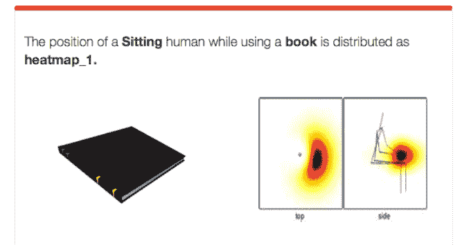

# “机器人大脑”将利用互联网来教机器人

> 原文：<https://web.archive.org/web/https://techcrunch.com/2014/08/25/the-robo-brain-will-use-the-internet-to-teach-robots/>

# “机器人大脑”将利用互联网来教机器人

如果你想知道天网什么时候上线的，不用再找了。去年 7 月，康奈尔大学的研究人员启动了 Robo Brain，这是一个搜索互联网并教会机器人如何思考的系统。

虽然我们晚了几年(这应该发生在 1997 年 8 月 4 日)，但机器人大脑实际上正在工作。通过拍摄公共网络上的图像和概念，Robo Brain 可以教会像 [Baxter](https://web.archive.org/web/20230326052954/https://techcrunch.com/tag/Baxter) 这样的机器人如何抓取和操纵物体，以及如何识别家用物品。在一堂“课”中，机器人大脑隔离了一个拿着书的人，从而使未来的终结者能够分辨出某人是在读赫胥黎的书还是挥舞着一把枪。

这个项目，[由 Robobrain.me](https://web.archive.org/web/20230326052954/http://robobrain.me/#/) 主持，是一个在互联网上搜索信息的系统，它可以教给机器人。数据库有多强大？

A 机器人的计算机大脑以数学家称之为马尔可夫模型的形式存储它所学到的东西，这种模型可以用图形表示为一组由线连接的点(正式名称为节点和边)。这些节点可以代表物体、动作或图像的一部分，每个节点都被赋予一个概率——你可以在多大程度上改变它而仍然是正确的。在搜索知识的过程中，机器人的大脑会建立自己的链，并在知识库中寻找符合这些限制的链。“机器人的大脑将看起来像一个巨大的分支图，具有多维查询的能力，”为大脑设计了大规模数据库的客座研究员阿特·科内尔·阿迪蒂亚·伊斯兰大教堂说。也许这看起来像是脸书朋友之间的关系图，但更多的是在银河系的尺度上。

由谷歌、高通和微软(以及国家科学基金会和其他机构)资助的 Robo Brain 将允许机器人更自由地与世界互动，更有效地与我们交流，并在他们起义的时候识别我们。你去哪里了，爱德华·福隆？一个国家将孤独的目光投向你