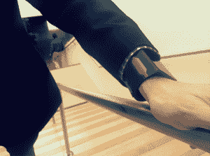

# Rufus Cuff 的尺寸和功能超过了微不足道的智能手表

> 原文：<https://web.archive.org/web/http://techcrunch.com/2014/04/17/the-rufus-cuffs-size-and-features-lord-over-puny-smartwatches/>

[vimeo 89260714 w=500 h=281]

Rufus Cuff 有着三英寸的屏幕，对有着小脸和精致腕带的智能手表嗤之以鼻。

这款可穿戴设备自称为“手腕沟通器”，运行于安卓系统，可以访问完整的 Google Play 商店；内置麦克风、扬声器和摄像头；完整的网络浏览器；加速度计和陀螺仪；触摸屏键盘；并附着在五种颜色的可切换硅胶带上。iOS 和 Android 设备都可以由 Rufus Cuff 控制，该公司现在正在通过蓝牙 4.0 连接在 Indiegogo 上筹集资金。

等一下，你可能想知道。为什么不把你的智能手机绑在手腕上，而不是再买一个小玩意呢？

[Rufus Labs](https://web.archive.org/web/20230320061409/http://www.rufuslabs.com/) 的首席执行官兼联合创始人 Gabe Grifoni 表示，随着智能手机变得越来越大——只有 4 英寸，最新款的 iPhone 是一个例外 Rufus Cuff 的目标是最终让手机“在 50%的时间里更像一个中枢设备，就像一个家用路由器，只需将信息推送到屏幕上，就可以进行完全的双向通信，而无需拿出平板手机。”

与智能手机不同，Rufus Cuff 被设计为在横向模式下使用(更容易在小屏幕上打字)。Grifoni 补充说，即使有三英寸的屏幕，它也比绑在手腕支架上的智能手机薄得多，也不那么显眼。

他说:“设计一款特别适合在旅途中佩戴、浏览和使用的设备的目标是，根据需要制作足够大的东西，但不要过大。”

“设计对我们来说非常重要，我们认为为这一特定目的设计可穿戴设备是我们的发展方向。这就好比说，为什么不在你的 iPad 上加一个带键盘的 folio，而不用笔记本电脑。我认为有些人会这样做，但对我来说，我发现这两种设备在我的生活中有着特定的用途。”

Rufus Labs 最终希望创建一个产品生态系统，让 Rufus Cuff 取代你的智能手机、钥匙和钱包。例如，你可以用它来控制一扇门的智能锁，或者将它连接到在线支付提供商和会员卡。

Rufus Cuff 已经筹集了 20 万美元的目标中的 14.4 万美元，其活动还剩 10 天，该设备有很大的机会达到目标。这款袖套起价 249 美元，预计发货日期为 2014 年 9 月。