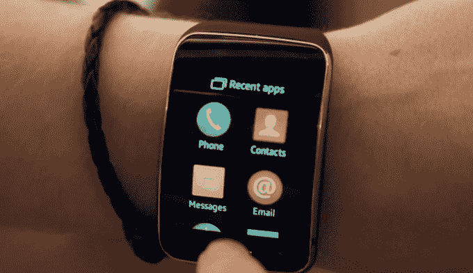
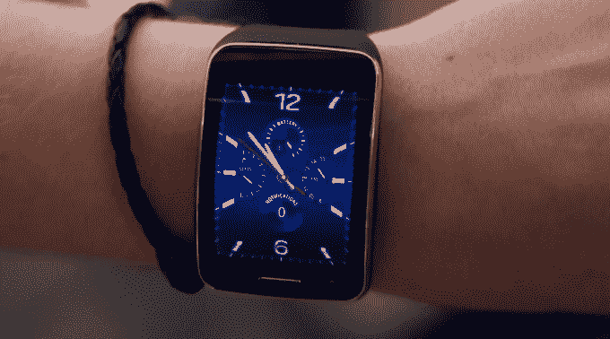
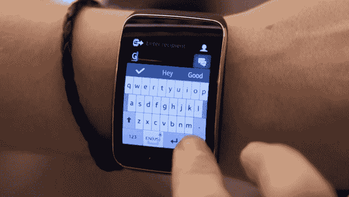

# 三星 Gear S 是戴在手腕上的智能手机 

> 原文：<https://web.archive.org/web/https://techcrunch.com/2014/11/15/the-samsung-gear-s-is-a-smartphone-on-your-wrist/>

早在 9 月宣布的[，三星 Gear S 是这家韩国电子公司第六次尝试制造智能手表。它拥有几年前的中档手机规格，运行三星自己的操作系统 Tizen。](https://web.archive.org/web/20221006110636/https://beta.techcrunch.com/2014/09/03/hands-on-with-the-samsung-gear-s-smart-watch/)

Gear S 的吸引力在于它可以独立于你的其他设备使用。除了蓝牙(Android Wear 设备和健身追踪器的标准配置)，三星的最新手表还具有 Wi-Fi 无线电，以及 2G 和 3G 蜂窝连接。

如果你通过手机运营商获得 SIM 卡(三星正在向美国所有主要运营商推广这一功能)，你可以将 Gear S 与一套无线耳机配对，并从三星的 Milk streaming 音乐服务获得你的慢跑播放列表，而不需要手机。您还可以使用内置的地图应用程序进行导航，以及在过马路时暂停交通时跟踪您的脚步并检查您的心率。

Gear S 由 [Tizen](https://web.archive.org/web/20221006110636/https://www.tizen.org/) 驱动，该操作系统原本将在命运多舛的[三星 Z](https://web.archive.org/web/20221006110636/https://beta.techcrunch.com/2014/06/02/samsung-z/) 上运行，并将于明年在三星的智能电视上运行。正如大多数非谷歌 Android 或 iOS 驱动的通用计算设备一样，Gear S 发布时没有太多可用的应用程序。三星在本周的会议上向许多开发者分发了其中一个，所以希望这种情况在未来几个月会有所改变。

在花 400 美元购买这款设备(和智能手机一样，价格取决于你是想签约还是分期付款)并承诺每月花 10 美元购买数据之前，去运营商或百思买试试这款设备。它是巨大的。

我从每天穿 [Basis Peak](https://web.archive.org/web/20221006110636/https://beta.techcrunch.com/2014/11/05/the-basis-peak-is-a-premium-fitness-tracker-that-could-be-a-little-smarter/) 换成了穿 Gear S，差别看起来很可笑。Gear S 的手表部分大约是 Peak 的两倍长，以便容纳弯曲的 2 英寸屏幕。它看起来像一个扭曲的小星系。

屏幕很漂亮，虽然我不得不说我不喜欢大多数默认的手表表面，它看起来像机械表，在指针的“后面”有通知指示器。我更喜欢直接用数字格式显示时间、步骤和通知的页面。不幸的是，切换面孔的菜单不让你预览，所以你必须一遍又一遍地翻菜单，才能找到你喜欢的那个。

同样奇怪的是:在消息应用中包含了一个非常窄的 QWERTY 键盘。没有人会觉得这个键盘很方便。您必须非常努力地去触摸正确的字母，但经常会错过，自动更正功能在防止绝对的挫败感方面做得很好。如果可能的话，你会希望只使用语音控制。

尽管拥有你能要求的所有收音机(对电池寿命有合理的预期)和相当大的存储量，Gear S 仍然与你的手机相连——这必须是三星。你需要手机来激活手表，获得更多应用程序，并获得更详细的健康数据等信息。我一直在使用一个朋友的旧 Galaxy S3 和 Gear S，所以我很高兴看到三星没有将其独家绑定到当前的旗舰设备上。

Gear S 最适合那些拥有 Galaxy Note 4 这样的大手机，又不想把手伸进包里或一直从口袋里晃来晃去的人。如果你有一部更小的手机，Gear S *可以*独立做事情的事实并没有提供足够的边际便利性改善，让我觉得值得在我的日常使用中投资。如果你的工作不需要你整天绑在电脑和/或电话上，那就完全不同了。