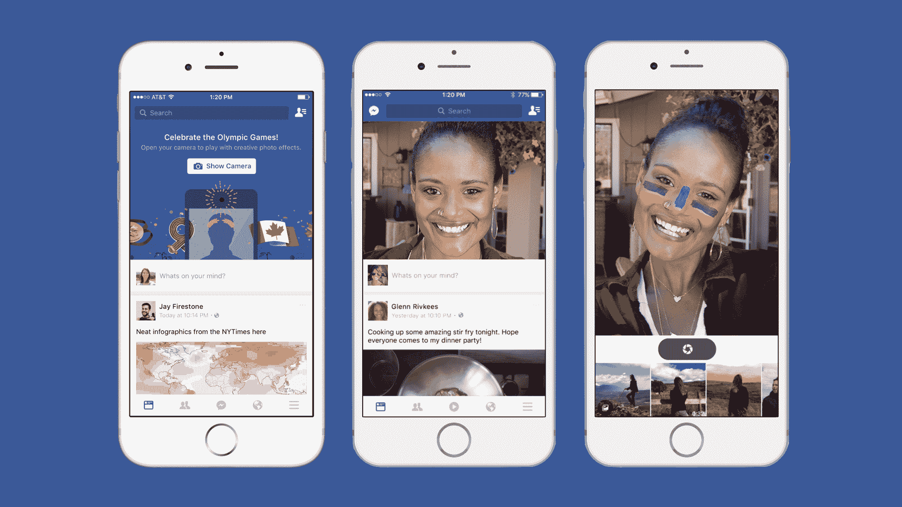
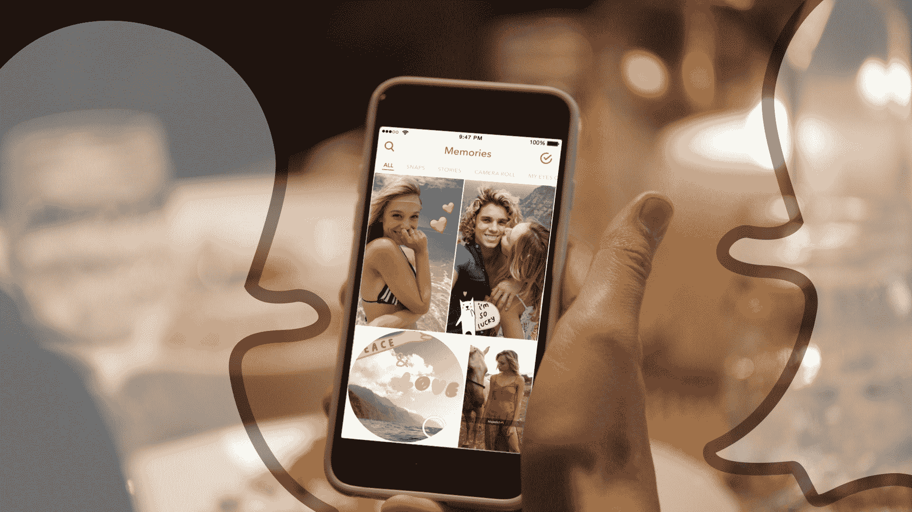

# 社交应用冗余引擎 

> 原文：<https://web.archive.org/web/https://techcrunch.com/2016/08/05/the-social-app-redundancy-engine/>

磨砂玻璃有一个明确的吸引力:它引人注目，有令人愉快的各种颜色，手感很好。制作它只是需要时间，重复的动作——把一些玻璃扔进一个平底玻璃杯里大约一个星期，瞧——出来的比进来的好。但它最终也只是玻璃。

我们每天使用的社交应用开始变得越来越像滚落的玻璃。

如果你认为模仿是最真诚的奉承，那么过去的一周让脸书成为了现存最真诚的科技公司，而 Snapchat 是最受宠若惊的。

周二，Instagram 推出了 Stories，它甚至没有费心更改它正在复制的产品的名称，Snapchat Stories。脸书旗下的 Instagram 也不避讳这种相似性: [Instagram 首席执行官凯文·斯特罗姆对 Snapchat 的这一概念给予了肯定](https://web.archive.org/web/20230129222039/https://techcrunch.com/2016/08/02/silicon-copy/)，如果你不在社交圈子中，这一概念包括让用户将照片和视频串成一个“故事”，在 24 小时后过期。

然后，上周五，脸书开始测试一项实验，即[移动应用程序直接打开用户订阅上方的一个相机窗口](https://web.archive.org/web/20230129222039/https://techcrunch.com/2016/08/05/facebook-camerafeed/)，该应用程序利用脸书收购公司 MSQRD 的自拍滤镜进行奥运搭配。当然，这是一种与特定事件相关的特殊情况，仅在巴西(有道理，奥运会在那里)和加拿大可用。加拿大是更有趣的组成部分，因为北美通常是公司在美国大规模推出之前进行测试的地方，因为该市场非常相似，但由于其规模小得多，风险低。

直接面对摄像机肯定会推动这种参与，尤其是对年轻观众。我们知道这一点，因为这就是 Snapchat 的工作方式。这也是脸书产生这个想法的原因。在接受 The Verge 采访时，FB 产品经理 Sachin Monga 解释说，它旨在给日常用户“这种神奇的 AR 体验”这不是 Systrom 风格的大喊，但 Snapchat 被广泛认为是通过其动态自拍过滤器广泛使用增强现实的先锋。

这两个例子在时间上如此接近可能足以证明我的观点，但 TechCrunch 的 Josh Constine 还发现[脸书已经完全建立了 Snapchat Stories 在脸书的克隆版本，但随后取消了发布](https://web.archive.org/web/20230129222039/https://techcrunch.com/2016/08/04/no-facebook-stories/)。

同时，这也不完全是单行道。Snapchat 本月早些时候推出了 Memories，这是一款可以与脸书时刻直接媲美的产品。它不仅给一个普遍严重依赖短暂性的社交网络带来了一些脸书风格的持久性，而且还引入了从相机胶卷中提取内容的能力，这使得品牌和出版商可以像脸书和 Instagram 一样，将其作为一个观众参与渠道。

 我完全赞成精益求精，我不认为任何一家科技公司在确定一种有效的交互模式或产品，并试图让它更有效，或更适合自己的受众方面有什么错:[这就是我们如何得到好东西的](https://web.archive.org/web/20230129222039/http://www.macworld.com/article/1151235/macs/apple-rolls.html)。但我无法摆脱这样一种感觉，即社交空间开始变得像是很多翻倒的玻璃，有很多翻新的东西，却很少有新的路径。

当然，随着更多新奇的努力，我们也有过一些失误。贝梅。桃子。Twitter(我开玩笑，算是吧)。这份名单包括一些早期令人兴奋的公司，以及应该对社交网站略知一二的创始人。不过，至少，他们有一些锋利的边缘，很高兴看到更多这样的边缘来自那些能够承受最大风险的球员。