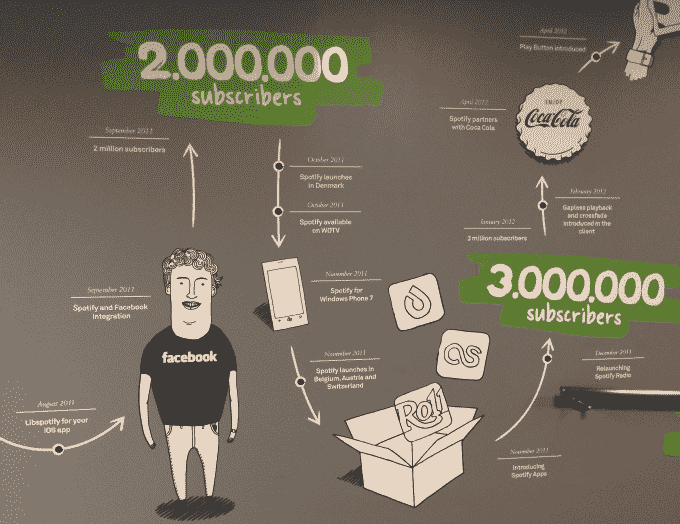

# Spotify - Echo Nest Skunkworks 内部 

> 原文：<https://web.archive.org/web/http://techcrunch.com/2014/10/19/the-sonic-mad-scientists/>

他们称之为松露猪，这是播放列表的原型。输入“可跳舞性”、日期范围或情绪等参数，松露猪会吐出一组顶级果酱，符合你的“相思 90 年代派对开创者”播放列表。

松露猪只是 sonic skunkworks 构想的新音乐发明之一，诞生于 [Spotify 以 1 亿美元收购 Echo Nest](https://web.archive.org/web/20230120033828/https://techcrunch.com/2014/03/06/spotify-connect/) 。在 Spotify 纽约总部的深处，该团队让我看到了合并后的公司计划如何提供推荐，将其他应用程序与合法音乐挂钩，并将人类 DJ 与算法相结合，以展示录音历史上最好的歌曲。

Spotify 花了很长时间来整理基础知识，所以它可以进入这个实验阶段。它的历史被记录在纽约总部大厅里一幅巨大的壁画上。每一个里程碑都有插图，从创始人 Daniel Ek 和 Martin Lorentzon 于 2006 年在斯德哥尔摩创立该公司，到 musictech curmudgeons Metallica 加入该服务，直到今天有 4000 万听众依赖 Spotify。这种艺术给人一种在 Napster 将盗版确立为规范后，让数字音乐再次合法化的斗争的感觉。这幅壁画唯一缺少的是 Spotify 为这次旅程筹集的超过 5 亿美元的巨额资金。

当 Spotify 在脸书的帮助下于 2011 年年中在美国推出时，它是仅有的点播流媒体服务之一，提供所有主要唱片公司的收藏。三年后，音乐已经成为一场残酷的地盘战，苹果/Beats、谷歌/Songza、Rdio、亚马逊、Deezer 和更多的公司争夺耳朵。

Spotify 拥有最大的图书馆之一，拥有超过 2000 万首歌曲，每天还会增加 20000 首。但重要的不是你的目录的大小，而是你用它做了什么。用户被选择淹没了，需要筛选出最甜美的声音。因此，每个服务都在拼命用发现来区分自己。

这也是 Spotify 收购 Echo Nest 的原因。作为音乐智能的基本构建模块，Echo Nest 的元数据和个性化推荐算法库为 Spotify、Rdio、Beats Music、SiriusXM 等提供了发现功能。因此，为了确保它比任何竞争对手都更了解人们想听什么，Spotify 斥资 1 亿美元(主要是股票)收购了这家马萨诸塞州的初创公司。

## 口味特征

经过几个月的整合，合并后的音乐巨头让我看到了它在修补什么。在办公室的一个假设房间里，我见到了 Spotify 的产品副总裁查理·赫尔曼(Charlie Hellman)和 Echo Nest 的首席执行官吉姆·卢切斯(Jim Lucchese)。很多人声称自己是狂热的音乐迷，但很少有人像这两个人那样激动得口吐白沫。

回声巢首席执行官吉姆·卢切斯

“这里的理念是创造绝对最佳的聆听体验，”Lucchese 说。“接触每一个热情的音乐粉丝，让普通粉丝更加投入，更加热情。”幸运的是，Spotify 的商业模式不是销售硬件或搜索广告。它的激励措施是一致的，因此当 Spotify 听起来更好时，所有人都会受益。赫尔曼解释道，“人们在平台上呆的时间越长，就越有可能付费”，这是 Spotify 真正的赚钱机器。

释放这种热情的关键是理解每个用户独特的音乐偏好，这样 Spotify 就可以向他们推荐合适的歌曲。所以 Echo Nest 的第一项工作是深入 Spotify 的所有数据。“我们参与度最高的用户每月有 20 多天前来，每次收听一个小时。卢切斯说:“数据太多了，比听众意识到的还要多。我们的目标是“把你理解成一个音乐迷，一个在我们走到一起之前我们都无法做到的深度。”

所有这些挖掘的结果就是 Spotify 所谓的“品味档案”，这是一种偏好分析和可视化工具，目前只对员工开放。通过评估您所听内容的元数据，Spotify 可以确定大量属性，包括:

*   主流化:你所听的音乐有多受欢迎？
*   **新鲜感**——你喜欢刚刚发行的音乐吗？
*   **多样性**——你对新声音有多开放？你多久向你的播放列表或收藏中添加一次新音乐？
*   在引领潮流者中，你玩的游戏有多时髦？
*   **发现**——你听的东西多久会流行一次？

“口味特征”工具用这些尺度来衡量你，并把你和其他人进行比较，然后宣布“你比平均新鲜度高出 6.6%。”除了有趣之外，这些统计数据还有助于 Spotify 知道它是否应该向你推荐更多或更少的主流歌曲，坚持经典还是提供最新版本，以及它是否应该利用你敏锐的耳朵向其他用户建议什么是热门。

“重要的是要知道你是一个处于风口浪尖的音乐专家，还是一个漫不经心的听众，”赫尔曼告诉我。“因为最终，我们希望这些用户有两种不同的体验。”

Spotify 还会评估您喜欢的流派和艺术家，以可视化您的音乐“集群”。这些都是你倾听身份的不同方面。我的音乐品味细分为 [Hot Chip](https://web.archive.org/web/20230120033828/http://open.spotify.com/artist/37uLId6Z5ZXCx19vuruvv5) 、[geographics](https://web.archive.org/web/20230120033828/http://open.spotify.com/artist/5vvvgOwPjA4R5t07ZXLLwZ)、 [Robert Delong](https://web.archive.org/web/20230120033828/http://open.spotify.com/artist/42crL07E4WPfVovyUtMpvC) 、 [Goldroom](https://web.archive.org/web/20230120033828/http://open.spotify.com/artist/4eZebkMFU3xelF8mbZYXyl) 、 [Poolside](https://web.archive.org/web/20230120033828/http://open.spotify.com/artist/5szdY7KaSi7epwyffrbV8c) 、[触敏](https://web.archive.org/web/20230120033828/http://open.spotify.com/artist/2OC53Inn0G9QwWM7CM0G5Z)等“Indietronica”，以及[詹姆斯·布雷克](https://web.archive.org/web/20230120033828/http://open.spotify.com/artist/53KwLdlmrlCelAZMaLVZqU)、[discovery](https://web.archive.org/web/20230120033828/http://open.spotify.com/artist/6nS5roXSAGhTGr34W6n7Et)和 [SBTRKT](https://web.archive.org/web/20230120033828/http://open.spotify.com/artist/1O10apSOoAPjOu6UhUNmeI) 等“颤音流行音乐”。

我可以从它的名字推断出最后一个的冰冷、分离的声音，但我完全被“R-Neg-B”是什么难住了。起初，我认为这是对《R&B》中“&”的错误翻译。但赫尔曼解释说，“否定”指的是这种流派对传统安全的 R&B 题材的反驳，以及它探索同性恋关系和禁欲主义等主题的倾向，如像弗兰克·奥申和 T2 这样的艺术家所描绘的那样。Spotify 不断在语义网上爬行，试图找出这些模糊的流派。

*给我自动生成的 Indietronica/Indie Pop cluster mix 一个旋转。*

[Spotify id = " Spotify:user:ajaykalia:playlist:2 nykocrqpms 6 gzup 7 acck 1 " width = " 300 " height = " 380 "/]

集群也可以变成不同的播放列表，包括一个流派中最受欢迎的歌曲，你已经听过的该风格艺术家的热门歌曲，或者夹杂着你可能喜欢的新艺术家。

品味档案和聚类都依赖于算法收集和编辑洞察的结合，以了解如何将艺术家归入流派。Hellman 说“这是一个很好的例子，说明了机器和人类并不矛盾，而是真正地在一起工作。”这些功能仍在 skunkworks 中孵化，但你可以在 Spotify 浏览和广播部分品尝它们的推荐。

## 块菌猪

Pandora 引以为豪的是，它的音乐基因组能够在没有真人驾驶的情况下播放你接下来想听的内容。然而，Spotify 正试图采用一种经典的发现方法:询问知识渊博的唱片店店员。然而，Spotify 的 skunkworks 并没有完全依赖人脑，而是设计了一种工具，将其纯粹的凡人编辑变成制作播放列表的电子人。松露猪。

“播放列表正进入它生命的下一个阶段，”赫尔曼说。“它始于你收藏的东西或你可以从收音机里录制的东西”，但现在由于唱片公司提供了对其全部旧目录的访问，Spotify 为其浏览功能制作播放列表的团队需要一种方法来整理其 2000 万首歌曲。松露猪创建了一个先进的搜索引擎，返回的结果可以很容易地整理成精确的播放列表。

通过 Echo Nest 对每首 Spotify 歌曲的详细分析，编辑可以输入与口味特征属性(如热度)或可量化方面(如节奏或录制日期)相对应的参数。但真正酷的是，它能够根据音轨的实际声音特征，如“声音度”、“语速”或“音量”来表现音轨。每个 Truffle Pig 搜索参数都可以设置一个阈值，因此编辑可能会允许一点语音或要求一首歌曲的高响度分数才能符合条件。

想做一个无字的播放列表，但是厌倦了电子音乐和古典音乐？一个编辑可以搜索过去 60 年的歌曲，用零语速、高音质和高能量来建立一个激励但不分散注意力的歌曲播放列表，这些歌曲来自像 Rodrigo Y Gabriela 这样的西班牙吉他大师。生气但讨厌重金属？调高可跳舞度，将情绪设置为“愤怒”，排除 80 年代的任何东西。对结果播放列表的参与度进行监控，以确定修订，并查看哪些播放列表具有点金术。

Spotify 产品副总裁查理·赫尔曼

“没有人比 Spotify 更重视 playlisting 了，”Hellman 声称。“编辑们互相指责他们的跳出率，取笑他们的一首歌表现很差，但却没有卖出去。”Spotify 希望通过给播放列表注入类固醇来提供大规模监管，而 Truffle Pig 是提高性能的药物。这种人类监管结合了朋友们所听的社交推荐和算法图表[，使 Spotify 成为一个全方位点唱机](https://web.archive.org/web/20230120033828/https://techcrunch.com/2013/08/10/the-quest-to-be-your-omni-jukebox/)。

遗憾的是，你还不会发现 Truffle Pig 公开发售，但 Hellman 表示，Spotify 正在研究如何在 2015 年为其社区中的时尚引领者和顶级业余选手提供访问途径。

## 合法音乐的支柱

即使有了目录和 Echo Nest 的数据，Spotify 也不能构建一切。排序、发现和播放音乐的方式多种多样。该公司很早就认识到了这一点，并于 2011 年 11 月在其桌面软件中推出了第三方应用平台。但在其他功能中，许多用户甚至从未发现像 MoodAgent 这样的应用程序，用于情感共鸣的音乐发现或 [Songkick](https://web.archive.org/web/20230120033828/http://songkick.com/) 用于附近你最喜欢的艺术家的音乐会。由于应用程序完全存在于 Spotify 中，而不是在移动设备上，它们很难赚钱，开发者对这个平台不屑一顾，Spotify 也不再接受新的应用程序。

然而，这是一个巨大的机会。Spotify 做了昂贵的跑腿工作，从主要唱片公司获得合法的音乐许可——这对小型音乐初创公司来说是非常困难的。因此，当 Spotify 收购 Echo Nest 时，我建议它创建一个 API，让人们用他们的 Spotify 帐户登录第三方音乐应用程序，并带着他们点播流媒体音乐的权利(T2)。这将使 Spotify 成为整个行业合法音乐的支柱，就像脸书通过让你登录其他应用程序并带上你的社交图谱而成为整个网络身份的支柱一样。

Spotify 不会像其竞争对手那样成为一个孤立的、一刀切的音乐应用程序，而是可以成为一个真正的音乐平台，在其库的基础上构建各种各样的界面。在我看来，每增加一个可以播放 Spotify 音乐的应用程序，你就会被更多地锁定，并有可能付费订阅。

Spotify 显然也有同样的想法。几个月后，它发布了与移动 DJ 应用 DJay 和 T3【起搏器】的第一个官方 API 合作。通过登录 Spotify，这些应用程序开始允许人们混合 Spotify 曲库中的任意两首歌曲，而不是像 iTunes 那样限制用户只能在本地设备上存储音乐。Echo Nest 数据还可以检测当前正在播放的歌曲的 BPM、可跳舞性和音调，并建议与之很好混合的歌曲。

这个 API 的影响不能被夸大。你可以突然用几乎所有录制的歌曲做 DJ，而不是你自己的那几首。这完全改变了音乐表演的游戏规则。只有当你每月订阅 9.99 美元的 Spotify Premium 服务，你才能使用它。

赫尔曼说:“如果人们能找到更多更好的音乐来听，并从这个生态系统中获得更多价值，我们就能繁荣发展。”。如果你必须在流媒体服务中选择订阅，Spotify 希望你会选择一个拥有完整应用程序系统的服务。

## 缺失的音符:社交

Spotify 可能有 1000 万付费用户，并有一个充满未来产品的 skunkworks 来招募更多用户，但它仍然没有完全解决社交问题。

首先，它让的脸书股票行情系统将你播放的每首歌的消息分享给朋友。很多人讨厌这个。这种感觉既令人生厌又令人生厌，让脸书充斥着偶尔令人尴尬却很少有用的故事，讲述你是如何听布兰妮的歌的。

然后 Spotify 改进了它自己的桌面自动收报机，让你可以 [跟随艺术家和名人](https://web.archive.org/web/20230120033828/https://techcrunch.com/2013/03/20/ears-on-with-spotify-social-the-new-follow-feature-now-available-to-everyone/) 的收听习惯。这个功能被塞在应用程序被遗忘的角落里，很少被使用。唯一有人真正关注的是由 Spotify 总监兼 Napster 创始人肖恩·帕克运营的独立音乐公开播放列表 [Hipster International](https://web.archive.org/web/20230120033828/https://open.spotify.com/user/napstersean/playlist/3vxotOnOGDlZXyzJPLFnm2) 。人们喜欢你如何订阅，新的歌曲会定期添加到顶部，这样你就总能听到新鲜的东西。

虽然社交在 Spotify 上被打破了，但它仍然是它最重要的元素之一。“把临时听众拉进 Spotify 的最强大的力量是朋友，”Lucchese 告诉我。

这就是为什么我认为 Spotify 应该利用 ticker、其浏览部分和 Hipster International 的最佳元素来创建我称之为 PlayFeed 的东西，而不是为音乐建立自己的小 Twitter。

这个想法是提供一个个性化的、不断更新的播放列表，它基于朋友们正在听的音乐、你喜欢的艺术家和流派的新专辑、排行榜冠军以及 Spotify 编辑团队的精选。Spotify 的浏览功能一部分是博客，一部分是新闻，需要你全神贯注，而 PlayFeed 则采用了人们熟悉的音乐优先、一放就忘的播放列表格式。但不是保持静态或需要你手动添加新的轨道，它们会根据 Echo Nest 的所有数据自动注入顶部。

在任何时候，你都可以按 play 来获得持续的、被动的新歌推荐，或者更深入地挖掘，返回到你喜欢的旧建议。这将有效地将 Spotify 的社交、算法和编辑监管统一到一个音乐发现的地方。如果做得好，它可能会像我们的其他提要一样令人上瘾，帮助艺术家增加他们的受众，通过他们的社交图锁定订户，并给 Spotify 带来一个差异化点。

## 不仅仅是一个亏损的领导者

Spotify 面临的最大问题是，它的点播流媒体竞争对手不在音乐行业。苹果使用音乐软件销售 iPhones 和 MacBooks。谷歌音乐旨在将人们锁定在其充满广告的生态系统中。亚马逊捆绑了“免费”音乐，每年 99 美元[的 Prime 订阅可以让你购买更多的实物商品](https://web.archive.org/web/20230120033828/https://techcrunch.com/2014/06/12/the-amazon-omnibundle/)。

【更新:Spotify 刚刚推出了一个[家庭计划](https://web.archive.org/web/20230120033828/https://www.spotify.com/us/family/)，该计划允许用户以 50%的价格，或者每人 4.99 美元，为最多四个额外的家庭成员购买高级订阅。一个五口之家将通过家庭计划支付 29.99 美元，每个人都有自己的账户，拥有自己的播放列表和个性化歌曲推荐，而不是 50 美元。]

不过，Spotify 的竞争对手可以提供比它更便宜的音乐，因为他们在其他地方赚钱。最终，点播流媒体可能是我们期望手机或移动操作系统免费提供的东西。大多数音乐听众还没有足够的骨灰级，以至于迫切需要或者甚至能够从一个简单的“足够好”的界面或目录中识别出一个更好的界面或目录。

要想胜出，Spotify 需要拥有最好的应用，并依赖于试用其广告支持版本的便捷性。Lucchese 说“我相信在今天的应用经济中，没有‘足够好’这样的东西。用户尝试新体验是如此容易，以至于人们不会满足于手机里的东西。”

因此，当竞争对手在整合方面胡作非为，试图决定音乐对他们有多大价值时，Spotify 可以继续微调其产品。鲁切斯总结道，“我们把它视为‘我们永远不会结束’”。