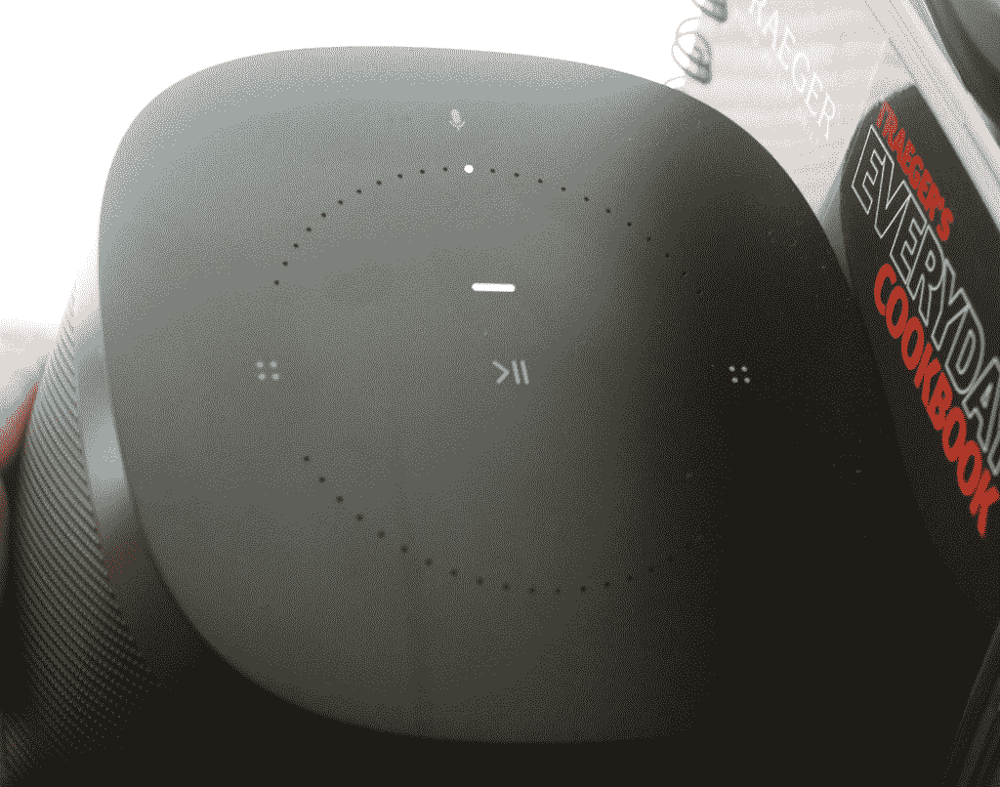
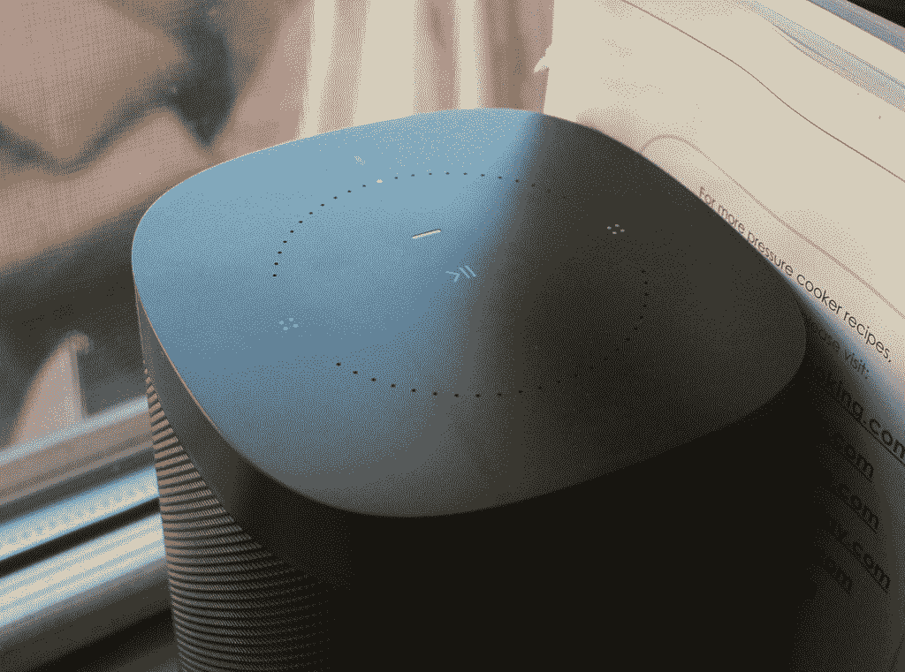

# Sonos One 提供了所有无线扬声器的优点，并配有 Alexa 

> 原文：<https://web.archive.org/web/https://techcrunch.com/2017/10/18/the-sonos-one-offers-all-that-wireless-speaker-goodness-with-a-side-of-alexa/>

# Sonos One 提供了所有无线扬声器的优点，并配有 Alexa

关于新的 Sonos 没有太多的话要说，Sonos 已经说过了。该公司长期以来一直是无线家庭音频和扬声器的黄金标准，虽然很小，但功能强大，可用于音乐、家庭娱乐和一般娱乐。那么如何让一个好的演讲者变得更好呢？加 Alexa 就行了。

新的 Sonos One 是一款 199 美元的全无线扬声器，可以通过智能手机或台式机控制。您可以将多个扬声器放在多个房间中，将它们配对在一起创建一个立体声系统，甚至可以将其中的四个扬声器连接起来，创建一个环绕立体声客厅系统。该单元作为独立或立体声组合使用效果最佳，非常适合厨房或卧室等较小的房间。

任何这种尺寸的扬声器在深度和范围方面都会有点静音，但 Sonos 传统上在平衡声音方面做得很好，没有诉诸廉价的技巧，如以牺牲高端为代价提升低音或添加声音改善“过滤器”。相反，这款手机有一个调谐系统，可以用你的智能手机听到房间周围的一系列信号。然后，它会将扬声器调到特定的房间。结果是更好的低音响应和清晰，这是调音前所没有的。

没有按钮，所以当你在客厅外使用这款扬声器时，不会沾上番茄酱或者更糟的东西。稀疏的黑色或白色身体并不引人注目，直到音乐开始通过一个简单的触摸涌出。

我倾向于同意 Engadget 的兄弟们的观点，Sonos One 是你能买到的声音最好的智能扬声器。但我想说这也是你能买到的最好的智能音箱，毫无疑问。设置的简易性、音乐来源的丰富性和界面的简单性让其他人大吃一惊。到目前为止，我已经使用了一些无线系统，除了一些适用于一个房间的基本蓝牙解决方案，没有什么能与 Sonos 丰富的功能体验相提并论。

Alexa 在这个组合中添加了什么？相当多。首先，你可以用设备顶部的触摸感应开关打开和关闭 Alexa。这确保了 Alexa 不会一直监听你。然后，一旦你打开她，你可以要求她播放汤姆·佩蒂、爵士、泰勒斯威夫特，或者苹果音乐、谷歌音乐、Soundcloud 或任何其他地方的播放列表、艺术家或标题的任何其他排列。你也可以告诉 Alexa 在不同的房间播放不同的音乐。

你需要把你所有的扬声器都升级到 Sonos One 吗？不完全是。One 与 Play 不相上下:1 在音质方面，只要你在 Sonos One 听不到你的房间里有一个支持 Alexa 的设备，你仍然可以发送语音命令。那么，这一个是对索诺斯万神殿的一个很好的补充，但不是绝对必要的。

缺点是什么？不多。Spotify 支持尚未发布，因此无法用语音控制该应用程序。此外，199 美元对于单个扬声器来说是一个很大的价格，但如果你看看简单性和单线设置，那么你肯定会看到花费 400 美元购买一对立体声系统的好处(或者大约 900 美元购买一个客厅设置，而不是类似价格的高端有线系统)。有价格低得多的家庭影院，但我挑战你找到一个具有 Sonos 提供的功能的。

所以 Sonos 又做了一次。本不应该挺过 2000 年代的小公司一次又一次地摇摆不定，[挺过了](https://web.archive.org/web/20221207100713/https://beta.techcrunch.com/2011/01/19/how-sonos-got-it-right-up-close-with-a-survivor/)，这也没什么不同。在一个面向廉价消费者的跟风音频设备的世界里，Sonos 给自己定了很高的价格，并给了我们大量的钱。很高兴看到他们以令人着迷和愉悦的方式向物联网未来迈出了试探性的一步。

