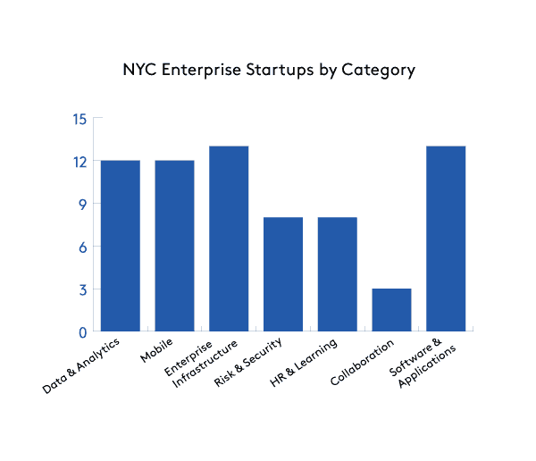

# 纽约市的企业技术状况 

> 原文：<https://web.archive.org/web/https://techcrunch.com/2015/03/08/the-state-of-enterprise-tech-in-nyc/>

乔纳森·莱尔撰稿人

More posts by this contributor

**编者按:** *乔纳森·莱尔* *是*[*Work-Bench*](https://web.archive.org/web/20221206061913/http://www.work-bench.com/)*的风险投资总监，在那里他专注于早期企业技术投资。他也是纽约企业技术聚会的创始人。*

人们经常吹捧纽约是主要产业的所在地，包括金融服务、媒体、广告、医疗保健和制造业。事实上，财富 500 强中有 52 家总部设在纽约，纽约市拥有的财富 500 强公司比美国任何其他城市都多。虽然这个等式的企业端是众所周知的，但鲜为人知的是我们在纽约市的企业创业生态系统增长了多少。

利用 Work-Bench [企业初创公司融资数据库](https://web.archive.org/web/20221206061913/http://www.work-bench.com/blog/2014/10/29/enterprise-technology-startups-funding-database/)、 [CrunchBase](https://web.archive.org/web/20221206061913/https://www.crunchbase.com/) 和其他关注纽约的来源的数据，我创建了一个主列表，代表符合我们对企业的定义[并已筹集外部资金的企业科技公司。](https://web.archive.org/web/20221206061913/http://www.work-bench.com/blog/2014/03/14/how-we-define-game-changing-enterprise-technology)

你可以在这里看到公司的完整名单[。通过观察地形，我们发现了四个有趣的趋势。](https://web.archive.org/web/20221206061913/http://www.work-bench.com/startups_database)

## 纽约有一个不断发展的 IT 基础设施生态系统

在快速增长的 IaaS 初创公司 Digital Ocean、使用 Tutum 和 Quay.io(被 CoreOS 收购，现在代表 CoreOS 的纽约团队)等容器的新兴公司、Appfirst 和超级热门的 [Datadog](https://web.archive.org/web/20221206061913/https://www.datadoghq.com/) (最近[筹集了 3100 万美元的 C 轮](https://web.archive.org/web/20221206061913/https://beta.techcrunch.com/2015/01/28/investors-thow-datadog-a-31m-bone/))等监控公司，以及 BetterCloud 的云应用管理平台之间，如果你眨眨眼，你可能会发现，当谈到 it 基础设施的未来时，纽约并没有乱来。

我们刚刚从 GoDaddy 对 node jitsu[的收购中走出来，并且有一些新的参与者，如 Bowery、Backtrace I/O 和 NSONE，所以请继续密切关注这一领域。](https://web.archive.org/web/20221206061913/http://venturebeat.com/2015/02/10/why-godaddys-nodejitsu-deal-is-great-for-node-js/)

## 垂直移动解决方案正在兴起

可能是因为我们在纽约有各种各样的行业，以垂直为重点的移动解决方案正在出现。[握手](https://web.archive.org/web/20221206061913/https://www.handshake.com/)正在颠覆批发销售订购和履行行业， [VTS](https://web.archive.org/web/20221206061913/https://www.vts.com/) 和 [Hightower](https://web.archive.org/web/20221206061913/http://www.gethightower.com/) 都使用移动设备重新思考商业房地产租赁，Monaeo 利用移动设备和位置提供可审计的税务数据， [Kasisto](https://web.archive.org/web/20221206061913/http://kasisto.com/) 实现移动银行应用的智能对话， [Enhatch](https://web.archive.org/web/20221206061913/http://www.enhatch.com/) 为移动销售专业人员提供更好的工具， [Lua](https://web.archive.org/web/20221206061913/https://getlua.com/) 使移动消息传递变得轻而易举， [FieldLens](https://web.archive.org/web/20221206061913/http://fieldlens.com/) 为建筑提供项目管理工具这些垂直移动应用程序已经筹集了 8000 万美元，能够在旅途中更快、更高效地完成业务。

我们还有诸如 [Appboy](https://web.archive.org/web/20221206061913/https://www.appboy.com/) 、 [Carnival](https://web.archive.org/web/20221206061913/http://www.carnivalmobile.com/) 和[m article](https://web.archive.org/web/20221206061913/https://www.mparticle.com/)等工具来帮助移动开发者构建和营销他们的应用。去年，谷歌以 1.2 亿美元的价格收购了 Divide，这是纽约市的一次大退出。

## HR 势头强劲

不知情的人可能认为人力资源是一个保守的行业，但不要告诉像[即](https://web.archive.org/web/20221206061913/http://www.namely.com/)和[温室](https://web.archive.org/web/20221206061913/http://www.greenhouse.io/)这样的人，他们分别为 HCM 和招聘提供工具。两家公司都在经历巨大的增长，并利用这种增长进入了新的融资轮:本周，[获得了 1，100 万美元的新融资，比三个月前融资 1，200 万美元的 B 轮融资翻了一番 Greenhouse 在 8 月份获得 750 万美元的 A 轮融资后，又获得了由 Benchmark](https://web.archive.org/web/20221206061913/http://www.forbes.com/sites/alexkonrad/2015/03/05/how-namely-doubled-its-valuation-in-three-months/) 牵头的 1，360 万美元的 B 轮融资。

我们还有 [Pymetrics](https://web.archive.org/web/20221206061913/https://www.pymetrics.com/) ，它将神经科学应用到招聘中， [Hirepurpose](https://web.archive.org/web/20221206061913/https://www.hirepurpose.com/) ，它帮助退伍军人找到工作，还有 [Pathgather](https://web.archive.org/web/20221206061913/http://www.pathgather.com/) ，它帮助企业通过利用 MOOCs 的内容来改善他们的学习管理系统平台。

[将过时的培训内容变成互动课程的 True Office](https://web.archive.org/web/20221206061913/http://www.trueoffice.com/)[于 11 月被纽交所](https://web.archive.org/web/20221206061913/http://www.forbes.com/sites/tomgroenfeldt/2014/11/19/nyse-acquires-true-office-developer-of-interactive-game-style-training/)收购，还有几家后期公司，如 [Jibe](https://web.archive.org/web/20221206061913/http://www.jibe.com/) 和 [PeopleDoc](https://web.archive.org/web/20221206061913/http://www.people-doc.com/) ，它们也称 NYC home。

## 数据和分析是一个相对成熟的领域

鉴于纽约有许多大公司需要通过数据获取商业价值，纽约市拥有许多成熟的数据和分析公司也就不足为奇了。虽然 [MongoDB](https://web.archive.org/web/20221206061913/http://www.mongodb.org/) 是纽约市的企业创业海报，拥有 3.11 亿美元的资金和[16 亿美元的估值](https://web.archive.org/web/20221206061913/http://blogs.wsj.com/digits/2015/01/14/big-data-startup-mongodb-now-valued-at-1-6-bililon/)，但我们也有像 [Syncsort](https://web.archive.org/web/20221206061913/http://www.syncsort.com/en/Home) (其 Hadoop 和大型机 ETL 工具的收入为[7500 万美元](https://web.archive.org/web/20221206061913/http://www.forbes.com/sites/gilpress/2014/02/11/top-10-big-data-pure-plays-2014/))、 [Sisense](https://web.archive.org/web/20221206061913/http://www.sisense.com/) (其面向非技术人员的商业智能工具已经筹集了 4400 万美元)和 [1010data](https://web.archive.org/web/20221206061913/https://www.1010data.com/) (其已经

尽管纽约有这些后期玩家，但资金也继续涌入早期数据和分析公司。我们拥有用于大数据分析的平台、数据库和数据集。这些包括 [Yhat](https://web.archive.org/web/20221206061913/https://yhathq.com/) 的平台，用于数据科学团队更有效地操作他们的模型， [InfluxDB](https://web.archive.org/web/20221206061913/http://influxdb.com/) 的时间序列数据库，以及 [Enigma](https://web.archive.org/web/20221206061913/https://www.enigma.com/) 使商业价值来自公共数据集。

别忘了预测分析、机器学习和人工智能。[占卜](https://web.archive.org/web/20221206061913/http://www.augury.com/)的预测维护工具识别需要维修的机器， [Fusemachines 的](https://web.archive.org/web/20221206061913/https://www.fusemachines.com/)机器学习技术改善客户体验，Amy 是 [x.ai](https://web.archive.org/web/20221206061913/https://x.ai/) 的友好虚拟个人助理，帮助你安排会议。

## 展望未来

今年有可能成为一个大融资年。迄今为止，我们有 26 家公司的融资额低于 800 万美元，17 家公司的融资额在 800 万至 3000 万美元之间，12 家公司的融资额超过 3000 万美元。我预计更多的西海岸风投会注意到这一点，我们会看到很多首轮融资、B 轮融资和 C 轮融资交易完成。这对我们的初创公司来说将是一个持续的福音，因为资金将推动额外的增长，并将我们在纽约的公司置于全国的聚光灯下。

今年可能还会有一些企业在纽约上市。Sprinklr 提供了一个社交媒体管理平台，使企业品牌能够通过每个接触点与客户联系起来，该公司可能会在今年[进行首次公开募股](https://web.archive.org/web/20221206061913/http://www.businessinsider.com/sprinklr-ipo-2014-4)。像 Datadog、Sisense 和 [Dataminr](https://web.archive.org/web/20221206061913/https://www.dataminr.com/) 这样的高增长公司可能会在今年年底或明年年初首次公开募股，如果他们的巨大增长继续下去的话。当然还有 [MongoDB](https://web.archive.org/web/20221206061913/http://www.mongodb.org/) ，这家 NoSQL 数据库公司是纽约市获得资金最多、估值最高的初创企业，也是 2015 年 IPO 的潜在候选人。

*感谢[大卫·阿罗诺夫](https://web.archive.org/web/20221206061913/https://twitter.com/dba)(Flybridge)[瑞秋·索罗门](https://web.archive.org/web/20221206061913/https://twitter.com/shannonsolomon)(首轮资本)[希文·齐里斯](https://web.archive.org/web/20221206061913/https://twitter.com/shivon)(彭博测试版)[莱尼·普鲁斯](https://web.archive.org/web/20221206061913/https://twitter.com/lennypruss) (RRE)分享了帖子上的宝贵反馈，并推荐了一些我在研究中遗漏的公司。*

True Office 和 LayerVault 是 Work-Bench Ventures 投资组合公司。

*BETTER、Bowery、Fusemachines、Enhatch、Honey、Kasisto、Hirepurpose、Monaeo、Nodejitsu、Mortar Data、Socure 和 Pymetrics 是 Work-Bench 的企业技术增长加速器的成员和/或校友，但 Work-Bench Ventures 在这些公司中没有所有权。*