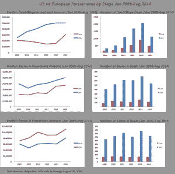
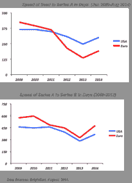

# 欧洲投资状况:过去 5 年回顾 

> 原文：<https://web.archive.org/web/https://techcrunch.com/2014/09/20/the-state-of-investments-in-europe-a-review-of-the-last-5-years/>

克里斯蒂安·埃尔南德斯撰稿人

斯蒂芬·皮隆撰稿人

**编者按:** *克里斯蒂安·埃尔南德斯是[白星资本](https://web.archive.org/web/20221205113849/http://www.whitestarvc.com/)的管理合伙人，斯蒂芬·皮龙是数据分析公司 [BrightSun](https://web.archive.org/web/20221205113849/http://brightsun.vc/) 的联合创始人。这篇文章的数据是通过 BrightSun startup discovery 工具从多个渠道收集的。*

在过去的几年里，有很多关于欧洲科技生态系统演变的文章，包括 Christian 自己对欧洲的乐观态度，Stephen 关于该地区种子基金爆炸的文章，以及吹捧伦敦、T21 和柏林这两个当地领先的创业中心的文章。

我们进行这一分析的目的是利用数据来确定欧洲创业生态系统面临的挑战和机遇。与美国同行相比，欧洲公司在每个阶段的融资规模都较小，在获得下一轮融资之前，这些融资最多能持续 8 个月。在首轮融资阶段，欧洲仍存在明显的资金缺口，同时还有更为严重的 B 轮融资危机。

点击放大

然而，这种情况正在改变。有更多的机构资金来源，正如我们自己的 White Star Capital、Passion Capital 和 Point Nine 等新的早期风险企业的崛起所证明的那样。我们也看到像 Atomico 和 Highland Capital Europe 这样的成长期投资者关闭基金，以期支持 Accel 和 Index 的 B 轮融资。

这些新投资者正对欧洲企业家日益增强的实力、活力和韧性做出回应。在过去五年中，成功筹集种子期资金的欧洲公司数量增加了 600%。首轮融资的规模中位数正在稳步上升。从赫尔辛基、伦敦到马德里和柏林，欧洲出境人数正在加速增加。

## 种子阶段的交易势头越来越大

过去几年，这两个地区的种子期交易量显著加快，美国在 2009 年至 2013 年间增长了 85%，达到 2000 多项种子期交易，欧盟每年增长近 6 倍，达到 900 多项交易。

这种现象可能是由宏观经济、政策和社会因素驱动的，这些因素导致对创业精神的更大兴趣，对该地区天使投资者的各种税收激励，以及欧洲每个主要中心的大量加速器和孵化器。

## **资金缺口始于种子期**

在 2009 年至 2014 年期间，美国种子阶段的投资额中值翻了一番，达到 50 万美元。另一方面，在欧洲，从 2010 年到 2013 年，这一数字每年都下降到 15 万美元。2014 年前 8 个月，这一增长达到了更健康的 30 万美元(受瑞典和德国更大规模种子交易的推动)，但数据集太小，不足以最终表明更广泛的上升趋势。

换句话说，在过去五年的大部分时间里，相对于美国的竞争对手，欧洲的种子期公司资本不足。这可能意味着欧洲创业者的创业潜力只有大西洋彼岸的三分之一，但我们强烈反对这种假设。

我们承认美国市场一开始就提供了更大的规模。然而，我们要指出欧洲初创公司不断增长的势头和全球潜力，最近 King、SuperCell、BlaBlaCar、Klarna、Spotify 和其他公司就证明了这一点。我们还认为，脸书、Twitter、App Store 和 Google Play 等分销渠道的全球影响力正在降低任何单一市场的规模。

## **A 轮和 B 轮危机在欧洲更大**

如果以中值回合规模来判断，欧洲似乎正在 A 轮阶段迎头赶上。自 2009 年以来，欧洲 A 轮交易的数量几乎翻了一番，融资金额的中位数增加了 73%，达到 375 万美元。相比之下，2014 年在美国制造的 531 系列的资金中值为 500 万美元，自 2009 年以来增长了 28%。

然而，如果我们看看成功筹集 A 轮融资的种子期公司的比例，我们会发现“A 轮融资危机”在欧洲要严重两倍。自 2009 年 1 月以来，我们收集了超过 9000 笔种子交易的数据，其中只有 6%的欧洲公司成功获得了 A 轮融资，而美国的这一比例为 12%。更能说明问题的是，只有 1.5%的欧洲公司继续进行 B 轮融资，而美国有 4%

因此，虽然首轮投资的美元金额中值差距正在缩小，但资本供应正在减轻欧洲早期公司漏斗的缩小，并持续到后期阶段。

## **更少的资金，欧洲 B 系列赛更长的燃烧期**

在 B 轮融资阶段，无论是融资交易的比例还是融资规模，美国都远远超过了欧洲

在此期间，欧洲 B 轮交易的数量保持不变，而美国则增长了 37%。自 2012 年以来，美国 B 轮交易和欧洲 B 轮交易的中值规模之间一直存在 300 万美元的差距。这标志着欧洲公司资本不足的危险，尤其是当他们试图与美国同行进行大规模竞争时。

## **投资速度**

我们通过观察投资的“速度”来深入研究这一现象。在这种情况下，速度是指一家宣布进行种子融资的公司进行 A 轮融资和随后的 B 轮融资的平均天数。

点击放大

乍一看，欧洲从种子到 A 轮的速度从 424 天增加到 205 天似乎是一个好迹象。然而，请记住，2013 年欧洲的平均种子投资是 15 万美元，而美国是 50 万美元。

我们怀疑，欧洲两轮融资间隔时间的缩短不幸地表明，企业家正被迫以牺牲构建和扩大产品和业务为代价，更快地重新聚焦于融资。

对于 B 轮融资，美国公司在 A 轮融资后平均融资 375 天，而欧洲为 486 天。换句话说，欧洲公司(它们的 A 轮融资一开始就少了 20%)在筹集 b 轮融资之前，必须让这笔钱再维持四个月。欧洲初创公司可能会将更大比例的资金用于支持 burn，而不是投资于增长和规模。

作为欧洲的资助者和创始人，我们都坚信欧洲的知识、技术和创新人才正在将注意力转向数字领域。欧洲企业家有雄心、能力和远见在他们的领域创造全球领导者，数据证明了这一势头，但也证明了未来的挑战。