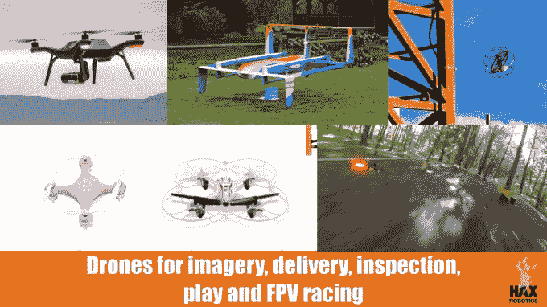
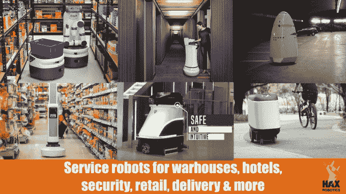
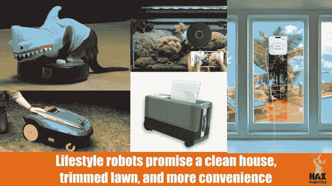
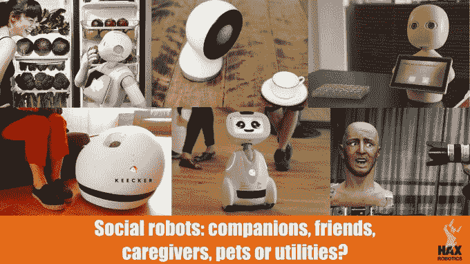
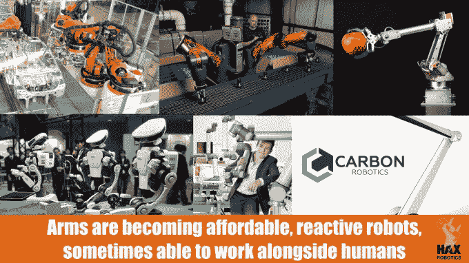
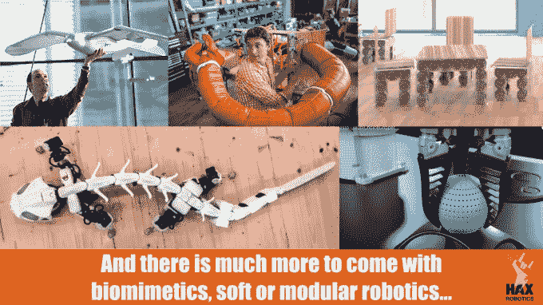

# 2015 年机器人技术状况 

> 原文：<https://web.archive.org/web/https://techcrunch.com/2015/12/13/the-state-of-robotics-for-2015/>

西里尔·埃伯斯韦勒撰稿人

西里尔·埃伯斯威尔是

[HAX](https://web.archive.org/web/20230130234710/https://hax.co/)

，是的普通合伙人

[SOSV](https://web.archive.org/web/20230130234710/https://sosv.com/)

.

More posts by this contributor

邓肯·特纳撰稿人

邓肯·特纳是

[HAX](https://web.archive.org/web/20230130234710/https://hax.co/)

，基于深圳& SF 的硬件创业加速器。

More posts by this contributor

本杰明·乔菲撰稿人

本杰明·乔夫是

[SOSV](https://web.archive.org/web/20230130234710/https://sosv.com/)

.

More posts by this contributor

当有缺陷的悬浮滑板被点燃来庆祝圣诞节时，机器人正逐渐从实验室走向新闻报道，进入我们的日常生活。

首先是已经在许多人手中的无人机，早期部署的自动驾驶汽车，如[特斯拉的 autopilot](https://web.archive.org/web/20230130234710/https://www.teslamotors.com/presskit/autopilot) ，以及像 3d 打印机这样的桌面机器人。

2015 年，机器人以多种形式、形状和行业出现。对机器人的投资持续增长(2014 年约为 3 . 4 亿美元)，机器人创业公司的数量也在增长。他们代表了 2015 年 T21 三分之一的新投资。

现在让我们回顾一下机器人技术的现状。

**机器人蓬勃发展**

像所有联网设备一样，它们受益于智能手机和高级游戏机的繁荣带来的传感器和 CPU 价格和尺寸的大幅下降。机器人公司当然可以感谢苹果、任天堂和微软！他们还可以感谢现已倒闭的初创公司 Willow Garage 发起了 ROS 机器人 OS 项目。

更多的项目和可用的早期资本意味着许多创业公司可以建立原型。随着大多数专业资金等待收入来推动增长，下一阶段的事情变得困难起来。尽管如此，许多初创企业获得了大量资金。谷歌、亚马逊、特斯拉、苹果和优步等大型企业正在投资或收购各种公司、人才和技术。

什么是机器人？

想出一个能让专业人士和公众都满意的定义并不容易，因为他们会随意使用这个术语。简而言之，机器人是一种通过自主运动来适应环境并做出自主决定的设备。该定义不包括仅执行重复性任务或需要完全远程控制的机器。因此，大多数玩具无人机、3d 打印机和大量工厂武器都不符合条件，尽管许多人会称它们为机器人。然而，这些机器人正朝着拥有计算机视觉和更多智能的方向进化，并朝着合适的“机器人”状态爬行。

**机器人回顾**

给机器人分类是另一个棘手的问题。这可以根据技术或应用来完成。我们决定按以下方式对他们进行分组:

**无人机**正受到大量关注和资助。、 [3DR](https://web.archive.org/web/20230130234710/https://www.crunchbase.com/organization/3d-robotics#/entity) 、 [Parrot](https://web.archive.org/web/20230130234710/https://www.crunchbase.com/organization/parrot) 以及 [eHang](https://web.archive.org/web/20230130234710/https://www.crunchbase.com/organization/ehang) 和 [Yuneec](https://web.archive.org/web/20230130234710/https://www.crunchbase.com/organization/yuneec-apv) 等少数新贵获得了 8 位数的投资(中国正在崛起为无人机强国)。 [GoPro 公布了 2016 年的参赛作品](https://web.archive.org/web/20230130234710/http://www.theverge.com/2015/10/28/9631626/gopro-drone-quadcopter-test-footage)。应用程序正在从图像、测量和监控发展到交付([亚马逊 Prime Air](https://web.archive.org/web/20230130234710/http://www.amazon.com/b?node=8037720011) ，阿里巴巴，但也包括中国的顺丰快递等交付公司)、检查，甚至[第一人称视角(FPV)比赛](https://web.archive.org/web/20230130234710/https://www.youtube.com/watch?v=ZwL0t5kPf6E)。主要参与者组成了[小型无人机联盟](https://web.archive.org/web/20230130234710/http://www.smalluavcoalition.org/)来通知政策制定者和促进安全。

**服务机器人**是最令人兴奋的类别之一。零售机器人初创公司 [Simbe Robotics](https://web.archive.org/web/20230130234710/http://www.simberobotics.com/) *的联合创始人 M.A. Shah 表示，“今天的自主地面服务机器人拥有与 2-3 年前无人机相同的势头”*。

其中包括仓库机器人——Kiva Systems(现为[亚马逊机器人](https://web.archive.org/web/20230130234710/https://www.amazonrobotics.com/#/))、 [GreyOrange](https://web.archive.org/web/20230130234710/http://www.greyorange.com/) 、 [Fetch 机器人](https://web.archive.org/web/20230130234710/http://fetchrobotics.com/)、[inVia](https://web.archive.org/web/20230130234710/http://www.inviarobotics.com/)——以及其他各种行业的机器人，如[接待](https://web.archive.org/web/20230130234710/http://www.savioke.com/)、[监控](https://web.archive.org/web/20230130234710/http://www.knightscope.com/)、客户服务[零售库存](https://web.archive.org/web/20230130234710/http://www.simberobotics.com/)、[拆除](https://web.archive.org/web/20230130234710/http://www.husqvarna.com/us/construction/products/demolition-robots-product-range/)、[商业清洁](https://web.archive.org/web/20230130234710/http://avidbots.com/)、[地面递送](https://web.archive.org/web/20230130234710/http://www.dispatchrobotics.com/)、[清洁](https://web.archive.org/web/20230130234710/https://ecovacsrobotics.com/ecovacs-robotics-products/winbot-window-cleaning-robots/)

**生活机器人:**自主真空吸尘器和剪草机现在已经普及并迅速商品化。像 Nua 的行李箱这样的新产品越来越接近于一种小丑的生活方式。

社交机器人:他们是新一代的王牌。从软银的 [Pepper](https://web.archive.org/web/20230130234710/http://www.softbank.jp/en/robot/) 到麻省理工的 grad [Jibo](https://web.archive.org/web/20230130234710/https://www.jibo.com/) ，或者法国的 [Keecker](https://web.archive.org/web/20230130234710/http://www.keecker.com/) 和 [Buddy](https://web.archive.org/web/20230130234710/http://www.bluefrogrobotics.com/) ，很难说这是否会流行起来。

**Robot arms:**

传统的工业部门正朝着两个方向发展:更智能(使其成为真正的“机器人”)和更低的成本。爱好武器现在可以找到了

[for a few hundred dollars](https://web.archive.org/web/20230130234710/https://www.google.com/search?q=robot+atm+kickstarter&oq=robot+atm+kickstarter&aqs=chrome..69i57.3532j0j7&sourceid=chrome&es_sm=91&ie=UTF-8)

。制造操纵物理世界的机器人的圣杯可能是低于 5000 美元的工业级手臂。一些创业公司，比如

[Carbon Robotics](https://web.archive.org/web/20230130234710/http://www.carbon.ai/)

正在工作

那些协作机器人是机器人学的一个有前途的分支，像 [Rethink Robotics](https://web.archive.org/web/20230130234710/http://www.rethinkrobotics.com/) 、 [Universal Robots](https://web.archive.org/web/20230130234710/http://www.universal-robots.com/) 、 [Kawada Industries](https://web.archive.org/web/20230130234710/http://nextage.kawada.jp/en/) 或大型 [ABB](https://web.archive.org/web/20230130234710/http://www.directindustry.com/emag/hannover-messe-2015/robots-yumi-abb-cobot-enters-the-market-9033.html) 这样的公司。和人类一起工作，当它们变得可以被非专家训练，并且一旦价格下降，它们会变得非常有用。

**其他机器人:**在这里，我们有 DARPA 资助的项目，谷歌与 [Boston Dynamics](https://web.archive.org/web/20230130234710/http://www.bostondynamics.com/) 一起收购，还有农业机器人、[仿生机器人](https://web.archive.org/web/20230130234710/http://www.buildingservicesblog.com/festo-biomimicry-robots/)、[可重构机器人](https://web.archive.org/web/20230130234710/http://rrl.epfl.ch/)、[模块化机器人](https://web.archive.org/web/20230130234710/http://biorob.epfl.ch/cms/page-36376.html)和[柔性机器人](https://web.archive.org/web/20230130234710/http://www.pneubotics.com/)(后两者在麻省理工学院和卡耐基梅隆大学观察到，[启发了《大英雄 6》中的机器人](https://web.archive.org/web/20230130234710/http://gizmodo.com/8-real-life-robots-that-inspired-big-hero-6-1643663925))。

我们在这里添加了一些创新的夹持器，如帝国机器人公司的 Versaball 和 Festo 的 FinGripper，因为人们有时会说“机器人和它的夹持器一样好”。

**2016 &超越**
2016 年会有机器人的“麦金塔时刻”吗？更低的组件价格和更多的即插即用硬件和软件将会有所帮助。然而，除了经济和组件，还有其他障碍:

**——首先，机器人仍然很笨**
正如 Carbon Robotics 的联合创始人 Dan Corkum 所说:*“路径规划、逆运动学、图像处理、物体和人脸识别或协作自动化需要更好的&更便宜的芯片。”高质量的机器人需要更便宜的中央处理器、更好的算法和接口、更好的致动器和更好的安全性:一个能做你真正想做的事情的机器人也能做你真正不想做的事情。*

**——第二，缺乏资金**
热衷于为早期机器人初创公司融资的投资者数量很少。机器人通常是硬件的一个子类，它本身只占风险投资的一小部分(2014 年，机器人仅占风险投资的 0.7%)。在可靠的数字出现之前，积累足够的专业知识来自信地投资，这需要一个专注的焦点。

**–第三，机器人人才缺乏**
获得资助的初创公司往往会求助于内部培训。其他一些公司，如谷歌和特斯拉，采取了更激进的策略，如从竞争对手或大学实验室挖人。

**–第四，机器人有形象问题**

最后但并非最不重要的一点是，公众心中仍有阻力，人们经常提到机器人接管我们的工作、摘取我们的器官或接管世界的主题。这种情绪化的话语阻碍了一种更理性、更有分寸和更规范的方法。

虽然过渡可能会有摩擦，但机器人是可以给我们带来许多好处的机器，如工人、助手、同伴、宠物、工具和玩具，就像棉纺厂、洗衣机和计算机一样。

[slide share id = 55831883 & doc = stateofroboticsfinal-151204190406-lva 1-app 6892]