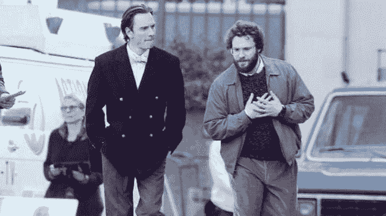

# 由塞斯·罗根和迈克尔·法斯宾德主演的史蒂夫·乔布斯电影将于 10 月 9 日上映

> 原文：<https://web.archive.org/web/https://techcrunch.com/2015/02/04/the-steve-jobs-movie-with-seth-rogen-and-michael-fassbender-will-open-oct-9th/>

# 这部由塞斯·罗根和迈克尔·法斯宾德主演的电影将于 10 月 9 日上映

迈克尔·法斯宾德是个很有才华的绅士。他在《x 战警:过去的未来》中扮演一个年轻的万磁王，在《T2》中扮演一个受惊吓的虐待狂奴隶主，在《为奴 12 年》中扮演一个受惊吓的奴隶主，在《T4》中扮演一个戴着大假头的角色，并证明他仍然可以拥有屏幕。

但是，他能成为史蒂夫·乔布斯吗？见鬼，塞斯·罗根能搞定沃兹吗？我们将在 10 月份找到答案。

在被索尼*和曾经领先的克里斯蒂安·贝尔*抛弃后，环球影城宣布其史蒂夫·乔布斯的电影将于 10 月 9 日上映。

由阿伦·索尔金(来自《白宫风云》、*新闻编辑室*、*金钱球*、*社交网络*和《百万其他你可能见过的事情》的作者)编剧，这部电影据说主要发生在少数几个地方:乔布斯的车库、一家餐馆和三场产品发布会的幕后。摄制组在迪安扎学院及其周围呆了相当长的时间，乔布斯于 1999 年在这里推出了第二代 iMac。

即使像上面这样的现场照片在最近几周泄露出来，也很难想象法斯宾德就是乔布斯。至少在《社交网络》中，如果你仔细看，杰西·艾森伯格有点像扎克。然而，比法斯宾德扮演乔布斯更难想象的是，法斯宾德会扮演一个他并不完全迷恋的角色——所以还是有希望的。

虽然阿什顿·库彻可能不会在 2013 年的《乔布斯传》中设立那么高的标准，但我仍在等待有人能比诺亚·怀尔在《T21 盗梦空间》中做得更好