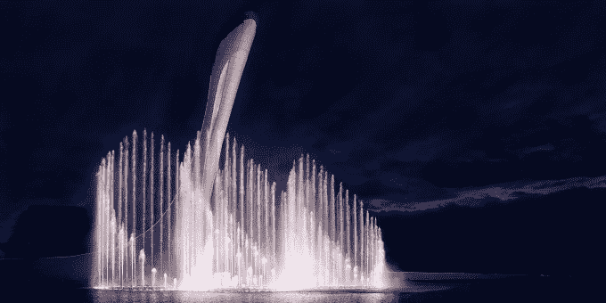

# 世界上最知名的喷泉背后的故事

> 原文：<https://web.archive.org/web/http://techcrunch.com/2016/03/15/the-story-behind-the-most-recognizable-fountains-in-the-world/>

几个月前，我去拉斯维加斯参加消费电子展。很少有人喜欢在 CES 上玩，但是*没有人*喜欢去罪恶之城工作。吃角子老虎机传来的巨大噪音，男人们用裸体女人的照片向你扔卡片，以及每个人都喝醉了的普遍感觉，足以让任何人感到筋疲力尽。

但是维加斯有一点我很喜欢:喷泉。它们不仅仅是从雕像中喷出的水柱。它们是根据音乐编排的水上舞蹈，配有灯光和主题，以及你从一场 300 美元的百老汇秀中所期待的一切。他们将高科技工程与美丽的艺术相结合，将普通的水变得与众不同。

我们都知道贝拉焦酒店入口的标志性水柱，海市蜃楼入口处的火山和里维埃拉酒店的飞溅表演。但是很少有人知道这些喷泉背后的故事——设想它们、设计它们并最终建造它们的人们。

这是马克·富勒和他在 WET 组建的团队的故事，WET 是一家负责设计和制造世界上一些最知名和最壮观的喷泉的公司。

WET 在 20 个国家共建造了 242 个喷泉，包括贝拉焦喷泉、迪拜喷泉、拉斯维加斯城市中心的一些喷泉、纽约市哥伦布圆环的喷泉等等。

富勒在犹他州的一个贫困家庭中长大。富勒不能玩玩具，他不得不将就他们放在家里的东西。

十几岁时，他自学如何冲洗自己的胶片照片。然而，家里没有照片放大机。他花了几个小时小心翼翼地用一台旧电影放映机和从他母亲的礼品包装用品中偷来的薄纸进行实验，以计算出他自己组装的照片放大机的正确曝光时间。

富勒的好奇心从未消退。他去犹他大学获得了土木工程学位。

富勒说:“当你把时钟拨回到大约 100 年前，所有的工程都是民用的。“现在我们有机械、电气、结构……我选择土木，因为它是最广泛的，让你对所有其他类型的工程略知一二。”

但是富勒超越了基本的 CE 学位，参加了一个包括很强的文科课程的荣誉项目。工程领域没有人经历过这个项目。

然后，他去了斯坦福大学攻读硕士学位，这让他能够更深入地研究美术，学习了一些产品设计课程，用他的话说，这些课程“帮助[他]培养了对形式的深刻鉴赏力。”

在斯坦福大学的夏天，他申请加入一个贸易技术项目(他称之为蓝领学校)，在那里他帮助建造了阿拉斯加输油管道。

简而言之，富勒的学术生涯给了他对艺术和数学如此广泛的理解，以至于他几乎可以用他的技能做任何他想做的事情。

这就把我们带到了 WET，一个垂直整合的设计和制造工作室，建造了世界上最不可思议的喷泉。

富勒一直对水很着迷。

“我的祖父曾经给了我一台旧洗衣机，我想，‘我能用它做什么呢？’”富勒说我最后用洗衣机的残余物建造了一个水下隧道，让鱼在外面的鱼塘里游泳。"

富勒还开发了一个大型层流喷泉，作为他在犹他大学本科期间的一部分，这个喷泉今天仍然存在。这项技术是 WET 许多设计的核心。

1983 年，富勒创建了 WET，并开始组建团队。起初，他们只是想成为如今世界上游客最多的一些地标背后的设计师。

“我们发现很难让制造商小批量生产非常特殊的零件，”富勒说，他描述了 WET 如何从一家喷泉设计公司转变为一家垂直整合的公司。WET 不仅与肯尼·奥特加等世界著名的编舞家合作设计这些喷泉，而且实际上还设计和制造建造喷泉所需的所有部件。

“这给了我们更多的创作时间，”富勒说。“我们的项目时间有一半被制造部门占用，相反，我们能够在各个部分进行创新和迭代，直到最后一分钟，因为一切都是在内部开发的。”

当然，这些部件包括基本的喷水阀和管道。但它们也远远超出了你可能想象的喷泉公司会开发的东西——水下 LED 灯、水下机器人等等。

WET 最小的项目成本最低为 100 万美元，最高可达 2 亿美元，迪拜喷泉就是如此，它是有史以来世界上客流量最大的地标之一。

WET 目前拥有 293 名来自各种背景的员工，包括设计、舞蹈、工程以及其他相关领域。该公司有自己的课程，让员工可以学习各种行业，名为 Wet You，每年提供多达 120 门不同的课程。

你可以在这里了解更多关于 WET [的信息。](https://web.archive.org/web/20230316051245/https://www.wetdesign.com/default.html)