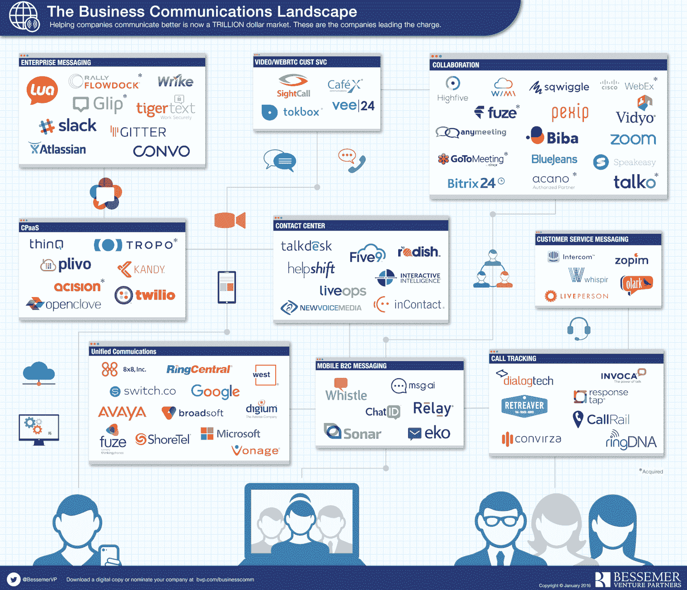

# 突然令人兴奋的企业通信未来 

> 原文：<https://web.archive.org/web/https://techcrunch.com/2016/03/14/the-suddenly-exciting-future-of-enterprise-communications/>

鲍勃·古德曼是 Bessemer Venture Partners 纽约办事处的创始合伙人，专注于软件、移动和通信领域。

Josh Harder 是 Bessemer Venture Partners 的副总裁，专注于软件、移动和电信领域的投资。

More posts by this contributor

企业通信不是一个通常会产生明显兴奋的领域。在企业中，管道永远不会像固定装置那样令人兴奋，人们花更多的时间关注通信能实现什么，而不是它是如何传递的。考虑到部署新基础设施的高资本成本和自然垄断，企业通信经常被斥为创新缓慢，这也于事无补。

但这种偏见现在已经过时了，主要是因为软件已经在以前以硬件为中心的行业中占据了主导地位。通信是为数不多的几个市场之一，初创公司可以在这个万亿美元的市场中分得一杯羹。

像 Slack、Fuze(以前的 ThinkingPhones)和 Twilio 这样的公司已经在新的类别中开辟了大型和不断增长的业务，以改善企业的沟通方式。这种转变的主要驱动力之一是因为通信正从最封闭的技术生态系统之一转向最开放的技术生态系统之一。在电信垄断和铜线时代，只有少数值得信赖的奇才真正知道如何构建和维护需要提供 99.999%正常运行时间的复杂系统。

随着基础设施转向数据、更快的网络和云，不仅提供基本连接变得更加容易，而且在附加服务上也变得更加容易。

我们在 Bessemer Venture Partners 的团队认为，更多的企业通信独角兽将会崛起。我们特别感兴趣的一个领域是 B2C 消息传递。就像 Snapchat 和 WhatsApp 这样的公司已经成为个人通信的主要内容，Slack 和 Yammer 已经普及了员工之间的消息传递，我们认为一家公司有机会成为 B2C 通信的消息传递标准。

虽然脸书正通过最近对 Messenger 的投资努力抓住这一机会，但我们认为还有更大的空间。

> 企业通信不是一个通常会产生明显兴奋的领域。

例如，中继网络帮助银行和保险公司通过短信和移动门户网站进行安全通信。与电子邮件或直邮广告相比，客户实际上会阅读和回复短信。2016 年，更多的 B2C 通讯初创公司将会发现杀手级产品和最佳用例，消费者将会喜欢这种简单和方便。

我们也看到了工作流和分析的巨大机会。企业刚刚开始利用云通信可能带来的所有伟大集成。现在，可以开发工具来为销售代表提供关于何时以及如何联系客户的准确建议，或者在通话结束时自动记录 Salesforce 数据。

通过 Fuze，企业可以将外部数据和来电显示数据库与内部数据源(如 CRM 或发票系统)相链接，因此当客户成功代表接到来电时，他们不仅知道对方是谁，还知道最新合同谈判的最新情况。

第三，除了小型企业之外，我们认为纯移动工作人员有更多的机会。当每个人都使用智能手机而不是台式电话时，大中型企业将如何实现员工之间的安全通信？

例如，Lua 支持面向航空公司等客户的纯移动 B2B 消息传递，因为航空公司的员工总是站着的。在从客户端/服务器到 SaaS 的转变中，许多应用最初只是针对云进行了简单的重写，与此不同，移动通信公司将需要开发全新的解决方案，来解决已经将智能手机作为主要计算设备的员工所面临的问题。

鉴于通信是企业 IT 预算中最大的部分之一，我们看到了更多创业公司在使企业通信更易访问和更高效的宏观趋势上的光明前景。有一件事是肯定的——这个曾经平淡无奇的领域突然变得令人兴奋起来。

