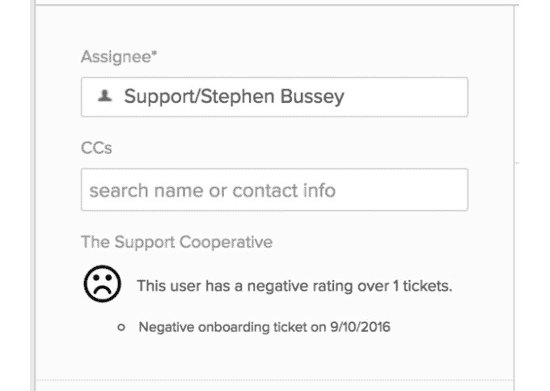

# 支持合作社帮助公司共享客户服务数据 

> 原文：<https://web.archive.org/web/https://techcrunch.com/2016/09/11/the-support-cooperative-helps-companies-share-customer-service-data/>

# 支持合作社帮助公司共享客户服务数据

每个公司都需要更好地了解他们的客户，没有丰富的知识就很难把握住，尤其是当客户是你的新客户时。想象一下，能够访问一个关于该客户的聚合数据库来帮助您做到这一点。

这正是 TechCrunch Disrupt Hackathon 参与者 Stephen Bussey 想用他的 Hackathon 创意——支持合作社——做的事情。

正如来自佐治亚州亚特兰大的 Bussey 所认为的那样，管理客户流失是运营一家 SaaS 公司的重要部分。“支持和客户管理部门必须尽可能提供最好的服务，这需要了解和理解特定的客户，甚至是那些他们以前从未见过的客户，”Bussey 在他的黑客马拉松演讲中写道。

支持合作应用程序中的客户评级屏幕。图片来源:斯蒂芬·布西

他知道让公司参与进来可能是一个挑战，但他相信，如果更多地了解他们的客户符合整个群体的最佳利益，组织就会共享数据。

他认识到这里有隐私的成分，因为它涉及到客户数据，他实际上是在亚特兰大销售店担任工程经理时由他的隐私团队提出这个想法的。“你不能泄露公司的成绩单。如果你尽可能的普通，那么隐私问题应该不是问题，”Bussey 解释道。

他在去加州的前一两天想出了这个主意，他决定单干，而不是试图协调一个团队。他看到了独自工作的优势，因为他确切地知道自己想做什么，而且他不必协调团队，在他看来，这可能会增加练习的压力。

产品后端使用 SAP Secure Graph 数据库构建，前端使用 ZenDesk Chrome 插件。他说他故意保持简单，以便在 60 秒的演示时间内尽可能简单地解释，并减少独自工作的压力。

他不确定自己是否想用它做一个产品，但他喜欢参加黑客马拉松——这是他第三次参加 TechCrunch Disrupt——他喜欢使用日常工作中不常使用的 API 和工具的挑战。