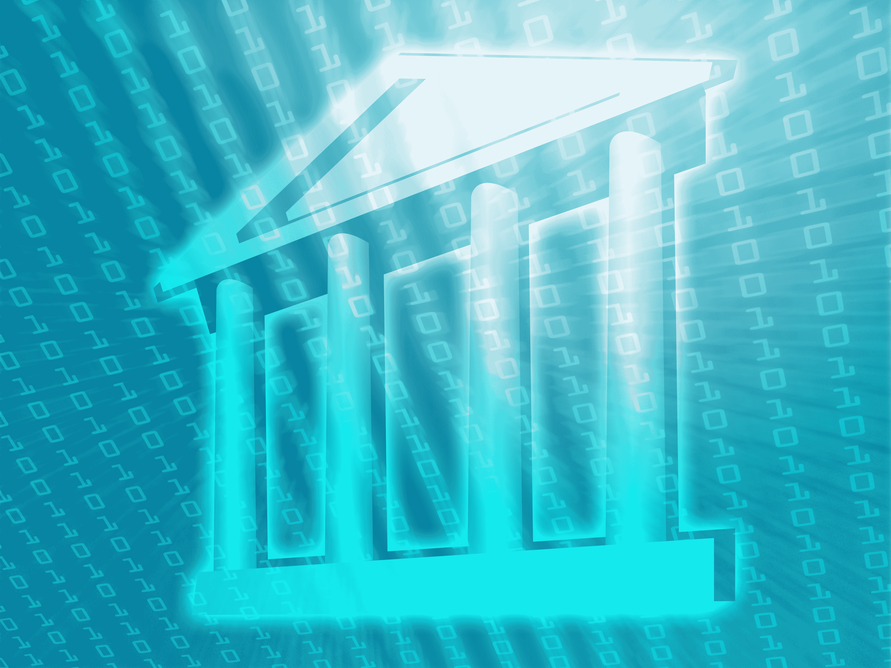

# 2018 年，科技行业需要走向负责任的创新

> 原文：<https://web.archive.org/web/https://techcrunch.com/2017/12/22/the-tech-industry-needs-to-move-towards-responsible-innovation-in-2018/>

赫曼特·塔内贾撰稿人

More posts by this contributor

十多年来，硅谷的意识形态一直是同时:

快速移动，打破东西。

让世界变得更美好。

我们的社区——企业家和投资者——都有一种推动人类前进的宿命感。然而，在这个过程中的某个地方，让世界变得更美好变得更像是一句妙语，而不是一种风气，打破东西已经成为我们在硅谷以外最出名的事情。

为此，2017 年是令人沮丧的一年。虽然我们的产品创新已经在蓬勃发展的解除管制和开放的互联网上建立了可访问和负担得起的内容、社区和商业，但它们[也](https://web.archive.org/web/20230304215415/https://techcrunch.com/tag/russia/) [被坏人](https://web.archive.org/web/20230304215415/https://techcrunch.com/tag/north-korea/) [用来对抗社会](https://web.archive.org/web/20230304215415/https://techcrunch.com/2017/08/16/hatespeech-white-supremacy-nazis-social-networks/)。社交媒体成为欺凌和宣传的载体。旨在个性化体验的算法最终放大了偏见。个人数据已经以我们还不完全了解的方式被泄露。

更糟糕的是，随着我们的行业获得影响力和权力，除了持续缺乏多样性之外，我们还受到性骚扰丑闻的困扰。这不是我们这个行业独有的，但它大大加深了我们都是坏演员的看法。看到这些真的很痛苦，尤其是当我踏上这个国家的其他地方，描述我所做的事情时。

此外，还出现了另一种动态，即我们带给世界的企业日益强大，国会感到受到了威胁。两党越来越支持加强对互联网公司的监管。本届政府与科技和投资者在国际企业家规则和其他签证和移民点上争论不休。在当前 FCC 的领导下，我们因网络中立而享有的公平竞争环境即将消失。

目前，科技和监管机构之间的关系介于紧张和敌对之间。我担心的是监管会摧毁创新能力。我们在 20 世纪早期对电力进行了监管，这极大地促进了气候变化。如果我们监管技术(人工智能在许多方面是 21 世纪的电力)，我们将为自己制造其他大问题。

## 我们将何去何从？

首先，我们需要认识到创新的风险越来越高。我们已经从建立软件公司，为各行各业的员工提供效率，到完全重新思考如何提供更好的医疗保健、教育、金融服务、交通，甚至工作本身。随着区块链、CRISPR、3D 打印、AR/VR 和无人机等新的使能技术的出现，我们将在更大程度上影响我们围绕平等、目的和工作的核心价值观。

有一点是肯定的，我们不能在我们作为一个社区的核心价值观上倒退，并期望承担如此重大的责任。我希望我们可以像批评坏演员一样，赞美那些用正确的价值观建设公司的伟大创始人。下一代企业家和投资者需要受到鼓舞，在此基础上继续发展。

在过去的几年里，我鼓励许多创始人将两个无形资产纳入他们自己的最低可行产品定义中:监管意识和对社会影响的认识。随着时间的推移，对我来说很明显，这是不够的，我们需要将我们的集体思维模式从痴迷于黑客企业家原型转变为同情型企业家。

我们不再能够对技术对我们社会和文化的影响做出反应。虽然在过去，竞争激烈、痴迷于产品的黑客创造了发展最快的公司，并产生了最佳的风险投资回报，但未来的情况不会是这样，因为现在有更多的风险，每个人都在审查我们的工作。

照片由 Shutterstock/Kheng Guan Toh 提供

## 在 2018 年获得所有权

脸书因其处理 2017 年选举的方式而受到很多批评，我知道这是其领导层士气低落的一年，尽管作为一个企业取得了巨大的成功。但是他们值得称赞的是[在他们已经开始测试和推出的功能上取得了持续的进展](https://web.archive.org/web/20230304215415/https://techcrunch.com/tag/fake-news/):使用第三方服务和人工智能来标记和排名假新闻；添加对发布者信息的一键访问；并开发了一个工具，让用户可以看到他们是否在上次美国大选前被煽动性广告所欺骗。这是一个好的开始。

2018 年，我们将看到主要参与者呼吁他们的算法工作方式更加透明。这是每一个使用任何数量的机器学习的创业公司都需要考虑的事情，以某种方式将其构建到他们的产品和平台中，告诉用户他们的数据是如何被解析的，但又不泄露任何秘密。

谷歌和脸书等公司已经发布了透明度报告，详细说明了它们对政府索取用户数据的回应。为什么他们不应该为内容完整性做类似的事情呢？尤其是现在我们更充分地理解了当完整性得不到保护时的含义。

这种开放和透明的增长必须来自硅谷内部。监管本身并不坏，但它确实倾向于鼓励开发变通办法，而不是专注于真正的创新。作为技术社区，我们有责任联系监管机构和立法者，帮助他们更好地了解我们正在努力的事情的更广泛影响。我们有责任对消费者保持透明和诚实，告诉他们我们如何使用他们的数据，以及他们能从我们这里得到什么。

在硅谷，我们最擅长的一件事就是快速迭代出最佳答案。我希望，随着我们继续重写经济和社会整体的主要部分，我们的社区将重复其核心价值观，从黑客攻击和增长到负责任的创新。为负责任的 2018 干杯！