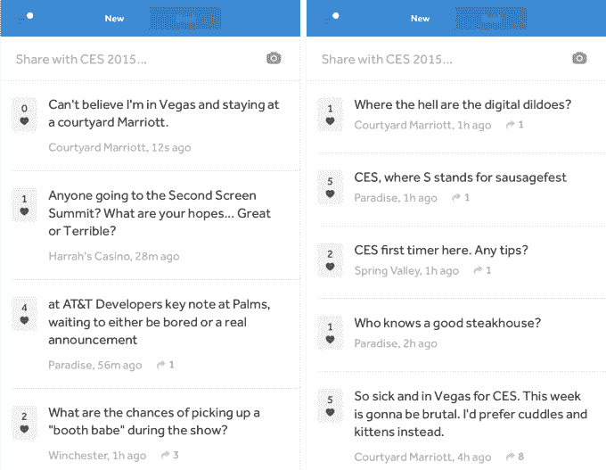
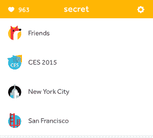
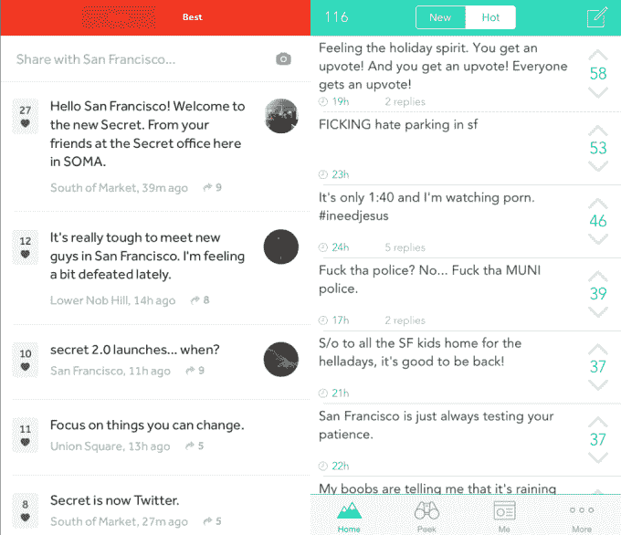

# Secret 想成为直播事件的意识流，从 CES  开始

> 原文：<https://web.archive.org/web/https://techcrunch.com/2015/01/05/the-temporary-backchannel/>

这次大会上哪个小组不无聊？庆功宴在哪里？你在世界各地的朋友和追随者可能不知道或不关心。但是附近的人可能会，Secret 希望将您与他们联系起来。今天 [Secret](https://web.archive.org/web/20230323141129/https://www.secret.ly/) 发布了 CES feed，只有与会者才能分享。虽然帖子将是匿名的，但重点是为临时社区创建一个超级本地的后台渠道。

Secret 去年在 SXSW 的[网站上试验了基于事件的订阅，收集标签为#SXSW 或来自该地区的帖子。新的 CES feed 有所不同，因为它可以在 Secret 应用程序中看到，只能由拉斯维加斯中心地理围栏外的人查看，而不能发布。](https://web.archive.org/web/20230323141129/https://techcrunch.com/2014/03/08/sxsw-just-got-real-interesting-as-secret-creates-realtime-sxsw-web-feed/)

Secret 的 CES 专用订阅源

“我参加过其他会议，人们总是试图弄清楚发生了什么。Secret 的联合创始人克里斯·巴德-韦克斯勒说:“从来没有一个好方法能让所有这些都集中在一起。外部人士的转发、提及和标签使用让 Twitter 太吵了，无法成为事件的反向渠道。

 Secret 的计划可能会解除人们因害怕惹恼其他社交网络上的粉丝而自我审查的分享。CES 和 SXSW 就是很好的例子，在那里，容易激动的书呆子要么喋喋不休地谈论三星的主题演讲和可穿戴产品发布会，淹没了 Twitter 上的一切，要么担心他们会这样做，保持沉默。

“你知道在一个会议上，你在一个小组或某个地方，想要发表你的意见，但不想把它发送给你所有可能不关心的追随者？”巴德-韦克斯勒问道。Secret 上的专用事件源可能是答案。

你不用分享给你的朋友或城市的 feed，而是在秘密的 [iOS](https://web.archive.org/web/20230323141129/https://itunes.apple.com/us/app/secret-speak-freely/id775307543?mt=8) 或 [Android](https://web.archive.org/web/20230323141129/https://play.google.com/store/apps/details?id=ly.secret.android&hl=en) 应用程序中打开 CES 流，自由发布任何正在发生的事情。所有最近的帖子都将出现在 CES 的新标签中，而那些获得最多关注的帖子将被捆绑到最佳标签中。

朋友或来自您正常位置的人不会看到您所说的内容。由于最近增加了聊天功能，如果您想要更多的小组或聚会推荐，抱怨活动，或尝试联系，您可以私下跟进。到目前为止，CES 上的很多讨论都是关于他们在拉斯维加斯对“短暂浪漫”的渴望。

左边是重新设计的秘密，看起来就像右边的 Yik Yak

CES feed 中更短暂的实时聊天将受益于 Secret 的新设计。上个月，这款应用牺牲了覆盖着文字的大而漂亮的图像，换来了一个空白的、以文字为中心的提要，我指责这个提要[看起来就像秘密竞争对手 Yik Yak](https://web.archive.org/web/20230323141129/https://techcrunch.com/2014/12/18/the-anonymous-app-singularity/) 。

Bader-Wechseler 解释说，重新设计是为了让它感觉更快、更容易发布，而不是像创作一幅视觉艺术作品。图片很漂亮，但重要的是文本，现在用户可以在相同的时间内阅读更多的帖子，因为它们堆叠得更紧，滚动的必要性更少。

Bader-Wechseler 告诉我，如果 CES feed 大受欢迎，“你会看到更多这种事件驱动的空间”，可能是在 Sundance、SXSW 或 Coachella。Snapchat 最近通过其基于事件的地理过滤器和协作我们的故事直播流获得了成功，这些活动包括世界杯、梅西百货感恩节游行和新年前夕。为临时事件创建频道，而不仅仅是地点，可能会让 Secret 比 Yik Yak 更有优势。

重新设计无疑以功能的名义抹去了大部分[秘密](https://web.archive.org/web/20230323141129/https://www.secret.ly/)的身份和风格。但是，如果降低准入门槛可以将其转化为无形的社会结构，将人们编织在同一个地方，这可能会有回报。