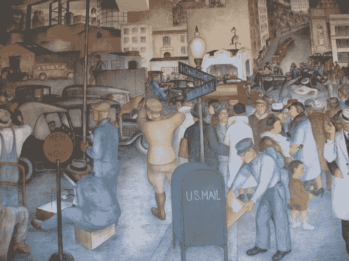

# 数字的三个时代

> 原文：<https://web.archive.org/web/https://techcrunch.com/2016/06/23/the-three-ages-of-digital/>

More posts by this contributor

事情似乎比以往变化得更快，生活变得越来越复杂和支离破碎。

我们可能正处于最复杂的阶段，但我认为，事实上，生活很快就会变得简单。我们目前正处于两个时代的中间阶段:前数字时代和后数字时代。

当你没有理解“新的力量”时，认为你已经理解了它是不寻常的。我们认为 MP3 格式的美妙之处在于它的存储能力，而事后看来，它是关于流式传输曾经制作的每一首音乐。我们认为移动电话的奇妙之处在于可以在任何地方打电话，而事实上它是个人上网的门户。

我最喜欢的故事是关于我们最初对电的误解。它并没有在一夜之间改变企业。人们花了大约 20 年的时间才明白，这不是修饰现有流程的问题，而是从头开始重建它们。

在电力出现的第一个十年，工厂主们保持一切不变。电灯照明使员工效率更高，工作时间更长，享受更安全、更安静的工作环境。电力带来了体面但不起眼的改善。

只是 20 年后，工厂才被改造。工厂主开始意识到机器可以用新的方式排列。工厂可以用更少的工人更高效地生产产品。后来，人们清楚地认识到，电改变了一切。

当应用于业务核心时，这意味着工厂可以远离电源，并位于更靠近港口的地方。企业可以制造新的东西。简而言之，电力不仅用于提高公司的效率，还用于改造公司。

所以，我们需要以这三个阶段来看待世界:在完全沉浸于数字通信技术之前；当这种技术已经退居幕后时；以及两者之间的混乱。

## 前数字时代

人们很容易记住这个时代，那时设备只有一种功能。在这里，媒体是有形的，技术彼此并行共存，但很少纠缠在一起。零售要么在店内进行，要么通过家庭购物进行。媒体频道被贴上了我们消费它们的单一设备的标签:电视、报纸、杂志、广播。

当时可能看起来不是这样，但现在回想起来，生活很简单。进展是稳定的，但基本上是线性的。当然，事情发生了变化:我们从 VHS 转向了 DVD 盒式磁带掉到了光盘上；公司提出“直接”销售产品。然而，这些都是相对较小的变化。他们没有改变零售格局或物流供应链。权利管理和知识产权管理保持不变。

公司是围绕生产和产品来安排的。广告和营销刺激了需求。注意力很集中，但信息很少。

起初，前数字时代发展缓慢。产品变得数字化。照片变成了比特。知识从百科全书转移到维基百科。电话簿变成了在线目录。印刷杂志变成了网站。

第一个时代是物理产品数字化的时代。它导致了零售、制造和分销领域的创造性破坏，这就是我们现在所处的时代:数字时代中期。

## 中间数字

这是一个跨越数字刚刚被主流接受的时代和数字完全融入我们社会的时代的时期。

Mid-digital 代表了一个时代，在这个时代，BBC 不会在英国播放某些内容，因为全球数字版权尚未得到批准。就是有些公交车只收卡，有些只收现金的地方。

在这个时代，我用我(被低估的)注意力为媒体付费，因为微支付还没有起作用。

这是特朗普或苹果的头条新闻统治世界的地方，因为眼球支付账单。

要观看电视，我需要选择输入设备，然后选择应用程序或频道，而不仅仅是通过节目导航。电视本身受到广告商的喜爱，他们关注的是媒介而不仅仅是信息；他们关心何时、何地以及如何投放广告。另一方面，观众却不在乎。

我们的零售商不接受在实体店收取或退回在线商品。它们正被亚马逊这样的公司和众多易贝小型零售商扼杀。

亚马逊以规模取胜，而小众的易趣只是需要一个租来的储物柜来运行他们举世无双的电子商务操作。在这个时代，亚马逊就是一个例子——凭借其无坚不摧的易用性(包括自助出版、电子书和网络托管)；它的灵活性；它不愿意支付给员工超过法律允许的工资，我们知道零售行业即将消亡。

这是因为下一次转变是真正改变一切的转变。

照片由 Flickr/ [Will](https://web.archive.org/web/20220817121034/https://www.flickr.com/photos/ajourneyroundmyskull/) 提供。

## 后数字时代

像前数字时代一样，在这个时代没有人会想到“数字”。信息技术的概念将退居幕后，就像氧气或电力一样，我们将理解数字是变革性的，但却是不相关的。不会再有首席数字官，就像今天不会有首席电力官一样。

在后数字时代，数字技术将是一个巨大而安静的元素，形成生活的无缝主干。互联网将是一个背景设施，只有在它不存在的时候才会被注意到。智能家居将会发挥作用。视频会一直跟着我们。内容将被付费…所有无缝和毫不费力。

我们将不再谈论电视和网络，或者手机和台式机。零售商不会认为在线和实体是一种价值划分；他们只会庆祝销售。广告将围绕人展开，无缝地讲述连续的故事，以促使人们购买。内容不会在意国界；甚至像货币或语言这样的当代概念也将不再是生活的核心。

人们将生来就是真正的数字土著。父母不会像现在这样担心他们的孩子使用这些技术。孩子们在婴儿时期会本能地使用它们，并随着它们与技术一起成长，继续开发和培养它们。他们将处于安全的环境中，被追踪客户一举一动的大型跨国出版商锁定。

这些出版商和销售商将比政府更大。他们将是数据的持有者和大众行为改变的仲裁者。政府将屈从于他们的需求(洞察公民活动，作为支付网关等等)，而不是相反。

制造业将是适时的。产品将按订单生产，并由自动驾驶汽车运输。补给可以自动进行，也可以按下联网按钮进行。

当然，尽管这种自动化似乎让后数字世界感觉更加顺畅，但它远非灵丹妙药。随着自由职业和零工经济变得司空见惯，我们都将为自己工作。那些经营企业的人将受益于被削弱的政府，因为复杂的金融结构导致税收减少。自雇人士的社会流动机会可能更少，因为竞争来自世界各个角落，即使是最敬业的人，一天 24 小时工作也只能获得微薄的收入。

也许最模糊的界限将是真实和虚拟的界限。我们对现实、时间和地点的感觉对我们来说是最难以理解的。我们目前所知的虚拟耳机只是一种过渡技术。虚拟世界将会出现在我们周围的屏幕上。随着我们的虚拟生活变得更安全、更舒适、更亲密，有形的公共集会场所将继续消亡。

对于个人和企业来说，这显然是一个将当前的中数字时代与即将到来的时代联系起来的机会。尽管中断会很严重，但它不会在一天之内发生。我们是习惯性的动物，当它们在社会和商业上变得有利时，我们将转向后数字时代带来的机遇。但是，正如人们预测可视电话只会被 FaceTime 和 Skype 完全取代一样，后数字时代的愿景仍然有些模糊，没有什么是确定的。十年前，你绝不会押注于全球卓越的手机供应商诺基亚的彻底灭亡。

因此，当我们从中数字时代走向后数字时代时，建议很简单。为不测做准备。确保你的企业在文化上为未来做好准备。考虑四肢。要注意出血的边缘。不要留下任何东西。最重要的是，要有商业头脑。随着我们都成为一个永久可用、永远在线的多面市场的化身，请提醒自己电力如何改变了商业，进而改变了社会:它没有真正改变效果，但它完全改变了原因。