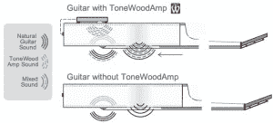

# ToneWoodAmp 将放大的声音从吉他的音孔中吹出

> 原文：<https://web.archive.org/web/http://techcrunch.com/2014/12/15/the-tonewoodamp-blows-amplified-sound-out-of-your-guitars-sound-hole/>

# ToneWoodAmp 将放大的声音从吉他的音孔中吹出

你准备好把你的木吉他调到最大音量了吗？ToneWoodAmp 为您提供全面保护。这个令人惊讶的酷 Kickstarter 项目本质上是一个扬声器，它从你的木吉他中获取来自的*的声音，修改它，然后自动再现它，这样你就可以在吉他体外听到它。它非常适合那些可能无法使用效果踏板或 PA 系统的人，以及那些正在寻找一种有趣的方式来修改标准吉他的街头艺人或现场演奏者。*

放大器连接到你的吉他背面，声音在身体中回荡。它有许多内置的效果，包括颤音和混响，你甚至可以通过 iOS 设备运行声音，以使用软件过滤器和效果。

早期支持者的价格为 110 美元，最终零售价为 199 美元。到目前为止，该团队已经有了工作原型，看起来它将在 6 月份发布。

虽然大多数吉他手已经有了一系列他们使用的踏板和效果，但将这些附加到木吉他上似乎是一个有趣的解决方案。该套件使用安装在吉他内部的磁性导轨连接到您的吉他。这意味着它可以在必要时拆除，不会破坏你的吉他的外部。作为 TechCrunch 的常驻碎纸机 MAETERXXXTOTHEMAXXX，我其实很好奇这听起来如何，以及它如何在户外工作。谁知道呢，你遇到的下一个街头艺人可能真的会用电子特效和旧挡泥板在冰冷的石头旁边撕碎一个小楼梯。

【YouTube = https://www . YouTube . com/watch？v=Eu-VHEEzuEg]