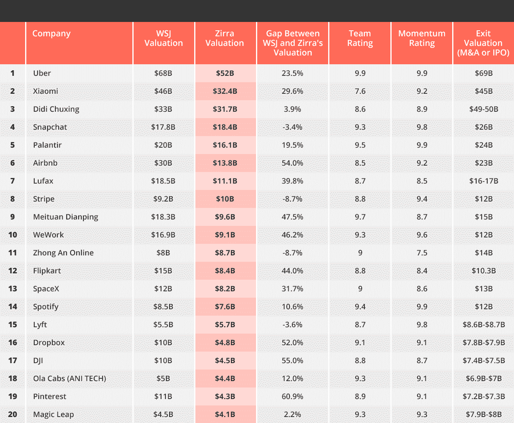

# 顶级独角兽被高估了 

> 原文：<https://web.archive.org/web/https://techcrunch.com/2017/02/01/the-top-unicorns-are-overvalued/>

Aner Ravon 是首席洞察官，也是

[Zirra](https://web.archive.org/web/20220927020848/https://www.zirra.com/)

.

年轻而精明的科技创业公司周围的热气不会去任何地方，尽管黑暗预言将 2016 年视为“冬天即将到来”的一年。

Snapchat 和 Airbnb 正在为 IPO 热身，BuzzFeed、Palantir 和优步每隔几个月就攫取数亿美元，没有收入和几乎没有用户的年轻初创公司(如 Houseparty)从顶级风投那里筹集了数千万美元。

科技泡沫主要集中在汽车行业，每个员工的估值高达惊人的 1000 万美元。这些年轻的初创公司甚至在展示原型之前就筹集了数百万美元的资金，并引发了人才从一家初创公司到另一家的快速迁移。交易很快达成，这是对初创公司需求很高的迹象，很明显，科技泡沫将持续一段时间，推高较低层次初创公司的估值。

但首先，让我们看看独角兽公司的“真实”估值，或者说，如果它们已经公开交易，它们的价值应该是多少。根据我们的公式，使用了 1200 家可比的私营公司历史，以及数十种当前的公开信号——从网络流量轨迹、投资历史、员工增长、谷歌搜索和客户评论——前 20 家独角兽已经被平均高估了 27%。

放大具体案例，我们使用公开数据估算的一些估值甚至更低。我们估计 Airbnb 的估值为 138 亿美元，约为其 250 亿至 300 亿美元普遍估值的一半。根据我们的公式，Pinterest 可以被定价为 43 亿美元，比常见的 110 亿美元的估值低约 61%。即使是 WeWork 这样的房地产初创企业爆炸式增长的巨头，按照我们的公式估计也只有 91 亿美元，比市场普遍价值低约 46%，而 SpaceX 的 82 亿美元也比可接受的阈值低约 32%。

Zirra 的 20 家最有价值的私营科技公司。资料来源:Zirra

那么，是什么让民营科技公司获得如此高的估值呢？以下是我们发现的主要原因——一些微不足道，一些更为重要。

**当负现金流遇上永无止境的上涨轮。**为了占领市场份额和管理监管活动，Airbnb 和优步等巨头需要源源不断的现金流。随着投资者越来越多，公司需要分配新的优先股，人为抬高估值。在 A 轮或 B 轮投资中，只要有一个固执的早期投资者要求特别条款的优先股，就足以导致所有后续投资者要求类似或更高的条款。这反过来又导致企业在筹集新资金或 IPO 时要求越来越高的估值。

看涨的公开市场。在 2016 年初的一次轻微咳嗽后，股市升至新的峰值，使纳斯达克达到历史最高价格——甚至高于新千年之交大幅暴跌之前的价格。苹果、Alphabet、脸书和亚马逊的股票都在享受美好时光，而 Snapchat 在 2017 年前三分之一的 IPO 看起来很有希望。看涨的股市预示着积极的投资环境；只要它上涨，私营科技公司的估值也会上涨。

**风险投资公司使用的人工估值公式和方法。**这是前一个因素的衍生，风险投资使用定价方法对公司进行估值，放弃了考虑贴现现金流、增长和风险估计的传统估值方法。这些相对方法使用相对估值，将公司定价为市场中类似的上市公司和私营公司。因此，当市场处于高位时，私营企业的估值也会飙升。

**空谈是廉价的；钱更便宜。**尽管最近有所上升，但利率仍然很低，风险投资和私募股权等替代投资资产类别是“高回报”的热门选择尽管略有下降，但与 2014 年前相比，风险投资对初创公司的总投资仍然很高。据 [NVCA](https://web.archive.org/web/20220927020848/http://nvca.org/wp-content/uploads/2017/01/4Q_2016_PitchBook_NVCA_Venture_Monitor.pdf) 报道，美国风投在 2014 年向初创公司投资 690 亿美元，2015 年投资 790 亿美元，截至 2016 年 9 月投资 560 亿美元。

越来越多的投资者(其中一些人在寻求高风险，也许不像市场上的老手那样专业)手中的大笔资金将导致公司利用这一趋势。此外，中国和世界其他地区公开市场的萎缩将更多资金集中在美国的新星身上。

兽群已经开始逃窜。跟风效应:跟风者和跟风者给人的印象是，创业行业比实际规模要大。它还允许二级和三级投资者收购那些无法打动顶级投资者的公司。

**风险投资公司之间围绕更具吸引力的交易展开的激烈竞争**推动估值飙升，并导致风险投资公司为了快速赢得交易而执行更宽松的尽职调查流程。这将影响此后的每一轮融资，并对其他公司产生溢出效应，即使它们没有那么有吸引力。投资者的高需求遇到了相对较低的好投资机会，导致投资者迅速握手并打开支票簿。

泡沫不会永远持续下去。过去超级热门的领域，如云计算或移动应用，不再具有破坏性，几年后人工智能和汽车也将失去光芒。所有这些创新公司仍需要几年时间来适应真正的基础设施和文化变革，创新行业即将面临崩溃。当这种情况发生时，消费者将意识到他们不需要身边有这么多跟风产品，随着利率再次开始上升，风险投资的成熟期结束，我们可能会看到估值让当前的游戏变得更加“有趣”——或者甚至可能是一个不那么友好的术语。