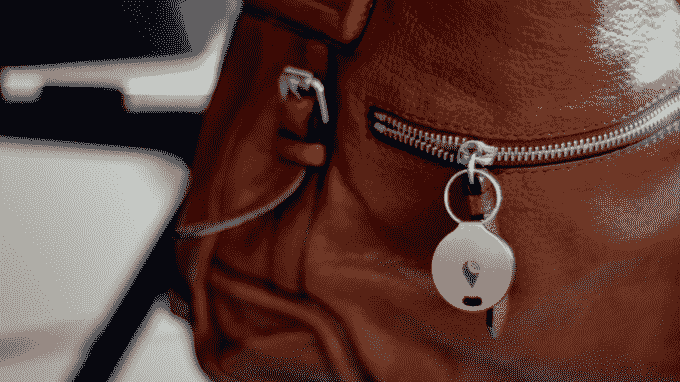
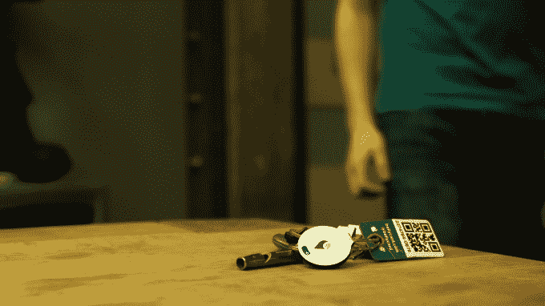

# TrackR Bravo 可防止您将贵重物品放错地方 

> 原文：<https://web.archive.org/web/https://techcrunch.com/2015/03/23/the-trackr-bravo-keeps-you-from-misplacing-your-valuables/>

今天发布的 [追踪器 Bravo](https://web.archive.org/web/20221005183835/https://www.thetrackr.com/bravo?locale=en) 是一款蓝牙设备，可以追踪你不想丢失的东西。

这款售价 29 美元的新型铝制追踪器比 25 美分硬币高一点，厚一点，可以贴在你的钥匙上、钱包里或狗的项圈上，这样你就可以通过相应的 iOS 和 Android 应用程序中的地图来追踪它。Bravo 还配有不干胶贴纸，你甚至可以把它贴在遥控器之类的东西上，因为遥控器总是会卡在沙发下面或靠垫之间。

一旦你把它放在你选择的物体上，这个应用程序让你从一个预置选项列表中选择它可能是什么，然后在 TrackR 的“人群 GPS”数据库中注册这个物体。Crowd GPS 是 TrackR 的解决方案，用于规避这样一个事实，即基本上不可能将 GPS 塞进这样大小的设备中，并从蓝牙 le 中挤出几个月的电池。

TrackR 没有花费更多的精力来处理手机没电后丢失 Bravo 的罕见情况，而是让其他运行其应用程序的手机可以从人群 GPS 列表中看到设备，并向您发送最新位置信息。这是一个聪明的解决方案，但在你确信你的设备会被发现之前，需要公司获得更多的关注。

我个人认为 TrackR 在我的公寓里最有用，而我的公寓目前处于一种有组织的混乱状态。一切看起来乱七八糟，但都在正确的地方。这种组织模式的问题是，最终你会忘记哪一个箱子里有备用耳机。随着追踪器粘在他们身上，我可以简单地滑动到耳机项目，轻击它，然后听到 Bravo 发出尖锐的警报。如果你把手机而不是钥匙放错了地方，你也可以按下 Bravo，让你的 iPhone 发出提醒。

你在 TrackR Bravo 上可以获得的范围大约是你对依赖蓝牙 LE 的设备的预期。根据你的电话和无线电之间的结构，你可以期望在 25 到 40 英尺远的设备之间保持通信。

TrackR Bravo 在蓝牙跟踪器领域并不孤单，像 [Tile](https://web.archive.org/web/20221005183835/https://www.thetileapp.com/) 这样的选项在相同的价格范围内提供类似的功能。如果你是一个追求美学的人，我会给 Bravo 干净的铝合金外观加分，尽管当它连接到钥匙上时会被打败。

大多数追踪器制造商在订购几个设备时都会给予很大的折扣(你可能需要注册几个设备，然后才会想到检查它是第二天性)，所以如果这个想法对你有吸引力，最好通过获得足够的数量来跟踪大多数较小的贵重物品。