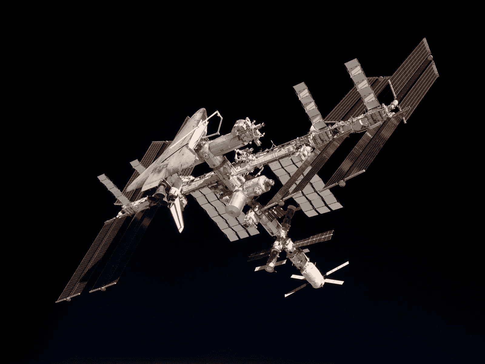

# 据报道，特朗普政府正在着手将国际空间站 TechCrunch 私有化

> 原文：<https://web.archive.org/web/https://techcrunch.com/2018/02/11/the-trump-administration-is-reportedly-moving-to-privatize-the-international-space-station/>

根据华盛顿邮报的报道，川普政府正计划将国际空间站私有化，而不是简单地在 2024 年停止国际轨道实验。

根据*邮报*获得的一份文件，现任政府正在考虑将国际空间站移交给私营企业，而不是使其脱离轨道，因为美国宇航局“将在未来七年扩大国际和商业伙伴关系，以确保人类继续进入和存在于低地球轨道。”

《华盛顿邮报》还报道说，政府正在寻求在 2019 财年申请 1.5 亿美元，“以促进商业实体和能力的发展和成熟，确保国际空间站的商业继任者-可能包括国际空间站的元素-在需要时可以运作。”

作为国际联盟的一部分，美国政府已经花费了大约 1000 亿美元来建造和运营空间站，该联盟还包括欧洲航天局、日本宇宙航空研究开发机构和俄罗斯航天局。

宇航员凯蒂·科尔曼从国际空间站的窗户往外看/图片由美国国家航空航天局提供

但是[正如一位美国宇航局工程师在 Quora 帖子](https://web.archive.org/web/20221224143825/https://www.quora.com/Why-is-the-ISS-being-dismantled-in-2024)中解释美国宇航局退役空间站的决定时指出的，该机构只是缺乏资源去做它想做的一切。

罗伯特·弗罗斯特是美国国家航空航天局飞行器集成和日常操作分部的工程师，他写道:

> “……不幸的是，太空探索没有足够的资金来同时运行多个大型项目。航天飞机计划对建造国际空间站至关重要，但一旦国际空间站组装完毕，航天飞机计划必须在下一个计划(星座)开始之前退役。
> 
> 美国宇航局的主要工作是继续向外推进前沿。这个想法是，美国宇航局已经掌握了足够的低地球轨道，我们学到的经验教训将使商业公司在低地球轨道运营成为可能，然后美国宇航局应该继续前进到下一个前沿。无论是在月球上建立一个永久的立足点，访问并可能检索一颗小行星，还是将人类送上火星(所有这些都是可能的)，都是未来政治领导人将决定的事情，但有一点是相当确定的——美国宇航局不会获得更多的预算来做这些事情。这意味着美国宇航局不得不停止正在做的事情。"

公私合作是最有可能确保空间站保持在高空的方式，而不是在轨道上燃烧，让其剩余部分落入水中。

一些公司已经在追求在低地球轨道和更远的地方运行的私人空间站网络的愿景。

由领导的 Axiom Space 已经筹集了 300 万美元的种子资金来建造一个商业空间站，该公司是美国宇航局的前雇员，曾为国际空间站管理运营 10 年。由古怪的拉斯韦加斯亿万富翁罗伯特·毕格罗创立的公司正在致力于建造新的建筑，以增加国际空间站上的生活和工作空间。

虽然有些人质疑空间站的运营在商业上是否可行，但一旦美国国家航空航天局的航天飞机计划退役，空间站将不得不采取一些措施的事实已经成为定局。

宇航员显然一直在考虑如何处理空间站的问题。上周，在《纽约时报》的一篇社论中，马克·凯利请求继续支持空间站。

> “两家公司，SpaceX 和轨道 ATK 公司，现在定期向空间站运送货物。就在本周，SpaceX [发射了猎鹰 9 重型](https://web.archive.org/web/20221224143825/https://www.nytimes.com/2018/02/06/science/falcon-heavy-spacex-launch.html?hp&action=click&pgtype=Homepage&clickSource=story-heading&module=second-column-region&region=top-news&WT.nav=top-news)，这是一种强大到足以提升 141，000 磅有效载荷的火箭。经过几年的中断，机组人员将再次离开美国的土地前往太空，并在明年尽快前往空间站，这要归功于波音公司和 SpaceX 公司。
> 
> 但是，如果特朗普政府在 2024 年之后停止对国际空间站计划的资助，这一切都将嘎然而止(尽管你不会听到太空真空中的“尖叫”)，这是一个[步骤](https://web.archive.org/web/20221224143825/https://www.theverge.com/2018/1/24/16930154/nasa-international-space-station-president-trump-budget-request-2025) [这是](https://web.archive.org/web/20221224143825/https://www.theverge.com/2018/1/24/16930154/nasa-international-space-station-president-trump-budget-request-2025) [考虑](https://web.archive.org/web/20221224143825/https://www.theverge.com/2018/1/24/16930154/nasa-international-space-station-president-trump-budget-request-2025)。原因尚不清楚，尽管特朗普总统曾表示，他希望优先考虑人类的月球旅行。
> 
> 无论轻重缓急，这种权衡都是短视的。削减空间站的资金，现在每年在 30 亿到 40 亿美元之间，对航天局来说是一种倒退，当然不符合国家的最佳利益。
> 
> 过去一年，美国在许多方面放弃了其在全球舞台上的领导地位。我们不再领导应对气候变化的努力。我们停止了在贸易和商业方面的领导，并对我们继续致力于多边组织和军事联盟提出了质疑。我们停止了在人权和法治方面的领导。如果我们不能继续资助国际空间站，美国将牺牲其作为太空探索和商业太空创新全球领导者的地位。
> 
> 自从 1958 年成立以来，美国国家航空航天局的项目已经造福了我们星球上的人们。太阳能技术、微型计算机芯片、CT 扫描和核磁共振成像只是美国国家航空航天局创新开发并交付给美国消费者的技术中的几个例子。

尽管如此，敲定如何将一个国际合作项目商业化的细节将是困难的，并且需要与过去十年关系大幅冷淡的各方进行谈判(至少在美国和俄罗斯的情况下)。

随着美国政府考虑退出低地球轨道，至少有一个国家准备在太空中获得更多的领导地位。

中国政府已经花费了数十亿美元在一个迅速发展的太空项目上，它当然有兴趣在太空发展中扮演更积极的角色。

正如凯利警告的那样，“(其他)国家无疑将填补美国撤军留下的空白——最明显的是中国和俄罗斯，我们认为这两个国家是重要的竞争对手。他们不仅会获得在太空领域领先的经济和政治利益，而且还会以不利于美国利益和价值观的方式改变世界集体太空努力的方向。”