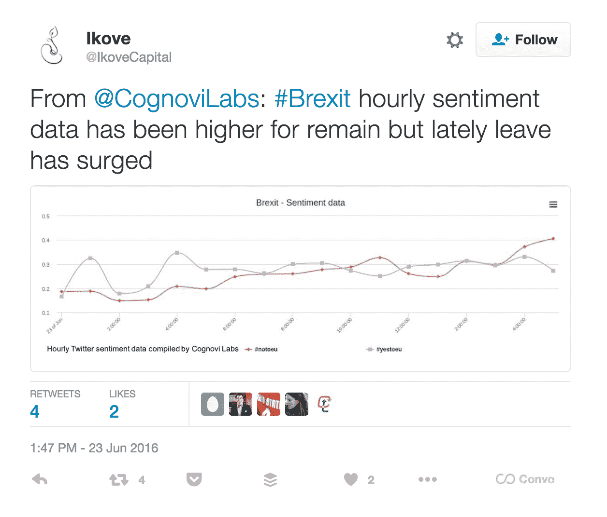

# Cognovi 实验室的 Twitris 情绪分析工具比民意调查早几个小时预测了英国退出欧盟

> 原文：<https://web.archive.org/web/https://techcrunch.com/2016/06/29/the-twitris-sentiment-analysis-tool-by-cognovi-labs-predicted-the-brexit-hours-earlier-than-polls/>

Cognovi Labs 是一家新的分析初创公司，它依赖于 Twitris，这是一款由 T2 莱特州立大学开发的工具，据称可以从社交媒体关于特定主题的聊天中提取样本，并推断出关于他们正在研究的特定主题的实时、大规模、自动化的情绪。

作为该工具功能的真实例子，由莱特州立大学研究员(Cognovi Labs 发明人)Amit Sheth 博士领导的 Cognovi Labs 研究团队分析了导致 6 月 23 日英国/欧盟成员国公投(英国退出欧盟)的 Twitter 聊天。该团队能够在新闻爆出前六个小时预测到倾向于“留欧”阵营的[民调](https://web.archive.org/web/20230314164840/https://en.wikipedia.org/wiki/Opinion_polling_for_the_United_Kingdom_European_Union_membership_referendum)是不正确的。

这是通过 Cognovi Labs Twitris 工具运行 Twitter chatter 预测的。机器学习工具利用 Cognovi Labs 的语义知识产权，能够以新的、更精确的方式从社交媒体聊天(包括俚语)中自动化和提取聚合意义。

换句话说，Twitris 可以判断出一个人是否在发推特*“感谢上帝，英国退出欧盟让我对未来充满信心！”*(顺便说一下，这是我瞎编的)，这些俚语和其他单词如何相互联系，以表达事件的意义，而不需要一个人真正去阅读和解释它。该工具可以理解，该声明不是指技术术语中的“上帝”或“未来”，等等。

这些搜索，或者谢思博士称之为“活动”，也可以设置在不同的地理区域。

Cognovi 实验室最近运行的另一个真实例子是在 Twitter 上搜索对大麻合法化政策的看法……试图了解美国不同地区的人们对某些州采取的不同合法化立场的感受。

该小组发现，讨论中一个反复出现的话题是香料，一种合成形式的大麻。然而，如果你只是搜索#spice 标签，大部分社交内容都是关于南瓜香料拿铁的。Twitris 能够解析不同的语句以获得更精确的含义，并得出分析结果。

这对金融市场、灾难应对、政治预测甚至品牌规划的影响显而易见。

要明确的是，情绪分析并不是什么新鲜事。那里有很多工具，像 [Brandwatch](https://web.archive.org/web/20230314164840/https://www.crunchbase.com/organization/brandwatch) 、 [Semantria](https://web.archive.org/web/20230314164840/https://www.crunchbase.com/organization/semantria) 、 [Spreadfast](https://web.archive.org/web/20230314164840/https://www.crunchbase.com/organization/spredfast) 等等。然而，Cognovi Labs 首席执行官 James Mainord 在电话中告诉我，他们的工具“由于能够支持全面的分析、深入的洞察和可操作的信息，因此独树一帜。这是因为它使用了背景知识、其他人不具备的能力(例如深度情感分析)和其他人拥有的更高级形式的能力(例如，它的特定主题情感分析非常先进，允许人们解释与特定事件(产品发布会、政治辩论等)相关的情感变化。)—以所需的粒度级别快速提供可操作的见解)。”

也有可能这是新手的运气；然而，Sheth 博士的研究小组已经进行这项研究一段时间了。虽然这是 Cognovi 实验室首次发表的报告，但在此之前，他们已经开展了许多活动来支持他们的方法。

目前唯一的社交媒体输入是 Twitter，但该团队计划在未来添加其他社交网络。

Cognovi Labs 是另一家从 Ikove Venture Partners 技术商业化团队中脱颖而出的创业公司。本质上，Ikove 识别未充分利用的知识产权(通常是美国研究机构)，并帮助构建商业计划，以“通过创业苗圃计划识别、审查和推出颠覆性技术，以跨越死亡之谷。”(这里的死亡谷是指知识产权经常因为产品化不当而失效的地方)。

在过去的两年里，Ikove 已经推出了五家技术公司，包括我们自己的 2015 年 TC Disrupt 和战地竞争对手 [Nikola Labs](https://web.archive.org/web/20230314164840/https://techcrunch.com/2015/05/04/nikola-labs-launches-iphone-6-case-which-harvests-electricity-from-the-air/) 的人民选择冠军。

Ikove Venture Partners 由首席执行官埃丽卡·韦特管理，由弗拉维奥·洛巴托、鲁道夫·贝勒西、罗伯特·李博士和约翰·奥拉齐奥创建。