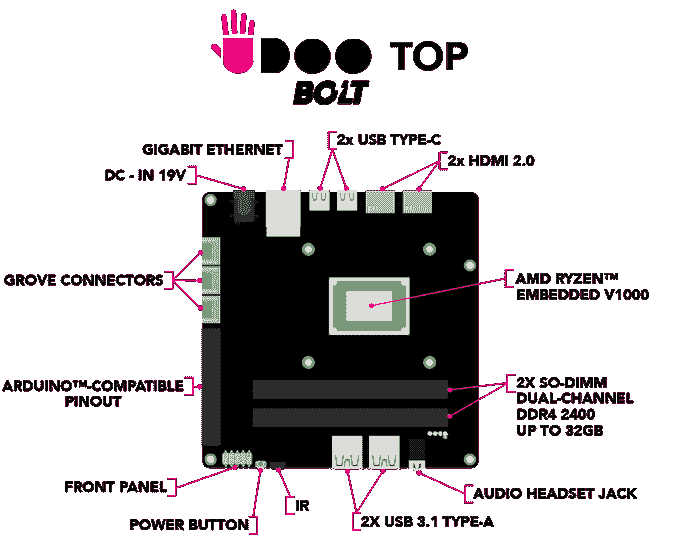
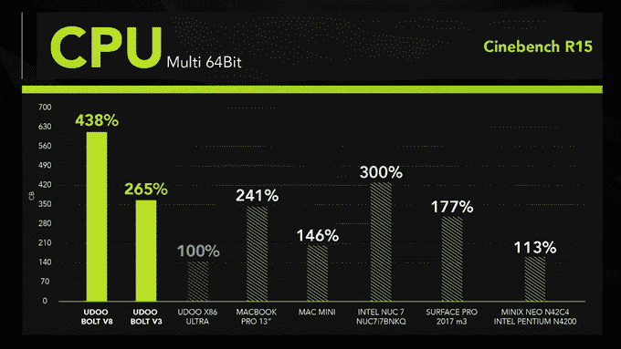

# UDOO BOLT 是微型主板上的强大计算机

> 原文：<https://web.archive.org/web/https://techcrunch.com/2018/07/03/the-udoo-bolt-is-a-powerful-computer-on-a-tiny-board/>

# UDOO BOLT 是一台小型主板上的强大计算机

当我们最后一次见到 UDOO 时，团队正在构建一个强大的基于 Raspberry Pi 的 DIY 板，它具有一系列令人印象深刻的功能，包括更多的端口和更好的处理器。现在，第一个单元背后的团队已经发布了 [UDOO BOLT](https://web.archive.org/web/20230323173335/https://www.kickstarter.com/projects/udoo/udoo-bolt-raising-the-maker-world-to-the-next-leve) ，这是一个 DIY 板，可以运行“AAA 游戏”，这要归功于内置的 AMD 锐龙嵌入式 V1202B 3.2 GHz SoC 处理器和镭龙 Vega 3 显卡。该系统还兼容 Arduino，因此您可以将其连接到您的机器人和其他电子项目。

根据创造者的说法，当配备大块 RAM 时，BOLT“几乎是配备英特尔 i5 的 MacBook Pro 13 英寸的两倍，比 Mac Mini 的三倍。”因为它几乎是一台完全成熟的电脑，你可以把它放在一个盒子里，把它当成一个迷你工作站，配有 USB 键盘和鼠标，HDMI 输出到显示器。BOLT 可以同时驱动四台显示器，两台通过 4K HDMI，两台通过 USB-C。它运行 Linux 或 Windows。

该团队计划于 2018 年 12 月发货。该入门套件在 Kickstarter 上售价 298 美元，包括一个电源和 4GB 内存。8GB 的 SATA 和无线设备售价 409 美元。

一个大容量处理器和显卡的 DIY 板是不是有点大材小用？绝对的。然而，由于该系统是为实验和即时设计而设计的，您可以轻松地将这样的电路板用于售货亭、商店展示或工作站。因为它非常便携，你可以在学校的桌子上放几台这样的电脑，给孩子们一台功能强大的电脑，可以运行你能扔给他们的几乎所有东西。此外，能够在花生酱和果冻三明治大小的机器上玩虚拟现实游戏也非常酷。

UDOO 已经在传统的 Raspberry Pi/Arduino 堆栈上添加了很长时间，他们已经成为使基本板更加强大的专家。鉴于他们早期的模型可以在运行 Android 的同时运行无人机和控制多足机器人，这款新产品应该是一个真正的享受。

