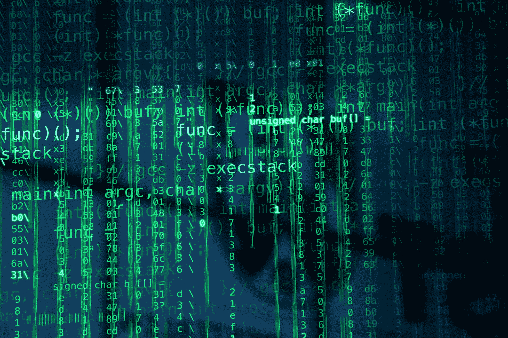

# 美国需要一个网络安全部

> 原文：<https://web.archive.org/web/https://techcrunch.com/2018/04/16/the-united-states-needs-a-department-of-cybersecurity/>

泰德·施莱因是凯鹏华盈的普通合伙人，也是网络安全和企业软件领域的顶尖专家。

More posts by this contributor

本周，40，000 多名安全专业人员将在旧金山参加 RSA，观看最新的网络技术展示并讨论关键问题。议程上最重要的话题莫过于俄罗斯支持的对美国 2016 年大选的黑客攻击，围绕这个国家为什么几乎没有做出回应，以及应该采取什么措施来阻止未来颠覆我们民主的企图。

有充分的理由。现在有明确的证据表明俄罗斯干涉了选举，特别顾问穆勒对 13 名俄罗斯人提出了长达 37 页的指控，然而对美国主权和稳定的攻击在很大程度上没有得到回应。[国会为应对俄罗斯攻击预留的 1.2 亿美元仍未支出。我们驱逐了俄罗斯外交官，但只是在一名前俄罗斯间谍及其女儿中毒后，迫于国际压力。](https://web.archive.org/web/20221128162323/https://www.axios.com/trump-admin-yet-to-spend-120m-grated-to-curb-election-meddling-0650200a-b49c-47c1-89e2-b71273ec0d66.html)

最近的制裁不太可能改变普京政府的行为。坦率地说，我们没有采取任何实质性措施来解决我们面对外国网络攻击的脆弱性。与此同时，我们的敌人在技术能力、成熟度和影响力方面都有所提高。

除了俄罗斯人，中国人、朝鲜人、伊朗人和新成立的民族国家每天都在使用网络技术，以进一步努力在地缘政治舞台上获得优势。这些政府有意识地决定，积极的网络计划在限制美国的同时推进他们的目标。

克里斯汀·博西/彭博

我们曾经在这个领域占据主导地位，无论是技术上还是知识和技能上。这个竞技场已经被拉平了，而我们却无所事事，没有努力重新获得优势的意愿或注意力。这是不可接受的，站不住脚的，并将最终导致潜在的可怕后果。

今年 3 月，美国网络司令部发布了一份名为[“实现并保持网络空间优势”的愿景文件。](https://web.archive.org/web/20221128162323/https://blog.cybersecuritylaw.us/2018/03/26/cyber-command-strategy-document-achieve-and-maintain-cyberspace-superiority/)这是一个行动号召，号召美国的网络战士与美国所有其他可用的外交和经济力量合作，为我们的国家安全而战。

这是一个开始，但光有愿景声明是不够的。如果没有一个合适的组织结构，美国将永远无法在其网络努力中实现卓越的运营。今天我们注定要失败。我们的能力分布在政府如此多的不同部门，以至于它们被官僚主义、低效率和人才稀释所淹没。

国土安全部负责国家保护，包括网络攻击的预防、缓解和恢复。隶属司法部的联邦调查局对调查和执法负有主要责任。包括美国网络司令部在内的国防部主管国防。此外，各军种都有自己的网络单位。没有一个想赢的人会以如此分散和分散的方式组织关键能力。

我们的立法者如何知道通过什么政策？当它可能只是一个军事分支的轮换时，我们如何在一个组织中招募和训练精英中的精英？当这些群体甚至彼此都不交谈时，我们如何能立即分享有益于所有人的知识？我们目前的方法行不通，也不可能行得通。

图片由科林·安德森提供

我们需要的是行政部门的第十六个分支——网络安全部门——它将汇集美国最优秀的人才和资源，在一个统一的保护伞下和一个统一的政策下运作。通过联合我们的网络努力，我们将最大限度地利用有限的资源，并确保网络空间中所有要素之间的无缝通信。该部门将代表政府和私营部门采取行动，防范网络威胁，并在必要时发起攻击。

与物理防御一样，有时这意味着外交或制裁，有时这意味着执行任务以削弱敌人的网络行动。我们有技术能力，我们有人才，我们知道该做什么——但除非所有这些火力都被统一起来并对准敌人，否则我们可能什么也没有。

当在华盛顿讨论一个网络安全部门时，通常会因为受影响的机构和部门数量而遭到拒绝。这是预算和人员损失的代码。如果我们想要发动一场有效的网络战争，我们必须超越地盘之争。有些人对进攻行动的协调提出了担忧，但可以通过与国防部建立明确的指挥链来解决这些问题，以避免更大冲突的可能性。

我们也不能因为与国土安全部的比较而得出结论，认为网络安全部会面临同样的挑战。DHS 是 22 个不同机构的集合体。一个网络安全部门将围绕一套共同的技能、人员和专业知识建立起来，所有人都致力于一个共同的问题和目标。很不一样。

加强我们的网络防御和拥有一支强大的常备军来保卫我们自己和我们的盟友一样重要。俄罗斯、中国和其他国家已经投资于他们的网络战能力，几乎可以随心所欲地利用我们的系统。

反击这些努力需要我们自己的国家授权，由内阁一级的权威来执行。如果我们不给予这场战斗这种程度的重要性，并让自己赢得胜利，对美国选举的干涉不仅会重复，而且与可能发生的事情相比，这种行为将显得微不足道。