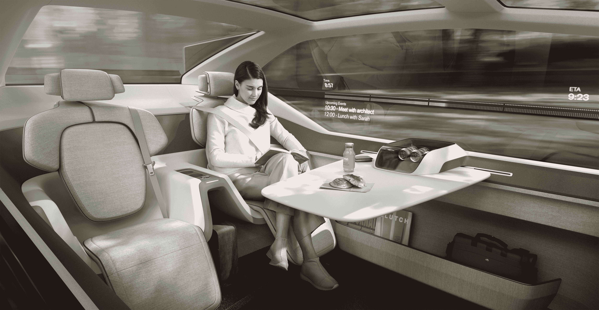
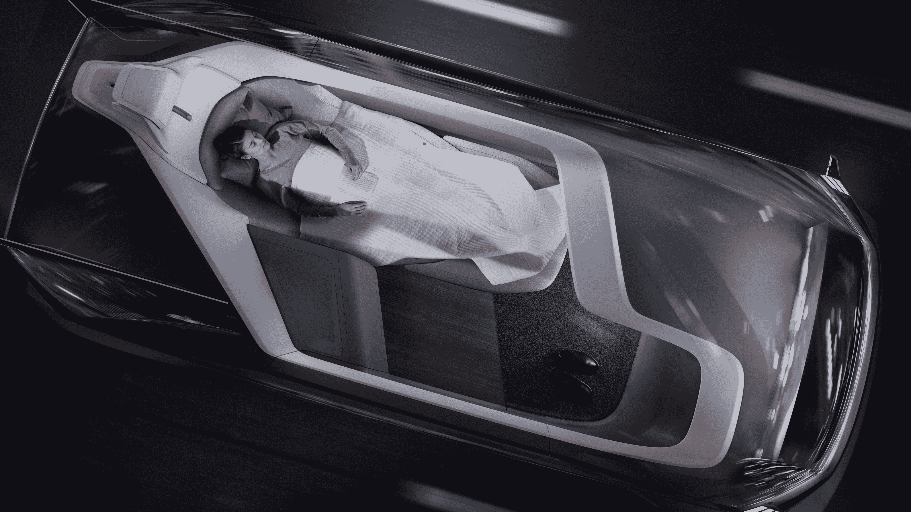

# 沃尔沃 360c 概念车是办公室-床-客厅混搭，旨在扰乱国内航空旅行 

> 原文：<https://web.archive.org/web/https://techcrunch.com/2018/09/05/the-volvo-360c-concept-is-an-office-bed-living-room-mashup-to-disrupt-domestic-air-travel/>

# 沃尔沃 360c 的概念是一个办公室-床-客厅混搭，以扰乱国内航空旅行

沃尔沃周三公布了未来旅行的愿景。这是一辆没有方向盘或其他传统控制手段的电动自动驾驶汽车，可以为乘客提供多种用途，并最终扰乱国内航空业。

360c 概念只是一个概念。这意味着，周三在瑞典展示的汽车不会很快投入生产，如果有的话。但正如大多数概念的目标一样，360c 让我们深入了解沃尔沃的想法，并暗示该公司的发展方向。

简而言之，360c 概念是一个话题。沃尔沃希望谈论像这样的自动驾驶汽车将如何被使用，以及这项技术将如何改变社会。

360c 概念展示了自动驾驶汽车的四种潜在用途:作为睡眠环境、移动办公室、客厅和娱乐空间。

沃尔沃 360c 内饰

沃尔沃汽车总裁兼首席执行官 kan Samuelsson 表示:“未来几年，业务将会发生变化，沃尔沃应该引领我们行业的变革。“自动驾驶将使我们在安全方面迈出更大的一步，同时也开辟了令人兴奋的新商业模式，让消费者可以花时间在车上做他们想做的事情。”

这一概念还应该代表沃尔沃所描述的“短途航空旅行的潜在有利可图的竞争对手”。沃尔沃认为，起点和终点之间的距离约为 300 公里(186 英里)的较短路线，“是替代旅行模式中断的主要候选对象”。"

沃尔沃 360c 内饰

沃尔沃没有说 360c 车队——假设它们曾经建造过——可能会对火车产生什么影响，火车是当今的一种旅行方式，经常在城市之间短途运送人们。

该公司还提出了一项关于自动驾驶汽车如何与所有其他道路使用者安全通信的全球标准的提案。工程师为 360c 创建了一个由外部声音、颜色、视觉和动作组成的系统，以向其他道路使用者传达车辆的意图，这是自动驾驶汽车最终在公共道路上大规模部署时的一个关键功能。