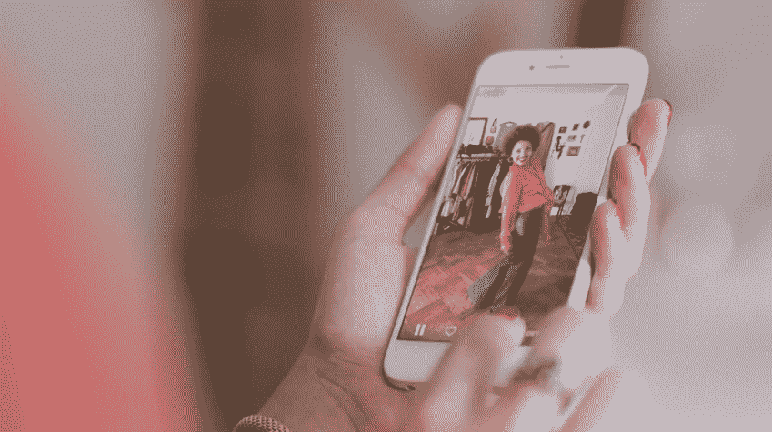

# 视觉数据将赢得人工智能之战 

> 原文：<https://web.archive.org/web/https://techcrunch.com/2017/05/17/the-war-over-artificial-intelligence-will-be-won-with-visual-data/>

埃文·尼塞尔森撰稿人

More posts by this contributor

主要的科技公司和新的创业公司正在为拥有最有价值的人工智能而战，这场战争的核心是拥有独特的高质量视觉数据。

拥有联网摄像头将赢得这场战斗。我们大脑分析的大部分数据是视觉数据，因此人工智能拥有人类(或比人类更好)技能所需的大部分数据将依赖于计算机翻译高质量视觉数据的能力。

人工智能将带来革命性变化的商业领域之一是电子商务。亚马逊的 Echo Look 是亚马逊的明智之举。给它们的回声添加一个摄像头验证了我去年的一个预测，叫做[眼睛网络](https://web.archive.org/web/20230205203438/https://thenextweb.com/insider/2016/05/13/the-internet-of-eyes-and-the-personification-of-everything-around-you/)，它使所有无生命的物体都能看见。带有摄像头的无生命物体使公司能够在收集数据以供计算机视觉和人工智能算法分析方面迈出第一步。

迄今为止，亚马逊主要依靠顾客在他们的网站上搜索产品和衣服来购买。这是他们让客户通过自拍购买产品的第一步，它为公司提供了视觉数据的趋势，因此他们的人工智能算法可以学习我们最喜欢的衣服、风格和产品。

他们的核心目标是捕捉客户独特和专有的视觉数据，以便他们的计算机可以通过我们通过 Echo Look 捕捉的自拍尽可能多地了解我们。这有助于他们让我们的购物体验更加顺畅。

斯坦福大学人工智能实验室主任、谷歌云首席科学家 AI/ML 费-李非表示，“5 亿多年前，视觉成为进化‘大爆炸’的主要驱动力，寒武纪大爆发导致了动物王国的爆炸性物种形成。5 亿年后，人工智能技术即将改变人类生活、工作、交流和塑造我们环境的方式。”

“大自然很早就发现，视觉是智能动物导航、生存、互动和改变其生活的复杂世界的最强大的秘密武器之一。智能系统也是如此。超过 80%的网页是像素格式的数据(照片、视频等。)，带摄像头的智能手机数量超过了地球上的人口数量，我们的每一台设备、每一台机器和每一寸空间都将由智能传感器驱动，”飞飞说。“建造智能机器的唯一途径是让它拥有强大的视觉智能，就像动物在进化中所做的那样。虽然许多人都在寻找视觉的‘杀手级应用’，但我想说，视觉是人工智能和计算的‘杀手级应用’。”

社会被它的自恋欲望所驱动，即捕捉自拍来直观地分享他们穿什么、吃什么、在哪里度假以及和谁在一起。人们制作图片的主要原因是为了视觉交流。

今天，电子商务也是由照片和视频驱动的，未来，它将由无生命的物体驱动，这些物体带有利用计算机视觉和人工智能的相机。我们的冰箱里将会有摄像头，我们的汽车上到处都有摄像头，安全摄像头，以及根据室内温度管理花园浇水的视觉传感器。这些相机将分析许多不同类型的视觉数据，包括摄影、热、X 射线、超声波和白光，以提供前所未有的高质量信号。

IBM Watson 一直在与 [North Face](https://web.archive.org/web/20230205203438/https://www.ibm.com/blogs/watson/2016/01/four-ways-watsons-improving-your-shopping-experience/) 、[梅西百货](https://web.archive.org/web/20230205203438/https://www.ibm.com/blogs/watson/2016/07/artificial-intelligence-transforms-store-shopping-experience-pilot-macys-call/)、[西尔斯](https://web.archive.org/web/20230205203438/http://chicagoinno.streetwise.co/2017/01/18/sears-uses-ibm-watson-to-bring-artificial-intelligence-to-tire-shopping/)和其他零售商合作，用人工智能赋予他们的购物体验。

我讨厌购物。我属于那种多年来都没有改变时尚风格的男人。当我最终去商店买我穿了多年的同样最喜欢的红色裤子时，我疯了，当然，他们不再生产我最喜欢的那种版本的裤子了。

我一直希望我的房子里有一台相机每天拍摄我，并随着时间的推移了解我的风格。最终，亚马逊 Echo Look、谷歌助手和我们家中其他带摄像头的物体将为我们提供一个解决方案。

利用计算机视觉和人工智能，相机有望帮助我主动购物，而不需要我在网上或商店里进行物理搜索。理想情况下，亚马逊 Alexa 会给我发一封电子邮件，说“看起来你最喜欢的红色裤子穿坏了，因为你一直穿着它们。我们注意到你的后口袋上有一个洞，我们有两条同样颜色和尺寸的裤子，我们想让你知道。要不要我给你点一两个？”是啊！

一键结账会把它们送到我家门口，这将解决我对购物的厌恶。这将使我成为一个非常高兴的顾客，并取代搜索的活动。

我也讨厌购买食物和浴室用品。当我家里的所有相机一起说话时，那将是非常棒的，这样我们就永远不会用完我们需要的东西，最重要的是，我们不必再去网上或商店购物。

扩展存储和处理基础设施以处理来自房屋周围摄像头的指数级视觉数据只是挑战之一，但幸运的是，亚马逊拥有最大的云计算网络之一。更困难的挑战和战争是利用正确的人工智能算法来破译和理解照片、视频和其他视觉数据中的有价值的信号，使他们的人工智能成为最聪明的。

计算机视觉专家、康奈尔理工大学计算机视觉教授 Serge Belongie 说:“人脑的大部分都涉及视觉数据的处理，用于场景解释和空间导航等目的。视觉数据对我们了解世界的方式至关重要，因此，追求智能机器将需要我们处理和解释视觉数据的能力取得实质性进展。”

谷歌将很快在他们的助手上安装一个摄像头，可能会与 Nest 和 Dropcam 进行通信。一个卖点将是你的自拍照和眼睛网络捕捉到的其他视觉数据。

在网上搜索购买产品将被从你的视觉数据中学习的[人工智能](https://web.archive.org/web/20230205203438/https://www.entrepreneur.com/article/288098)取代。我很高兴看到所有新的创业公司利用独特的视觉数据和人工智能建立电子商务业务。观看大公司之间争夺摄像头和解释我们的视觉数据的战斗将是令人兴奋的，希望让我们的生活更轻松，更有趣，并为他们增加收入。