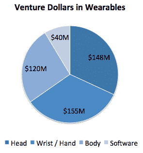

# 对可穿戴设备未来的投资 

> 原文：<https://web.archive.org/web/https://techcrunch.com/2014/09/20/the-wearable-future/>

马特·威瑟勒撰稿人

More posts by this contributor

**编者按:** *马特·威塞勒是* [*飞桥资本合伙人*](https://web.archive.org/web/20221007202425/http://www.flybridge.com/) *的普通合伙人。你可以关注他的[博客](https://web.archive.org/web/20221007202425/http://www.bitsofcents.com/)* *。*

人们可能会争论可穿戴设备何时首次出现，或者哪些行业将受到该技术的最大影响，但无可争议的是，可穿戴领域的创业活动已经加速。如果苹果进入一个类别是一个确定的信号，那就是。

在消费者兴趣和投资者关注之间，可穿戴类别正在爆炸式增长。事实上，它的爆炸式增长如此之大，以至于深入研究一下就能帮助确定到底是什么在推动这个领域的增长。

## **消费者在买什么**

或许衡量消费者对初创可穿戴设备兴趣的最佳代理是众筹网站。在之前分析的 443 个众筹项目中，有 64 个是所谓的可穿戴设备。就消费者的胃口而言，这个类别作为一个整体是最主要的类别之一:尽管可穿戴设备只占所有项目的 14%，价值 4100 万美元，但它们占消费者在硬件项目中筹集的所有美元的 22%。

在这 64 种可穿戴设备中，53%戴在手腕/手上，25%戴在头上，14%戴在身上。似乎消费者对手腕/手可穿戴类别的兴趣最高，特别是像 [Pebble](https://web.archive.org/web/20221007202425/http://www.getpebble.com/) 、 [Kreyos](https://web.archive.org/web/20221007202425/https://www.kreyos.com/) 和 [Omate](https://web.archive.org/web/20221007202425/http://www.omate.com/) 这样的联网手表项目，每个项目都预售了超过 100 万美元的产品。显然，手表作为第三块屏幕的想法在人群中引起了共鸣。

## **投资者在支持什么**

从投资者投资的角度来看可穿戴设备，会描绘出一幅不同的画面。根据 Mattermark 和 CrunchBase 的数据，从 2008 年到今天，人们在可穿戴设备上花费了 4100 万美元，而投资者在 82 家公司中投入了令人印象深刻的 4.63 亿美元。这意味着消费者在众筹网站上每花 1 美元，投资者就多花了 11 美元。

令人惊讶的是，大部分资金(58 %)进入了那些在融资前没有走众筹路线的公司。同样令人惊讶的是，只有 19 个众筹金额达到 10 万美元或以上的可穿戴类项目继续筹集风险资金。

从百分比来看，这意味着自 2008 年以来，只有 23%的可穿戴项目获得了风险投资，它们是在众筹网站上开始的，这表明投资者正在将众筹成功作为潜力的一个指标，但不是唯一的指标。

从类别的角度来看，如果投资者谈到他们的投资，他们最看好涉及手腕/手设备的可穿戴产品:这些产品占投资金额的 32%，似乎反映了消费者对该类别的兴奋。

然而，与消费者兴趣相反的是身体可穿戴类别，其中消费者仅花费了 9%的美元，但该类别积累了 26%的投资者美元。另一个不同之处是增加了一个“软件”类别，以捕捉旨在增强或改善可穿戴设备的软件——这是众筹世界没有贡献的。

## **可穿戴设备的未来**

如果说这些数据说明了什么，那就是消费者和投资者对可穿戴领域的兴趣都很高，而且还在继续增长。六年前，任何重要的可穿戴公司的数量都可以用两只手来数；现在你需要 15 个。无论是戴在手上还是戴在手腕上的设备，都是大众和投资者最感兴趣的领域，体现了他们对未来的共同愿景。

这种重叠暗示了一些独特的东西。当消费者支持众筹网站上的产品时，投资者支持愿景。消费者和投资者对互联手表的兴趣趋于一致，这特别表明，如今有令人信服的个人产品，而且这些产品在未来有令人鼓舞的前景；这是苹果公司的产品。无论你是消费者还是投资者，这都是每个人都会感到兴奋的事情。

要访问用于生成该报告的所有数据，请点击查看完整文档[。](https://web.archive.org/web/20221007202425/https://docs.google.com/spreadsheets/d/1nUTHUBrwO3ySZlxX9CGIJbsHSEJUNt-elHXJYGaHe8o/edit?usp=sharing)