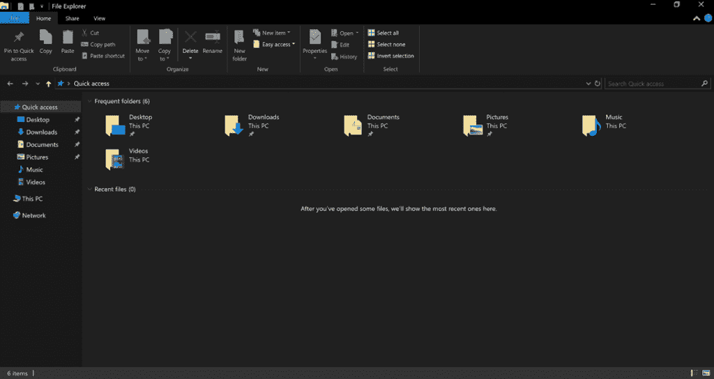

# Windows 10 年 10 月更新现已发布

> 原文：<https://web.archive.org/web/https://techcrunch.com/2018/10/02/the-windows-10-october-2018-update-is-now-available/>

微软今天宣布，Windows 10 年 10 月更新现已推出。该公司在纽约的一个小型新闻发布会上宣布了这一消息，尽管微软决定在为其命名的那个月推出 10 月更新显然并不令人惊讶。

像往常一样，这些部署需要一段时间。您现在可以强制更新，但对于那些想等待的人，微软将在 10 月 9 日开始自动更新。

像大多数最近的 Windows 更新一样，10 月发布的版本不会用新界面或疯狂的新功能让你大吃一惊。现在这些更新大部分是增量的，但是总的来说，新版本提供了许多有趣的新特性。

其中最有趣的可能是新的“你的手机”应用程序，它允许你使用运行微软移动配套应用程序的安卓手机从你的 PC 上发短信。在以后的版本中，该应用程序还会将通知同步到你的桌面，但目前，这不是一个选项。当您从手机切换到 PC 时，也有工具可以继续您的工作流程(反之亦然)。这些功能也适用于 iOS 用户。

至于设备之间的同步，值得注意的是，更新还将允许你在电脑之间共享你的剪贴板。

由于现在每个人都喜欢黑暗模式，Windows 10 文件浏览器现在也包括了一个黑暗主题。还有一个改进的搜索体验，以及一个新的截图工具。

尽管该版本在功能和设计方面都做了大量的调整，但最令人期待的功能 Sets 并没有出现在这个版本中。Sets 可能是自 Windows 10 发布以来对整体 Windows 用户体验的最大改变，所以微软试图完善这一点也许并不奇怪。完美需要时间。