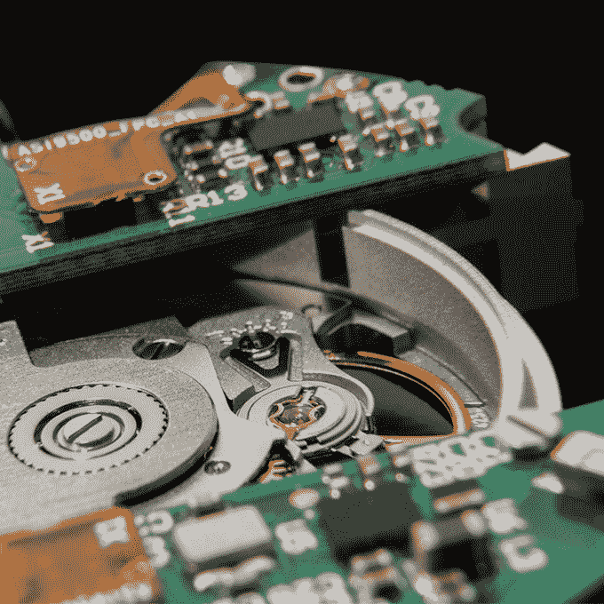

# X-ONE H1 是专为喜欢旅行的人设计的新型混合智能手表 

> 原文：<https://web.archive.org/web/https://techcrunch.com/2018/03/06/the-x-one-h1-is-a-new-hybrid-smartwatch-for-the-fancy-traveler/>

# X-ONE H1 是专为喜欢旅行的人设计的新型混合智能手表

自从智能手表问世以来，我们当中的手表爱好者就一直想要一款具备智能手表所有功能的机械表。一些人已经尝试了这个几乎不可能的壮举，现在 X-ONE H1 正在尝试。

X-ONE H1 有一个内部机械机芯，可以驱动时针、分针和秒针，就像普通的自动手表一样。此外，还有一个小的，可更换的电子产品包，为其余的功能提供动力，包括 GMT 时间，万年历和绝对独特的线性显示器，可以告诉你你的爸爸在用莫尔斯码打电话。

这款手表的不锈钢起价为 750 美元，最高可达 1000 美元左右。它运行 Sellita Caliber SW200 机芯，这是一款 bog 标准自动机芯，在斯沃琪停止销售过去几十年在瑞士手表中流行的许多重型 ETA 机芯后变得流行。电子设备通过感应充电，可以运行一周。

这款手表还有一个计步器，可以通知你有来电和信息。它超过了在 Kickstarter 上的目标。

需要明确的是，这款手表并非完全由你手臂的运动或身体的运动来提供动力。这项技术——只用一个旋转的转子为复杂的电子机芯充电的能力——还不太成熟，尽管一些手表可以利用转子旋转为简单的石英机芯提供动力。这款手表最终归结为审美选择——你喜欢这款手表还是苹果手表或类似的智能手表？如果你做到了，那么你就有一个赢家。

这是对传统瑞士表的巧妙改造，也是将机械和电子结合起来的一次令人着迷的尝试。希望未来的版本将更少精神分裂，并以真正的方式融合机械和电子。