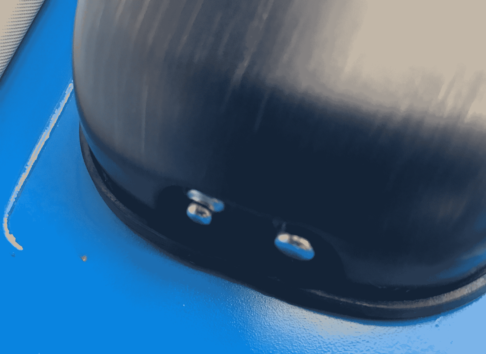

# 耶鲁大学的真实生活保证锁正是用来挫败撬锁僵尸的

> 原文：<https://web.archive.org/web/https://techcrunch.com/2016/11/10/the-yale-real-living-assure-lock-is-just-the-thing-to-thwart-lock-picking-zombies/>

# 耶鲁大学的真正的生活保证锁只是为了挫败开锁僵尸

你会注意到的第一件事是耶鲁生活保险锁没有钥匙孔。没有备用钥匙，没有物理键盘，它看起来像是你会安装在企业外部的东西，这样契诃夫可以在右后发动机上贴上“Shatner/Nimoy '74”保险杠贴纸后回到里面。这款售价 199 美元的锁是耶鲁最新的蓝牙产品，没有钥匙。

本质上，这就像大多数其他自动插销。要安装它，你拔出你的旧插销，滑入键盘的两边。它需要四节 AA 电池，内置一个扬声器，可以带你通过键盘进入系统菜单。

我用西勒奇的密码锁已经很多年了，我发现它们非常耐用(你会注意到我拆下旧锁的地方油漆脱落了。这一款稍逊一筹，背板比西勒奇的更薄，但构造是一样的。然而，我以前的锁不是无线的，这些是。另外，我认为真正有趣的部分是备份解锁机制。

如果世界被僵尸占领，你的 AA 电池没电了，锁下的两个触点可以让你将 9 伏电池压到锁上，输入密码，然后解锁系统。这是一个聪明的变通办法，可以说是容易破解的机械锁。

此外，Assure Lock 还支持蓝牙。这意味着你可以在手机上生成一把钥匙，然后打开耶鲁的应用程序打开锁。一扭电话，你就进去了。你可以把钥匙发给朋友和家人，让他们自己开锁。

触摸屏支持多次手指按压。你把三个手指放在屏幕上就可以锁定了，你也可以用同样的方式唤醒键盘。我还不能证明电池寿命，但它已经成为我们后门的一个坚实的补充。

这款锁有三种颜色——银色、金色和“摩擦黄铜”——现在已经发货。无按钮键盘非常容易使用(孩子们已经知道他们自己的密码)，我唯一的抱怨是，有时当门打开时，自动插销会滑出，从而迫使你在关门前转动内插销来关闭它。我还不知道为什么锁闩会这样溜走，但我怀疑当我用屁股碰键盘时它会被激活。

自动锁是未来，在未来，变异的僵尸怪物将从 YouTube 视频中学习开锁技术。我很高兴我的家人不会受到他们不倒翁般的骚扰。