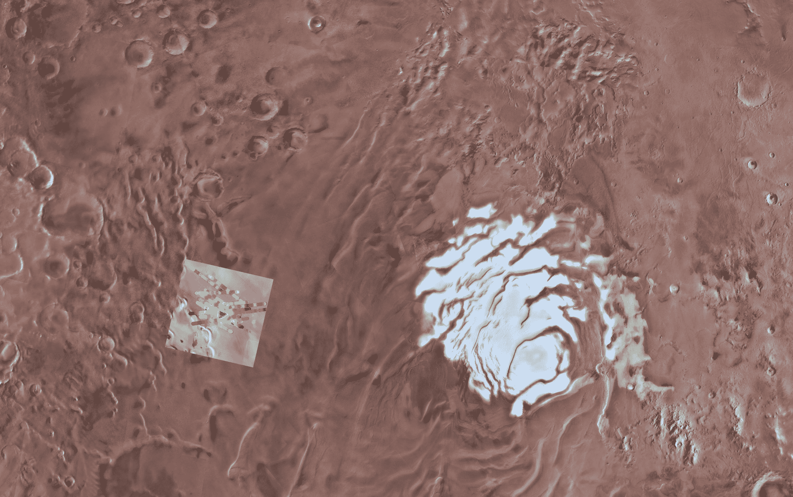
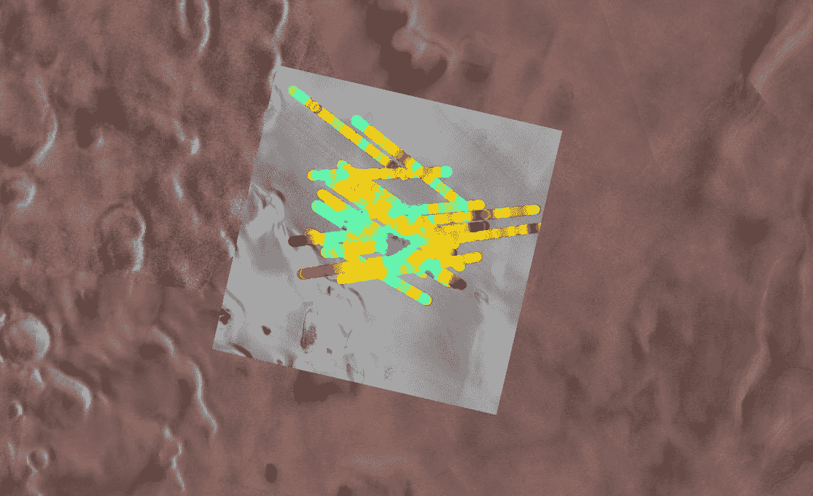

# 火星上有液态水

> 原文：<https://web.archive.org/web/https://techcrunch.com/2018/07/25/there-is-liquid-water-on-mars/>

经过多年的观察和分析，研究人员今天宣布，他们在火星上发现了大量的液态水。它位于地下一英里处，可能只是液体，因为它是含盐的，处于巨大的压力下，但尽管如此，这一突破性的发现可能会改变我们对这颗红色星球的理解，以及我们有一天自己去那里的计划。

这一发现是由来自不同机构的意大利研究人员发现的，他们由博洛尼亚的国家天文研究所的罗伯托·奥罗塞领导；描述他们探测和描述水的工作的论文发表在今天的《科学》杂志上[。](https://web.archive.org/web/20230307140420/http://science.sciencemag.org/cgi/doi/10.1126/science.aar7268)

他们是怎么做到的？这项研究使用了欧洲航天局火星快车轨道器上的火星地下和电离层探测高级雷达(MARSIS)的数据。这是一部探地雷达，它已经为火星上的水的故事做出了贡献，其读数表明盆地和其他特征表明那里曾经存在海洋。

研究人员查看了 2012 年和 2015 年覆盖火星地理南极附近区域的数据。尽管这个地区“没有表现出任何特殊的特征”，正如论文所说，几十年来一直有理论认为极地冰盖可能隐藏着液态水沉积。

这个理论[最著名的是由 Stephen Clifford 在 1987 年](https://web.archive.org/web/20230307140420/https://agupubs.onlinelibrary.wiley.com/doi/abs/10.1029/JB092iB09p09135)提出的，提出不仅表层冰将内层与低于冰点的表面温度隔离，而且数百万吨冰和岩石施加的压力将大大降低水的熔点，因此即使在零下几摄氏度也能保持液态。此外，矿物质混入水中并使其含盐可进一步降低其熔点，这些矿物质或盐类(钠、镁和钙)已知存在于火星土壤中。

但是，在我们这个时代，这种液体形成和保留的必要条件是否真的存在于地球上，这是一个争论了几十年的问题——今天的发现最终解决了这个争论。

来自火星的雷达读数包括在南方高原观察到的异常读数。顶线是表面，较低的层在图上相应地较低。

MARSIS 在经过南方平原(Planum Australe)某个 200 公里长的区域时捕捉到了 29 个雷达剖面图，并发现该区域的大部分地区都有来自雷达的“微弱而扩散”的反射，“但在某些地方，它非常尖锐，并且比周围地区和表面的强度(明亮的反射)更大。”

“地球上的这种情况只有在你观察到南极或东方湖等地的冰下水时才会发生，”Orosei 在论文附带的视频中解释道。“很长时间以来，我们一直在争论火星上是否也存在这种情况。这是一项漫长的调查，需要付出很多努力，但经过几年的努力，我们能够证明这确实是事实。”

在补充文本中，他们详细介绍了他们为消除其他可能性所做的工作，主要是二氧化碳层或纯水冰。他们写道，这些选项需要“非常具体和不可能的物理条件”，或者根本不会产生他们看到的反射类型。

该小组调查的火星区域；线条表示 MARSIS 雷达通过；深蓝色是被确定为水的强回声。

“事实上，我们发现，根据我们现有的证据，对这些非常强的回声的任何其他解释都是站不住脚的，”奥罗塞说。

正如这篇论文明确得出的结论:“我们将这一特征解释为火星上稳定的液态水。”

有问题的水域直径约为 20 公里，虽然深度无法确定，但沉积物可能至少有一米厚，才能产生观察到的反射。所以最低限度，我们可能会看到大量的水，大约数百万升。

问题区域的特写——蓝色表示湖面的倒影。

这可不是你想在其中游泳的地方——零下 80 华氏度，或者零下 60 摄氏度，可能更多的是到处沉淀成“盐水池”的厚厚的淤泥。如果我没弄错的话，如果你不在某种压力容器里，你可能也会像虫子一样被压碎。仍然是液态水。在火星上。今天。

不仅如此，研究人员认为这种水可能并不罕见。MARSIS 是一个广泛的测量仪器，而不是一个精确的扫描仪，这个地区被发现是因为它是如此巨大的矿床。

> 火星探测器需要探测到大面积的融水(直径几公里，厚度几十厘米),这就限制了识别小型液态水或它们之间存在任何水力联系的可能性。正因为如此，没有理由得出结论说火星上地下水的存在仅限于一个地方。

换句话说，这里可能到处都是池塘和河流，而我们却看不到它们——至少在马西斯那里看不到。我们需要更精确的东西。

关于火星上有生命的可能性，这说明了什么？嗯，液态水似乎是我们所知的所有生命形式都需要的东西。所以在火星上找到它满足了这个主要要求。

奥罗塞和他的团队在这个问题上没有官方的投入，但他确实说过，火星湖可能类似于地球上已知存在极端微生物单细胞生命的某些环境。然而，这样一种生命形式过去是否存在于火星上，或者现在是否还在逍遥法外，我们现在还不能回答这个问题。

事实上，我们甚至不能 100%确定它是液态水，直到我们派出机器人钻透冰层并直接测试它——但可以肯定地说，我们今天几乎可以肯定火星上确实有水。未来的任务可能会集中在这一地区，并进行更密切的探测，或者系统地观察地球的其他部分，以定位类似的水沉积物。