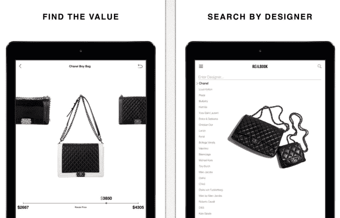

# RealReal 的最新应用 RealBook 会告诉你你的设计师商品实际上值多少钱 

> 原文：<https://web.archive.org/web/https://techcrunch.com/2014/06/30/therealreals-latest-app-realbook-will-tell-you-what-your-designer-goods-are-actually-worth/>

奢侈品寄售市场[real real](https://web.archive.org/web/20221207160101/http://www.therealreal.com/)今天推出了一款名为 [RealBook](https://web.archive.org/web/20221207160101/https://itunes.apple.com/us/app/realbook-luxury-resale-guide/id885614383?mt=8) 的新应用，让潜在买家和卖家更好地了解奢侈品的价值，包括时装和服装、高级珠宝和手表。RealBook 现在加入了该公司之前推出的智能手机应用程序，[real real 的移动商店](https://web.archive.org/web/20221207160101/https://itunes.apple.com/us/app/realreal-shop-latest-trends/id587618103?mt=8)和[托运](https://web.archive.org/web/20221207160101/https://itunes.apple.com/us/app/consign/id559861727?mt=8)。

到今年年底，RealReal 的收入有望达到 1.25 亿美元，是奢侈品寄售和设计师商品的顶级在线市场之一。该公司告诉我们，迄今为止，它已经售出 500 多个品牌的 50 多万件商品。这使得团队能够深入了解整个行业的价格趋势，了解哪些物品真正有价值，以及当当前所有者准备放弃它们时，它们的转售情况如何。

在 RealReal 上，商品将以原始零售价格的 10%到 90%转售，这是一个很大的范围。但当你按品牌缩小范围时，这些数字会变得更加精确。例如，爱马仕的配饰一般会打 7 折零售；大卫·雅曼零售额打四五折；Alaia 的零售价打了 55 折；Jimmy Choo 的零售额是 65 %,给你一个概念。

与此同时，RealReal 发现一些品牌的保值时间更长，包括香奈儿、路易威登、爱马仕、克里斯蒂安·鲁布托、卡地亚、大卫·雅曼、Alaia、梵克雅宝和 Goyard。但它也指出了其他一些最快速失去价值的品牌，如 Valextra、Tod's、Versace 和 Etro。

它还能够发现转售价值低得惊人的品牌，如玛尼、亚历山大·王、3.1 Philip Lim 和马克·雅可布，或者高价值的品牌，如纪梵希(Givenchy)、维多利亚·贝克汉姆(Victoria Beckham)、夏洛特·奥林匹亚(Charlotte Olympia)和亚历山大·麦昆(Alexander McQueen)。

随着 RealBook 的推出，该公司将其称为一种“凯利蓝皮书”类型的服务，其想法是现在将这些见解和其他数据传递给潜在客户。

该工具允许您按转售价格查看和排序数千种产品，保存您的最爱，接收转售价格更新，在社交媒体上分享产品，当然，还有购物。但是 RealBook 不仅仅是为了计算如何给你正在转售的物品定价，或者你看到的列表上的东西是否定价过低或过高——它还可以在奢侈品购买者购物之前帮助他们。

由于许多顾客将他们的设计项目视为某种投资，RealBook 可以帮助他们确定正在考虑的项目在未来是否会畅销。

如今，RealReal 表示，它现在每月通过其网站和移动应用程序处理 4 万件奢侈品，由鉴定师、钟表师、宝石学家和艺术策展人组成的团队帮助验证进货的质量和真实性。然后，寄售人可以获得最高 70%的转售价格。

新的 RealBook 应用程序是 RealReal 在 iPad 上的第一个应用程序，可以在这里免费下载。