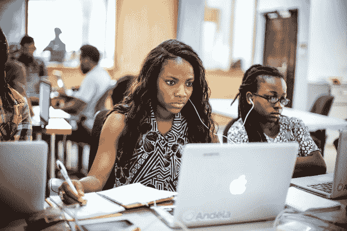

# 有一个简单的方法可以解决科技界的性别失衡...雇佣更多该死的女人

> 原文：<https://web.archive.org/web/https://techcrunch.com/2017/03/08/theres-a-simple-solution-to-techs-gender-imbalance-hire-more-damn-women/>

克里斯蒂娜·萨斯撰稿人

[Christina Sass](https://web.archive.org/web/20230323153502/https://andela.com/about-us/meet-the-team/christina-sass/)

是的联合创始人和首席运营官

[Andela](https://web.archive.org/web/20230323153502/https://andela.com/)

，该公司与来自非洲各地技术中心的最有才华的开发人员一起组建高绩效的工程团队。

1 月 21 日，我从尼日利亚的拉格斯飞往 DC 的华盛顿，与成千上万的女性一起涌上街头。令人振奋。我喜欢其中的每一秒——所有的海报，以及所有带着孩子的父母。我感受到了人数的力量，这种力量只有在街上为你真正信仰的东西示威时才能感受到。

现在国际妇女节就要到了，我发现自己在想的事情和我离开华盛顿妇女游行时想的完全一样，如此激动和鼓舞:我们如何将这种能量转化为持久的变化？

对于如何最好地为女性创造持久的变化，我有点打破记录了:这是长期就业。更多的妇女担任更多的领导职务，进入更多的董事会，担任更多的民选职务。

我意识到，“雇佣更多女性”在很多科技公司听起来肯定像是痛苦分手后朋友说的“忘掉它，继续前进”，或者对不熟悉投资的人说的“更明智地投资，赚更多的钱”。当然，很好。但是完全没用。

这是一个很难开始的对话，也是一个很难做出的改变，尤其是当团队已经缺乏多样性的时候。安德拉也不例外。

当我们创建 Andela 时，我的一个驱动力是建立一个女性技术人员聚集的公司，让她们在那里茁壮成长。在研究了全球最佳实践并增加了一个健康的伸展目标后，我将全公司的目标定为女性占 35%。我想，如果我说得足够多，给我的团队足够的鼓励，他们肯定会来的。

假的。

在首批申请安德拉大学的 6800 人中，87%是男性。我们在寻找一套非常具体的标准，我们不愿意改变。我们利用网络，说所有正确的事情，尽管我们有最好的意图，但我们无法让更多的女性加入进来。我亲身感受到了失败。

拉各斯的安德拉开发商玛丽亚姆·巴巴罗拉(Maryam Babalola)

在最初的震惊、重组和研究之后，我们采取了不同的方法。雇佣女性不是黑箱——而是目标受众。我们需要找到他们，问他们为什么不申请。他们在我们的代表身上看不到自己。他们觉得不舒服。

所以我们雇佣了女性招聘人员。尤其是在技术领域，男性强迫他们申请根本没有效果。然后，我把女性申请者的比例作为整个招聘团队的一个关键绩效指标。回应回来了:“你怎么能这么做？这不公平，我们从不雇佣不合格的人。”

正确。我们从来不雇佣不合格的人，没有惊人的天赋和致力于成为世界级技术专家的人。所以我们最好让更多的女性加入申请者队伍，这样我们就有更多的选择了。

我们开始实施全女性招聘周期，突然间事情真的开始发生变化。在我们正常的招聘过程中，平均每天有 8.6 名有抱负的女性开发人员申请安德拉。在四个“全女性”招聘周期的过程中，我们看到有抱负的女性开发人员申请人数增加了 288%(每天 24.8 人)。这四个全女性招聘周期产生了 4500 多名女性申请人，在安德拉产生了 40 多名女工程师。这些都是数字上的大跳跃，但还不够大。

然后，我为每个办事处的运营总监、安德拉的国家总监和我自己制定了女性雇员的百分比 KPI。我需要让自己对招聘团队的成功负责——给他们营销和旅行预算，让他们去女性比例高的大学，投放广告并测试他们。当我们不够有创造力的时候，我需要感受压力，无论是经济上的还是表现上的。

一旦我们都负起责任，并参与实现目标的新方法，我们就开始看到数字真的发生了变化。在肯尼亚的第一次全女性招聘课程后，不寻常的事情发生了:我们达到了 34%。

Fadekemi Ogunwa(中)是从 Andela 的第一个全女性训练营中挑选出来的开发人员之一，她在尼日利亚拉各斯从事一个开源项目

我设定了一个很多人都说不可能的目标。他们说，这对于技术来说是不现实的，对于肯尼亚、尼日利亚、软件开发商等等来说是不现实的。然后我们差点撞上了。

现在我们正在努力超越它。我们雇佣的女性人才的能力不言自明。在所有可衡量的指标上——技术技能、专业软技能和与快乐客户相关的心理测量特征——我们的女性开发人员与他们的男性同事竞争，而且在许多情况下超过了他们。

这不是公司内部一次性的项目。它无处不在，融入了我们的报告和内部消息传递。我们在每次全体员工会议上报告这一比例，这在某种程度上已经成为各地之间的友好竞争。我们也向董事会和所有投资者报告。这是我们的一部分。

在 3 月 8 日，国际妇女节，开始和你的同事讨论如何简单地采访更多的女性。坚持绝对雇佣最好的，在你的面试人才库中获得更多不同的人才。

这能解决女性在工作场所或就业市场遇到的一小部分问题吗？当然不是。但是，正如你错过了 100%你不拍的照片一样，你也错过了 100%的解决不平等问题的机会，因为你没有坚持让女性进入你的工作场所。

国际妇女节快乐。现在去雇佣吧。